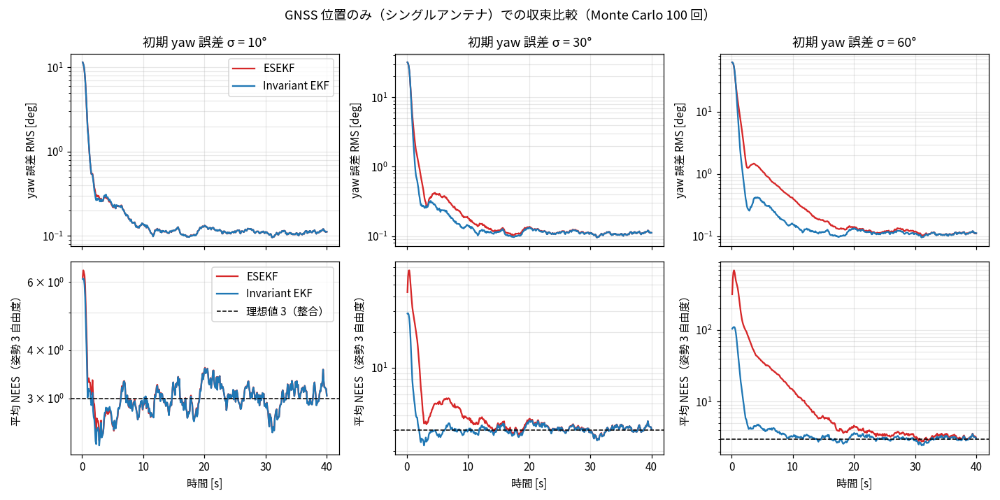

# アルゴリズム説明書: Invariant EKF による GNSS / LiDAR / IMU / ODOM 融合

- 関連文書: [要件定義](./requirements.md) / [設計書](./design.md)（v0.10） / [ソフトウェア構成](./architecture.md)
- 状態: ドラフト（v0.3。Phase 2 の実装に合わせ、LiDAR の照合（前処理・デスキュー・GICP・品質・共分散）、多仮説の探索、地図上での初期化、再位置推定の手順を追加）
- 検証スクリプト: [`tools/sim/compare_invariant_ekf_vs_esekf.py`](../tools/sim/compare_invariant_ekf_vs_esekf.py)
- 図解ページ: [https://sunomamo1126.github.io/gnss_and_lidar_localization/explainer/](https://sunomamo1126.github.io/gnss_and_lidar_localization/explainer/)（ソース: [`docs/explainer/index.html`](./explainer/index.html)）

本書は 2 部構成である。

- **第 I 部**: Invariant EKFの考え方を、通常の EKF / ESEKF と比べながら解説する。シミュレーションで確認した結果も示す。
- **第 II 部**: 本システムの推定アルゴリズム全体（予測、各観測、遅延観測、優先度と復帰、出力整形）を、実装できる粒度で手順と擬似コードにまとめる。

設計上の判断の理由は[設計書](./design.md)に書いてある。本書は「何をどう計算するか」に集中する。

---

## 0. 記号

| 記号 | 意味 |
|---|---|
| $`X = (\mathbf{R}, \mathbf{p}) \in SE(2)`$ | 車両の姿勢（UTM 座標系での向きと位置）。$`\mathbf{R} = \mathbf{R}(\theta)`$ |
| $`\hat{(\cdot)}`$ | 推定値 |
| $`\xi = (\rho, \varphi) \in \mathbb{R}^3`$ | 姿勢の誤差（$`\rho`$: 並進 2 成分、$`\varphi`$: 回転） |
| $`b_\omega,\ s`$ | ジャイロの鉛直軸バイアス、ODOM 速度のスケール係数 |
| $`\delta\mathbf{x} = (\xi, \delta b, \delta s) \in \mathbb{R}^5`$ | 誤差状態。共分散は $`\mathbf{P} \in \mathbb{R}^{5\times5}`$ |
| $`v_o,\ \omega_m`$ | 傾斜補正済みの ODOM 前進速度と、ジャイロのヨーレート（入力） |
| $`\mathbf{J} = \begin{bmatrix} 0 & -1 \\ 1 & 0 \end{bmatrix}`$ | 90° 回転（2D の外積に相当） |
| $`\mathbf{l}`$ | GNSS アンテナのレバーアーム（base_link 座標系） |
| $`\gamma,\ k`$ | UTM の子午線収差と点縮尺係数 |

---

# 第 I 部　Invariant EKF の解説

## 1. 通常の EKF で何が困るのか

### 1.1 本システムでの状況

本システムでは、GNSS はシングルアンテナで、ヘディングを直接測れない。yaw が分かるのは、次の 2 つの経路だけである。

- **走行による間接的な観測**: yaw がずれていると、進むにつれて位置がずれる。そのずれを GNSS が位置として観測する。
- 地図区間での LiDAR の姿勢観測。

そのため、起動直後や長いデッドレコニングの後は、**yaw の誤差が大きい状態から推定を始める**ことになる。

### 1.2 EKF / ESEKF の誤差の定義

通常の EKF や ESEKF（v0.2 までの案）は、誤差を次のように「成分ごとの差」で定義する。

```math
\mathbf{p} = \hat{\mathbf{p}} + \delta\mathbf{p},\qquad \theta = \hat\theta + \delta\theta
```

ここで $`\delta\mathbf{p}`$ は世界座標系での差である。このとき、直進中の位置誤差の伝播は次のようになる。

```math
\delta\mathbf{p}_{k+1} = \delta\mathbf{p}_k + v\,\Delta t \begin{bmatrix} -\sin\hat\theta \\ \cos\hat\theta \end{bmatrix} \delta\theta_k
```

**yaw の誤差が位置の誤差に移る方向が、推定値 $`\hat\theta`$ で決まっている**点に注目してほしい。本当は「真の進行方向に直交する方向」に誤差が出るのに、フィルタは「推定した進行方向に直交する方向」に出ると思い込んでいる。$`\hat\theta`$ が 60° ずれていれば、この方向も 60° ずれる。

GNSS の観測行列も同様で、$`\partial h / \partial\theta = \mathbf{J}\mathbf{R}(\hat\theta)\mathbf{l}`$ が推定値に依存する。

### 1.3 その結果起きること

1. **収束が遅れる**: 相関の向きが間違っているので、GNSS の位置残差から yaw を直す量と向きが不正確になる。
2. **共分散が楽観的になる（不整合）**: 線形化点が毎回変わることで、フィルタは実際には得ていない情報を得たと勘違いし、$`\mathbf{P}`$ が小さくなりすぎる。すると新しい観測を受け付けにくくなり、Mahalanobis ゲートでの誤った棄却にもつながる。

これは EKF の一般的な問題として知られている（SLAM や INS での「偽の可観測性」「不整合」）。yaw の誤差が小さいうちは、線形化点がほぼ正しいので目立たない。

---

## 2. リー群 SE(2) の最小限の基礎

Invariant EKF は、姿勢を「成分の寄せ集め」ではなく、**1 つの群の要素**として扱う。必要な道具は次の 4 つだけである。

### 2.1 群としての姿勢

平面の姿勢は 3×3 の行列で表せる。

```math
X = \begin{bmatrix} \mathbf{R}(\theta) & \mathbf{p} \\ \mathbf{0}^\top & 1 \end{bmatrix} \in SE(2)
```

- **合成** $`X_1 X_2`$: 「$`X_1`$ の姿勢から、その機体座標系で $`X_2`$ だけ動く」
- **逆** $`X^{-1} = (\mathbf{R}^\top, -\mathbf{R}^\top\mathbf{p})`$
- **点への作用** $`X \cdot \mathbf{q} = \mathbf{R}\mathbf{q} + \mathbf{p}`$（機体座標系の点を世界座標系に移す）

### 2.2 接空間と Exp / Log

姿勢の「小さな変化」は 3 次元ベクトル $`\xi = (\rho_x, \rho_y, \varphi)`$ で表す（機体座標系での前後・左右の移動と回転）。これを群に写すのが $`\mathrm{Exp}`$ である。

```math
\mathrm{Exp}(\rho, \varphi) = \big(\mathbf{R}(\varphi),\ \mathbf{V}(\varphi)\rho\big),\qquad
\mathbf{V}(\varphi) = \frac{\sin\varphi}{\varphi}\mathbf{I} + \frac{1-\cos\varphi}{\varphi}\mathbf{J}
```

$`\mathbf{V}`$ は「回りながら進む」ときに、並進が円弧に沿うことを表す。$`\varphi \to 0`$ で $`\mathbf{V} \to \mathbf{I}`$ になる。$`\mathrm{Log}`$ はその逆写像である。

**直感**: $`\mathrm{Exp}(\xi)`$ は、「一定の速度 $`\xi`$ で単位時間だけ走ったときの移動」である。そのため、IMU と ODOM の予測は $`\hat X_{k+1} = \hat X_k\,\mathrm{Exp}(\mathbf{u}\Delta t)`$ と書け、並進と回転の結合を厳密に扱える。

### 2.3 随伴（Adjoint）

機体座標系で表した小さな変化を、別の姿勢から見た表現に変換する行列である。

```math
\mathrm{Ad}_{(\mathbf{R},\mathbf{t})} = \begin{bmatrix} \mathbf{R} & -\mathbf{J}\mathbf{t} \\ \mathbf{0}^\top & 1 \end{bmatrix},\qquad
X\,\mathrm{Exp}(\xi)\,X^{-1} = \mathrm{Exp}(\mathrm{Ad}_X\xi)
```

### 2.4 誤差を群の上で定義する

誤差を「成分の差」ではなく、「推定値から真値へ、どれだけ動けば一致するか」で定義する。

```math
X = \hat X\,\mathrm{Exp}(\xi)
```

右から掛けているので、誤差は機体座標系で表される。$`\rho`$ は「推定した機体から見て、真の位置が前後・左右にどれだけずれているか」を表す。世界座標系での差ではない。

---

## 3. 不変誤差と、Invariant EKF が効く理由

### 3.1 左不変誤差と右不変誤差

群の上の誤差には、2 通りの定義がある。

| 名前 | 定義 | 誤差の座標系 | 向いている観測 |
|---|---|---|---|
| **左不変誤差** | $`\eta_L = X^{-1}\hat X`$ | 機体座標系 | 世界座標系で表される観測 $`Y = X\mathbf{b}`$（GNSS の位置、地図に対する姿勢） |
| 右不変誤差 | $`\eta_R = \hat X X^{-1}`$ | 世界座標系 | 機体座標系で表される観測 $`Y = X^{-1}\mathbf{b}`$（既知のランドマークを機体から見た位置など） |

「左不変」という名前は、全体を左から同じ $`g`$ で動かしても誤差が変わらない（$`(gX)^{-1}(g\hat X) = X^{-1}\hat X`$）ことに由来する。本書の $`\xi`$ は $`\eta_L = \mathrm{Exp}(-\xi)`$ で、左不変誤差の符号を反転したものにあたる。

本システムの観測（GNSS 位置、LiDAR の地図に対する姿勢、進行方位）はすべて世界座標系で表されるので、**左不変誤差**を使う。

### 3.2 性質 1: 誤差の伝播が推定値に依存しない

運動が「機体座標系の速度で動く」形 $`\dot X = X\,\mathbf{u}^\wedge`$（$`\mathbf{u}`$ = (前進速度, 横速度, ヨーレート)）であれば、左不変誤差の時間変化は次のようになる（Barrau & Bonnabel, 2017）。

```math
\dot{\xi} = -\mathrm{ad}_{\mathbf{u}}\,\xi
```

- これに入力ノイズとバイアスの項が加わる。
- 右辺には**推定値 $`\hat X`$ が現れない**。入力 $`\mathbf{u}`$ だけで決まる。
- さらに、ノイズが無ければこの式は近似ではなく**厳密に**成り立つ（log-linear 性）。誤差が大きくても、誤差の伝播そのものは正しく計算される。

これは運動モデルが「群アフィン」と呼ばれる条件を満たすときに成り立つ性質で、車両のデッドレコニングはこの条件を満たす。

**具体例（直進）**: 1 ステップで $`d`$ だけ直進すると、

```math
\rho_{y,k+1} = \rho_{y,k} + d\,\varphi_k
```

となる。「yaw が $`\varphi`$ ずれていれば、$`d`$ 進むと機体の横方向に $`d\varphi`$ ずれる」という関係が、推定値の yaw が何度であっても同じ形で成り立つ。1.2 節の EKF の式との違いがここにある。

### 3.3 性質 2: 観測行列が推定値に依存しない

世界座標系の観測 $`\mathbf{y} = X\cdot\mathbf{b}`$（GNSS なら $`\mathbf{b} = \mathbf{l}`$）について、残差を**機体座標系に戻して**取る。

```math
\mathbf{r} = \hat X^{-1}\cdot\mathbf{y} - \mathbf{b} = \mathrm{Exp}(\xi)\cdot\mathbf{b} - \mathbf{b} + \text{noise} \approx \rho + \varphi\,\mathbf{J}\mathbf{b} + \text{noise}
```

```math
\Rightarrow\quad \mathbf{H} = \begin{bmatrix} \mathbf{I}_2 & \mathbf{J}\mathbf{b} \end{bmatrix}
```

残差は誤差 $`\xi`$ だけの関数になり、観測行列は定数で、推定値が入らない。代わりに、観測ノイズの共分散の方が $`\mathbf{R}(\hat\theta)^\top\Sigma\,\mathbf{R}(\hat\theta)`$ と推定値に依存するが、GNSS のように等方的なノイズならこれも変わらない。

### 3.4 まとめ: なぜ yaw の誤差が大きくても崩れにくいか

EKF では、線形化に使う推定値そのものが間違っていることが問題だった。Invariant EKF では、遷移行列と観測行列のどちらにも推定中の姿勢が現れないので、**姿勢の推定値が間違っていても、誤差がどう伝わりどう観測されるかというモデルは正しいまま**である。その結果、次の 2 つが得られる。

- 大きな初期誤差からの収束が速く、安定している。
- 共分散が実際の誤差と整合しやすい（楽観的になりにくい）。

### 3.5 バイアスを含めると（imperfect Invariant EKF）

実際の状態には、ジャイロバイアス $`b_\omega`$ と ODOM スケール $`s`$ も含まれる。これらは群の外のベクトルとして $`\delta b = b - \hat b`$ のように普通の差で扱う。このとき、バイアスの列の遷移行列には入力が入る（例: $`\partial\rho/\partial s = (v\Delta t, 0)`$）が、姿勢の推定値は依然として入らない。厳密な不変性は崩れるが（imperfect Invariant EKF と呼ばれる）、姿勢の部分の利点はそのまま残る。これは INS への Invariant EKF 適用で一般的な構成である（Hartley et al., 2020）。

---

## 4. 本システムの Invariant EKF（要約）

第 II 部で詳しく扱うが、式だけをまとめておく。

**予測**:

```math
\hat X_{k+1} = \hat X_k\,\mathrm{Exp}(\hat s v_o\Delta t,\ 0,\ (\omega_m - \hat b_\omega)\Delta t)
```

```math
\mathbf{F} = \begin{bmatrix}
\mathbf{R}_\Delta^\top & \mathbf{R}_\Delta^\top\mathbf{J}\mathbf{t}_\Delta & \mathbf{0} & (v_o\Delta t,\ 0)^\top \\
\mathbf{0}^\top & 1 & -\Delta t & 0 \\
\mathbf{0}^\top & 0 & 1 & 0 \\
\mathbf{0}^\top & 0 & 0 & 1
\end{bmatrix},\qquad (\mathbf{R}_\Delta, \mathbf{t}_\Delta) = \mathrm{Exp}(\Delta\rho, \Delta\varphi)
```

**観測**（すべて残差は機体座標系）:

| 観測 | 残差 $`\mathbf{r}`$ | $`\mathbf{H}`$（5 列） | $`\mathbf{R}`$ |
|---|---|---|---|
| GNSS 位置 | $`\mathbf{R}(\hat\theta)^\top(\mathbf{y} - \hat{\mathbf{p}} - \mathbf{R}(\hat\theta)\tilde{\mathbf{l}})`$ | $`[\,\mathbf{I}_2\ \ \mathbf{J}\tilde{\mathbf{l}}\ \ \mathbf{0}\ \ \mathbf{0}\,]`$ | $`\mathbf{R}(\hat\theta)^\top\Sigma_{EN}\mathbf{R}(\hat\theta) + l_z^2\,\mathrm{diag}(\sigma_\vartheta^2, \sigma_\phi^2)`$ |
| 進行方位（任意） | $`\mathrm{wrap}(z - \hat\theta)`$ | $`[\,0\ 0\ 1\ 0\ 0\,]`$ | $`\sigma_\psi^2`$ |
| LiDAR 姿勢 | $`\mathrm{Log}(\hat X^{-1}Z)`$ | $`[\,\mathbf{I}_3\ \ \mathbf{0}\,]`$ | $`\Sigma_{\mathrm{reg}} + \mathbf{T}^\top\Sigma_{\mathrm{anchor}}\mathbf{T} + \Sigma_{\mathrm{floor}}`$ |
| ZARU（停止中） | $`\bar\omega_m - \hat b_\omega`$ | $`[\,0\ 0\ 0\ 1\ 0\,]`$ | $`\sigma_{\mathrm{zaru}}^2`$ |

**注入**: $`\hat X \leftarrow \hat X\,\mathrm{Exp}(\delta\xi)`$（右から掛ける）

---

## 5. ESEKF との対応表

| 項目 | ESEKF（v0.2 まで） | Invariant EKF（採用） |
|---|---|---|
| 位置の誤差 | 世界座標系の差 $`\delta\mathbf{p}`$ | 機体座標系の $`\rho`$（回転と結合） |
| yaw の誤差 | $`\delta\theta`$ | $`\varphi`$（2D では同じもの） |
| 予測 | 成分ごとの数値積分（中点法） | $`\hat X\,\mathrm{Exp}(\mathbf{u}\Delta t)`$（群の上で厳密に積算） |
| 遷移行列 | $`\hat\theta`$ に依存 | 入力だけに依存 |
| GNSS の観測行列 | $`\hat\theta`$ に依存 | 定数 |
| 注入 | 加算 | $`\hat X\,\mathrm{Exp}(\delta\xi)`$ |
| 出力の共分散 | そのまま | $`\mathbf{T}\mathbf{P}_{\xi\xi}\mathbf{T}^\top`$ で世界座標系へ変換 |
| 計算量 | 同等 | 同等 |
| 実装の追加 | なし | SE(2) の Exp / Log / Ad（数十行） |

---

## 6. シミュレーションによる確認

### 6.1 条件

[`tools/sim/compare_invariant_ekf_vs_esekf.py`](../tools/sim/compare_invariant_ekf_vs_esekf.py) で、同じデータに対して ESEKF と Invariant EKF を走らせて比べた。

| 項目 | 設定 |
|---|---|
| 運動 | 1.5 m/s（約 5.4 km/h）、ヨーレートは ±0.25 rad/s の正弦波（20 s 周期）で左右に旋回 |
| 予測 | IMU 100 Hz。ODOM ノイズ 0.05 m/s、ジャイロノイズ 0.01 rad/s、ジャイロバイアス 0.003 rad/s（真値）、ODOM スケール 1.02（真値） |
| 観測 | GNSS 位置のみ、10 Hz、σ = 2 cm、レバーアーム (0.3, 0.2) m。進行方位の観測・LiDAR は使わない |
| 初期値 | 位置は最初の GNSS から。yaw は真値に N(0, σ₀²) の誤差を加え、フィルタにも $`P_{\varphi\varphi} = \sigma_0^2`$ を与える（σ₀ = 10°, 30°, 60°） |
| 試行 | 各条件 100 回の Monte Carlo |
| 評価 | yaw 誤差の RMS。姿勢 3 自由度の平均 NEES（Normalized Estimation Error Squared。共分散が実際の誤差と整合していれば 3 付近になり、大きいほど共分散が楽観的） |

### 6.2 結果



| 初期 yaw σ | 手法 | yaw RMS 5 s 後 [deg] | yaw RMS 20 s 後 [deg] | 位置 RMS 20 s 後 [m] | 平均 NEES（5 s 以降） | 最大 NEES（5 s 以降） |
|---|---|---|---|---|---|---|
| 10° | ESEKF | 0.22 | 0.13 | 0.008 | 3.0 | 3.6 |
| 10° | Invariant EKF | 0.22 | 0.13 | 0.008 | 3.0 | 3.6 |
| 30° | ESEKF | 0.40 | 0.14 | 0.008 | 3.4 | 5.6 |
| 30° | Invariant EKF | 0.24 | 0.13 | 0.008 | 3.0 | 3.6 |
| 60° | ESEKF | 1.13 | 0.14 | 0.010 | 7.4 | 36.7 |
| 60° | Invariant EKF | 0.36 | 0.13 | 0.008 | 3.2 | 4.3 |

### 6.3 読み取れること

- **初期誤差が小さい（10°）ときは差が無い**。線形化点がほぼ正しいので、両者は実質的に同じ計算になる。
- **初期誤差が大きいほど Invariant EKF が有利になる**。60° では、5 秒後の yaw 誤差が ESEKF の約 1/3 で、NEES もほぼ理想値（3）のままである。ESEKF は NEES が最大 37 まで上がり、共分散が実際より大幅に楽観的になっている。
- 20 秒後には、両者とも同じ定常精度（yaw 約 0.13°）に落ち着く。**Invariant EKF の利点は定常精度ではなく、過渡時（大きな誤差からの立ち上がり）の収束と整合性**である。
- 設計への意味:
  - 設計書 3.11 節の初期化（1 m 走って粗い yaw を決め、σ = 15° で始動）なら、どちらでも収束する。Invariant EKF はそれに加えて、粗い yaw の推定が大きく外れた場合（例えば 60°）にも余裕がある。
  - 長いデッドレコニングの後や、再アンカー（設計書 3.13 節）で共分散を膨らませた直後など、誤差が大きい場面で共分散が楽観的にならないことは、誤った棄却を防ぐうえで重要である。

### 6.4 このシミュレーションの限界

- 観測は GNSS の位置だけで、LiDAR やゲート、再アンカーは含まない。
- ノイズは白色ガウスで、マルチパスや遅延は模擬していない。
- 初期 yaw 誤差が 90° を超えると、どちらの手法でも 1 次近似は成り立たなくなる。そのため、粗い yaw による初期化（設計書 3.11 節）は Invariant EKF でも残す。

---

# 第 II 部　推定アルゴリズム全体

## 7. 全体の処理の流れ

```mermaid
flowchart TB
  subgraph PRED["予測（IMU 周期 100〜200 Hz）"]
    I1["IMU 受信"] --> I2["姿勢推定器で roll / pitch 更新"]
    I2 --> I3["傾斜補正: ω_m, v_o"]
    I3 --> I4["Invariant EKF 予測<br/>X ← X Exp(u Δt), P ← F P Fᵀ + Q"]
    I4 --> I5["履歴に保存<br/>走行距離を積算"]
    I5 --> I6{"停止中？"}
    I6 -- はい --> I7["ZARU 更新"]
  end

  subgraph GN["GNSS（〜10 Hz）"]
    G1["NavSatFix 受信"] --> G2{"RTK-FIX？<br/>精度・安定待ち"}
    G2 -- はい --> G3["UTM 変換 → 位置観測"]
    G3 --> G4["遅延観測として適用<br/>（ゲートでは棄却しない）"]
    G4 --> G5{"ゲート不通過？"}
    G5 -- はい --> G6["再アンカー候補<br/>（3 回一致で再アンカー）"]
  end

  subgraph LI["LiDAR（10 Hz、別スレッド）"]
    L1["スキャン受信"] --> L2["デスキュー（回転と並進）<br/>base_link へ・クロップ"]
    L2 --> L0{"初期化待ち・<br/>再位置推定？"}
    L0 -- はい --> LS["多仮説の探索<br/>（格子 × yaw → VGICP → GICP）"]
    L0 -- いいえ --> L3["スキャン時刻の予測姿勢 → 地図座標へ"]
    L3 --> L4["GICP"]
    L4 --> L5{"品質 OK？"}
    L5 -- はい --> L6["UTM へ変換 → 姿勢観測"]
    L6 --> L7{"GNSS FIX 中？"}
    L7 -- はい --> L8{"食い違い ≤ 閾値？"}
    L8 -- はい --> L9["共分散を膨らませて適用"]
    L8 -- いいえ --> L10["棄却・アンカーずれ記録"]
    L7 -- いいえ --> L11["ゲート付きで適用<br/>不通過が続けば再アンカー / 再位置推定"]
  end

  subgraph OUT["出力（50 Hz）"]
    O1["最新状態"] --> O2["出力整形（補正オフセット吸収）"]
    O2 --> O3["状態監視<br/>デッドレコニング距離の判定"]
    O3 --> O4["publish"]
  end
```



---

## 8. 状態と初期化

### 8.1 状態

```text
FilterState {
  t        : double           // 時刻 [s]
  X        : SE2              // (R, p)。p は UTM [m]（double）
  b        : double           // ジャイロの鉛直軸バイアス [rad/s]
  s        : double           // ODOM スケール
  P        : Matrix5d         // 誤差 (ρx, ρy, φ, δb, δs) の共分散
}
```

### 8.2 初期化（GNSS 区間）

```text
on RTK-FIX GNSS y0 (採用条件を満たす):
    if phase == WAIT_FIX:
        anchor_y = y0; phase = WAIT_MOTION
on RTK-FIX GNSS y:
    if phase == WAIT_MOTION and |y - anchor_y| >= init_heading_min_distance (1 m) and 前進中:
        θ0 = atan2(y - anchor_y)                       // 粗い yaw（グリッド角）
        p0 = y - R(θ0) l̃                               // レバーアーム補正（傾きで射影済み）
        P0 = diag(σ_gnss², σ_gnss², init_yaw_stddev²(15°), σ_b0², σ_s0²)
        b0 = 静止時に姿勢推定器が求めたバイアス（鉛直成分）; s0 = 1
        start filter; phase = CONVERGING
    if phase == CONVERGING and σ_φ < 2° and σ_ρ < 0.1 m:
        phase = READY                                   // 出力を有効にする
```

### 8.3 初期化（地図区間）

GNSS が無い現場では、外部から与えた初期姿勢（RViz など）か、前回保存した位置の周りで位置合わせして初期化する（設計書 3.11 節）。探索そのもの（`search`）は 10.3.4 節。

```text
setInitialPose(pose, Σ, source):                        // source = EXTERNAL / SAVED
    if source == SAVED and filter 動作中: 無視
    if どれかのタイルから init_map_distance (10 m) 以内:
        pending = {pose, Σ, source, attempts: 0}
        phase = WAIT_MAP_MATCH                          // この間は GNSS による初期化もしない
        地図マネージャに pose の周りのタイルを読み込ませる
    else if source == EXTERNAL:
        start filter at (pose, Σ)
    // SAVED で地図の外なら捨てる（GNSS を待つ）

on LiDAR scan (pending あり、姿勢推定器の静止初期化の後):
    center = pose（地図座標へ。z は推定した楕円体高、無ければ地面の高さ + base_link_height）
    radius    = clamp(3 σ_xy,  0.5 m, 5 m)
    yaw_range = clamp(3 σ_yaw, 10°, 180°)
    res = search(scan, target, center, radius, yaw_range)
    if res.found:
        Σ0 = T Σ_reg T^T + Σ_anchor                     // 位置合わせの共分散 + アンカーの不確かさ
        start filter at (res.best を UTM へ, Σ0); pending = 無し
    else:
        attempts += 1
        if attempts ≥ init_max_attempts (5): giveUp()

// 出力周期ごと
if pending and 静止初期化の後 init_timeout (15 s) たった: giveUp()   // LiDAR が来ないときなど

giveUp():
    if source == EXTERNAL: start filter at (pose, Σ)   // 与えた姿勢のまま
    else: pending = 無し; phase = WAIT_FIX             // 保存した位置は捨てて GNSS を待つ
```

---

## 9. 予測

### 9.1 姿勢推定器（roll / pitch）

IMU は加速度と角速度しか出さないので、Mahony 型の相補フィルタで roll / pitch を求める。

```text
on IMU (gyro ω, acc a), 直近の ODOM 速度 v とその微分 v̇:
    ω ← ω - gyro_bias3                                  // 起動時の静止 3 s 平均と、停止中の更新
    a_lin = (v̇, v·ω_z, 0)                               // 加減速と向心加速度（機体座標系）
    g_b   = a - a_lin                                    // 重力方向の推定
    e     = normalize(g_b) × (q⁻¹ · (0,0,1))             // 推定した鉛直との角度差
    gain  = kp · clamp(1 - | |g_b| - g | / g_tol, 0, 1)  // 衝撃時はゲインを下げる
    q     ← q ⊗ Exp((ω + gain·e + ki·∫e) Δt)
    (roll, pitch) = q から取り出す（yaw は捨てる）
```

傾斜補正した入力:

```math
\omega_m = [\mathbf{R}_{wb}(\phi, \vartheta)\,\omega]_z,\qquad v_o = v_{\mathrm{odom}}\cos\vartheta
```

### 9.2 Invariant EKF の予測

```text
predict(state, v_o, ω_m, Δt):
    Δφ  = (ω_m - b) Δt
    Δρ  = (s v_o Δt, v_lat Δt)                      // v_lat: ODOM の横速度（通常 0）
    (RΔ, tΔ) = SE2::Exp(Δρ, Δφ)
    X ← X · (RΔ, tΔ)
    F = I₅
    F[0:2,0:2] = RΔᵀ
    F[0:2,2]   = RΔᵀ J tΔ
    F[0:2,4]   = (v_o Δt, 0)
    F[2,3]     = -Δt
    G = 0₅ₓ₃;  G[0,0] = s Δt;  G[1,1] = Δt;  G[2,2] = Δt   // 前進速度・横すべり・ヨーレートのノイズ
    Q = G diag(σ_v², σ_v_lat², σ_ω²) Gᵀ + diag(0,0,0, σ_b² Δt, σ_s² Δt)
    P ← F P Fᵀ + Q
    P ← (P + Pᵀ)/2                                      // 対称性を保つ
```

- ODOM の速度は、IMU の時刻に線形補間する（外挿は最大 0.1 s）。
- `s` の推定を無効にする設定では、$`P`$ の $`s`$ の行と列を 0 に固定し、更新でも $`\delta s = 0`$ とする。

---

## 10. 観測更新

### 10.1 共通手順

```text
update(state, meas, policy):
    (r, H, R) = linearize(state, meas)                  // 4 章の表
    S  = H P Hᵀ + R
    d² = rᵀ S⁻¹ r
    gate_passed = d² ≤ χ²_dof(1-α)
    if not gate_passed and policy == REJECT_ON_FAIL:
        return {accepted: false, gate_passed: false, d²}
    K  = P Hᵀ S⁻¹
    δx = K r
    X_before = X
    X ← X · SE2::Exp(δx[0:3]);  b += δx[3];  s += δx[4]
    P ← (I - K H) P (I - K H)ᵀ + K R Kᵀ                 // Joseph 形式
    P ← (P + Pᵀ)/2
    world_delta = (X.p - X_before.p, wrap(X.θ - X_before.θ))
    return {accepted: true, gate_passed, d², residual_body: r, world_delta}
```

`policy` は `SourceArbiter` が決める（12 章）。RTK-FIX の GNSS は `DEFER_TO_RECOVERY`（ゲートを通らなければその場では適用せず、捨てずに再アンカーの候補にする。候補どうしが一致すれば再アンカーで適用される）。

### 10.2 GNSS 位置

```text
linearize(state, GnssPosition{y_utm, Σ_EN, l̃, Σ_lever}):
    // l̃ と Σ_lever は GnssMeasurementBuilder が観測時刻の roll / pitch から作っておく:
    //   l̃       = [R_y(pitch) R_x(roll) l]_xy          （l = (l_x, l_y, l_z)、l_z ≤ 1 m）
    //   Σ_lever = l_z² diag(σ_pitch², σ_roll²)          （機体座標系）
    R̂ = R(θ̂)
    r = R̂ᵀ (y_utm - p̂ - R̂ l̃)
    H = [ 1 0 -l̃_y 0 0 ;
          0 1  l̃_x 0 0 ]
    Σ = max_diag(Σ_EN, σ_min² I)
    R = R̂ᵀ Σ R̂ + Σ_lever
```

採用条件（RTK-FIX の status、水平 σ ≤ 5 cm、FIX 後 1 s）は、観測を作る前に `GnssMeasurementBuilder` が判定する。FIX でないメッセージが来たときに加えて、メッセージが 3 s（`settle_reset_gap`）以上途切れたときも、安定待ちをやり直す（設計書 3.6 節）。

アンテナ高さ $`l_z`$（1 m 以内の想定）があるため、車両が傾くとアンテナが水平方向にずれる（$`l_z`$ = 1 m で、傾き 1° あたり約 1.7 cm、5° の坂で約 8.7 cm）。そのため、レバーアームは roll / pitch で水平面に射影した $`\tilde{\mathbf{l}}`$ を使い、roll / pitch の推定誤差の分を観測共分散に加える。

### 10.3 LiDAR 姿勢

```text
linearize(state, Pose{Z (UTM の SE2), Σ_reg_body, Σ_anchor_world}):
    r = SE2::Log(X̂⁻¹ Z)
    H = [ I₃  0₃ₓ₂ ]
    T = blkdiag(R(θ̂), 1)
    R = Σ_reg_body + Tᵀ Σ_anchor_world T + Σ_floor
```

small_gicp の共分散は、もともと機体座標系側の摂動に対するものである。そのため、(x, y, yaw) の成分を取り出すだけで $`\Sigma_{\mathrm{reg,body}}`$ として使える（左不変誤差と定義がそろっている）。

LiDAR の観測を作るまでの手順（設計書 6 章）を、以下に示す。

#### 10.3.1 前処理（デスキュー）

```text
process(scan, ω = gyro − bias3, v = (s · v_odom, v_lat, 0)):     // スキャンの間は ω, v 一定とみなす
    for each point p_L (時刻 τ_i = 点の時刻 − scan.t、負の値):
        p = T_base_lidar · p_L                                     // base_link へ
        if deskew and 点ごとの時刻がある:
            w = ω τ_i;  u = v τ_i
            p = Exp(w) p + V(w) u                                  // SE(3) の指数写像（τ を 0.1 ms 刻みで使い回す）
        if min_range ≤ |p_L| ≤ max_range and 車体の箱の外: 残す
```

スキャンの代表時刻 `scan.t` は最後の点の時刻（点ごとの時刻が無ければ `header.stamp + stamp_offset`）。IF 層がフィールドと単位を判別して、相対時刻にしておく（設計書 6.1 節）。

#### 10.3.2 位置合わせ（追跡）

```text
target = mapManager.currentTarget()                  // アクティブグループのロード済みタイル。無ければ照合しない
X̂(t) = history.stateAt(scan.t)                        // スキャン時刻の予測姿勢
X_map = target.anchor.toMap(X̂(t))                      // ターゲットのグループのアンカーで地図座標へ
init  = (X_map.x, X_map.y, z, roll, pitch, X_map.ψ)    // z: 推定した楕円体高、roll / pitch: 姿勢推定器
src   = voxel(points, 0.5 m) + 点ごとの共分散（近傍 10 点）
if |src| < min_source_points: 照合しない
r = GICP(src, target, init)                            // LM、最大 20 回、対応距離 1.0 m
```

#### 10.3.3 品質と観測共分散

```text
reject if not r.converged                         → NOT_CONVERGED
reject if r.inlier_ratio < 0.6                     → FEW_INLIERS
reject if r.overlap < 0.5                          → LOW_OVERLAP   // 0.3 m 以内に地図の点がある割合（壁・柱などの点で）
reject if |init⁻¹ r.T| > (1.0 m, 5°)               → JUMP
Σ6    = κ · N_in · (H + 1e-6 I)⁻¹                  // κ = cov_scale (0.15)。H の並びは回転 3 → 並進 3
Σ_reg = Σ6 の (x, y, ψ) = 添字 (3, 4, 2) + diag(σ_min_xy², σ_min_xy², σ_min_yaw²)
Z     = target.anchor.poseMapToUtm(r.T) の (x, y, ψ)  // 観測（UTM）
Σ_anchor = target.anchor.covarianceWorld()
```

品質で棄却した回数は、ゲートで棄却した回数と合わせて `RecoveryManager` が数える（12.2 節）。

#### 10.3.4 多仮説の探索（地図上での初期化と再位置推定）

```text
search(points, target, center, radius, yaw_range):
    fine   = voxel(points, 0.5 m);  coarse = voxel(points, 1.0 m)
    hyps   = { center ∘ (dx, dy, dψ) : (dx, dy) は 1 m 格子で |(dx, dy)| ≤ radius,
                                        dψ は 20° 刻みで ±yaw_range（180° 以上なら全周） }
    parallel for h in hyps:                                        // 候補ごとに並列
        c_h = VGICP(coarse, target のボクセル地図 (2 m), h, 最大 10 回)
        score_h = overlap(coarse, target, c_h.T, 1.0 m)
    上位から、互いに 1 m または 10° 以上離れた 5 個を選び、GICP(fine, target) で詰める
    best   = overlap（0.3 m）が最大の解
    second = best から 1 m または 10° 以上離れた解のうち overlap が最大のもの（無ければ 0）
    found  = best.inlier_ratio ≥ 0.6 and best.overlap ≥ 0.6
             and (second == 0 or best.overlap ≥ 1.5 · second.overlap)   // 一意に決まる
```

overlap に地面の点を数えないのは、地面はどの水平位置でも重なるため、含めると誤った解でも overlap が高くなるからである。

### 10.4 進行方位（任意）と ZARU

- 進行方位: $`z = \mathrm{atan2}(v_N, v_E) + \gamma`$。条件は RTK-FIX 中、$`|v| > 0.5`$ m/s、$`|\omega| < 5`$ deg/s、前進中。
- ZARU: 停止中（$`|v_o|`$ と $`|\omega_m|`$ が閾値未満の状態が 1 s 続く）に、1 s 平均の $`\bar\omega_m`$ で $`b_\omega`$ を観測する。

---

## 11. 遅延観測と履歴

```text
StateHistory: リングバッファ（既定 2 s）の Entry{t, state, input}

applyDelayed(meas, estimator, gate, policy):
    k = t_meas 以前で最新のエントリ
    if k が無い: 破棄（古すぎる）; return
    st = entries[k].state
    st = estimator.predict(st, entries[k+1].input, t_meas - st.t)   // t_meas まで伝播
    res = update(st, meas, policy)
    if not res.accepted: return res
    // t_meas 以降を入れ直す
    entries を t_meas の直後で切り、st を挿入
    for each 保存していた入力 u（t_meas 以降）:
        st = estimator.predict(st, u, Δt);  append
    return res
```

- 観測は時刻順に届くとは限らない（LiDAR は処理時間の分だけ遅れる）。どの順で届いても、`applyDelayed` で履歴の正しい位置に入る。
- 再伝播の計算量は、2 s 分（200 Hz で 400 ステップ）でも 5×5 行列の演算なので、1 ms 未満の見込み。

---

## 12. 優先度・食い違いの判定・復帰

詳細は[設計書](./design.md) 3.13 節にある。ここでは処理の手順だけを示す。

### 12.1 観測ごとの方針（SourceArbiter）

```text
gatePolicy(meas, t):
    GNSS 位置（RTK-FIX）     → DEFER_TO_RECOVERY
    GNSS 進行方位           → REJECT_ON_FAIL
    ZARU                    → REJECT_ON_FAIL
    LiDAR                   → lidarPolicy(classifyLidar の結果)
                              FUSE_INFLATED → SKIP（固定閾値で判定済み）、それ以外 → DEFER_TO_RECOVERY

classifyLidar(Z, state, t):
    if isGnssFixActive(t):                              // 直近 1 s 以内に RTK-FIX を採用
        e = SE2::Log(X̂⁻¹ Z)
        mismatch[group].add(T e)                         // アンカーずれの統計（世界座標系。平均が閾値を超えたら診断で WARN）
        if |e_xy| ≤ 0.15 m and |e_ψ| ≤ 1°:
            return FUSE_INFLATED                         // R を 4 倍にして適用
        else:
            return REJECT_MISMATCH
    return FUSE_PRIMARY                                  // ゲート付きで適用
```

### 12.2 再アンカーと再位置推定（RecoveryManager）

```text
onRejected(meas, res, history, gnss_fix_active, d_DR):  // ゲート不通過のとき
    cand[meas.source].push(meas)                        // candidate_max_age (5 s) より古い候補は捨てる
    // 各候補の「観測 − その時刻の推定から予測した値」を世界座標系で求める。
    // 推定値がずれているなら、短い区間ではこのずれはほぼ一定になる
    GNSS:  aligned = [ c.y − X̂(c.t)·c.lever  for 直近 3 件 ]          // 位置だけ
    LiDAR: aligned = [ (c.Z.p − p̂(c.t), c.Z.ψ − ψ̂(c.t)) for 直近 5 件 ] // 位置と yaw
    if 件数が足りていて、ばらつき（最大の差）≤ (0.10 m, 1°):
        return REANCHOR(最新の観測, inflation = diag(r²) + diag(σ_extra²))   // r: 最新の観測の残差
    if source == LiDAR: return countLidarReject(...)
    return NONE

onLidarFailure(t, ...):                                 // 品質の条件を満たさなかった（観測を作れなかった）
    return countLidarReject(...)

countLidarReject(t, gnss_fix_active, d_DR):
    rejects += 1
    if gnss_fix_active or rejects < 20 or state ∈ {RELOCALIZE, LOST}: return NONE   // GNSS FIX 中は GNSS を優先
    return RELOCALIZE(center  = 最新の推定値,
                      radius  = clamp(max(3σ_xy, 0.05 · d_DR), 1 m, 3 m),   // 共分散が小さすぎるときの下限
                      yaw幅   = clamp(3σ_ψ, 10°, 30°))

reanchor(meas, inflation):                              // Localizer::reanchorWith
    history.applyDelayed(meas, SKIP, inflation)         // P[0:3,0:3] += inflation の後、ゲートを通さずに適用
    候補とカウンタをクリア; state = TRACKING

on LiDAR scan (再位置推定の依頼あり、または LOST で前回の試行から 5 s):
    res = search(scan, target, request)                 // LOST の再試行は最大範囲（3 m、±30°）
    if res.found:
        e = Log(X̂(t)⁻¹ Z)
        reanchor(Z, inflation = diag(e²) + diag(σ_extra²))
    else:
        attempts += 1
        if attempts ≥ 3: state = LOST                  // 位置の観測をゲートを通して採用できるまで LOST のまま

on GNSS 位置を採用: 再位置推定の依頼を取り消す          // GNSS で位置が確定したため
```

---

## 13. 出力整形と状態監視

```text
// 観測更新のたびに
smoother.onCorrection(world_delta):
    offset -= world_delta                               // 出力は動かさず、差をオフセットとして持つ

// 出力周期（50 Hz）ごとに
smoother.apply(raw_pose, raw_cov, dt):                  // raw_cov = Σ_w（フィルタの推定値の共分散、世界座標系）
    step_xy  = min(|offset_xy|,  max_rate_xy  · dt)      // 0.1 m/s
    step_yaw = min(|offset_yaw|, max_rate_yaw · dt)      // 2 deg/s
    offset_xy  -= step_xy  · offset_xy / |offset_xy|
    offset_yaw -= step_yaw · sign(offset_yaw)
    pose = raw_pose + offset                             // 出力 = 生の推定 + 残っているオフセット
    cov  = raw_cov + offset · offsetᵀ                    // 残っているオフセットの分だけ不確かさを広げる
    return (pose, cov)

status = StatusMonitor.evaluate(...)                     // 設計書 3.12 節と 3.13.5 節
```

デッドレコニング距離の監視（設計書 3.12 節）:

```text
// 予測のたびに（9.2 節の predict の後）
d_DR += sqrt((s · v_o)² + v_lat²) · Δt                  // 停止中は v_o = v_lat = 0 なので増えない

// 位置の観測を採用したとき（GNSS 位置・LiDAR 姿勢。どちらも再アンカーを含む）
// フィルタを初期化したとき・外部から初期姿勢を与えたとき
d_DR = 0                                                // 進行方位の観測と ZARU では 0 に戻さない

// 出力周期ごとに
dr_exceeded = ready and d_DR > dr_error_distance          // 既定 30 m（仮）。初期化の完了前は判定しない
diag.level  = ERROR if dr_exceeded else level(status)     // DEGRADED / INITIALIZING = WARN、LOST = ERROR
if dr_exceeded:
    diag.message = status + ": dead reckoning for " + d_DR + " m without GNSS / LiDAR position (limit "
                   + dr_error_distance + " m)"
```

共分散による `DEGRADED` / `LOST` の判定はモデルが正しいことを前提にしているのに対し、デッドレコニング距離はモデルに依存しない。運用上の前提（点群地図と GNSS 区間の間には必要十分な距離が設定される）が崩れたことを直接検知するための安全策である。

出力の変化は「デッドレコニングによる滑らかな移動」と「レート制限された補正」だけになる。そのため、観測更新や再アンカーでフィルタの推定値が不連続に動いても、出力は飛ばない（FR-4）。

出力の共分散 $`\Sigma_{\mathrm{out}} = \Sigma_w + \mathbf{o}\mathbf{o}^\top`$ は、出力が最良推定からずれている分（オフセット）を含む。オフセットが残っている間は、下流から見た不確かさがその方向に大きくなり、吸収されるとフィルタの共分散に戻る（設計書 3.10 節）。

---

## 14. 実装上の注意

| 項目 | 注意点 |
|---|---|
| 小さい角度 | $`\mathbf{V}(\varphi)`$ と $`\mathrm{Log}`$ は、$`\lvert\varphi\rvert < 10^{-6}`$ でテイラー展開に切り替える（0 除算の回避） |
| 角度の正規化 | yaw の残差と出力は $`[-\pi, \pi)`$ に正規化する。$`\mathbf{R}`$ は行列で持つので、状態そのものには正規化が不要 |
| 共分散の数値安定性 | Joseph 形式で更新し、毎回対称化する。対角成分に下限（1e-12）を設ける |
| 精度 | UTM 座標と状態は `double`。点群だけ地図座標系の `float`（設計書 4.3 節） |
| 時刻 | すべてデータのタイムスタンプで扱う。履歴に入らない古い観測は破棄し、件数を診断に出す |
| LiDAR の照合と mutex | 位置合わせ（数 ms〜数百 ms）の間は mutex を持たない。結果を適用する前に、照合の間に初期化し直されていないか（`pending` や初期姿勢の時刻）を確かめる |
| 単体テスト | Exp / Log の往復、Ad の恒等式、$`\mathbf{F}`$ と $`\mathbf{H}`$ を数値微分と比較する。$`\mathbf{H}`$ は 1e-6 程度で一致する。$`\mathbf{F}`$ のバイアス列は右ヤコビアンの近似の分（$`\tfrac12 s v\Delta t^2`$ 程度）だけずれるのが正しい |
| 回帰テスト | `tools/sim/compare_invariant_ekf_vs_esekf.py` の結果（6 章の表）を基準値にして、C++ 実装でも同じ傾向が出ることを確認する |

---

## 参考文献

1. A. Barrau and S. Bonnabel, "The Invariant Extended Kalman Filter as a Stable Observer," *IEEE Transactions on Automatic Control*, 62(4), 2017.
2. A. Barrau and S. Bonnabel, "Invariant Kalman Filtering," *Annual Review of Control, Robotics, and Autonomous Systems*, 1, 2018.
3. J. Solà, J. Deray, D. Atchuthan, "A micro Lie theory for state estimation in robotics," arXiv:1812.01537, 2018.
4. R. Hartley, M. Ghaffari, R. M. Eustice, J. W. Grizzle, "Contact-aided invariant extended Kalman filtering for robot state estimation," *The International Journal of Robotics Research*, 39(4), 2020.
5. J. Solà, "Quaternion kinematics for the error-state Kalman filter," arXiv:1711.02508, 2017.
