# ソフトウェア構成: コンポーネント図・クラス図

- 関連文書: [要件定義](./requirements.md) / [設計書](./design.md)（v0.11） / [アルゴリズム説明書](./algorithm.md) / [gll_map](../map/README.md)
- 状態: ドラフト（v0.7。地図の部分を単体で使えるライブラリ `gll_map`（`map/`）に切り出した。v0.6 で Phase 2 の実装に合わせてクラス図とシーケンス図を更新）

本書は、設計書 7 章のアーキテクチャを、実装の粒度のコンポーネント図・クラス図に落としたものである。v0.6 で、Phase 2 までの実装（`map/include/gll/` と `core/include/gll/` のヘッダ）に合わせた。図では、引数の `const` 参照やスマートポインタの細部を省略している。

---

## 1. 構成の原則

| 原則 | 内容 |
|---|---|
| 依存の方向 | `ros2`（IF 層） → `core`（ロジック層） → `map`（地図のライブラリ `gll_map`）の一方向だけ。`core` と `map` は ROS のヘッダ・型・時刻・ログ・パラメータを一切参照しない。`map` は `core` を知らないので単体で使える（v0.7） |
| 時刻 | `core` 内の時刻はすべて、データに付いたタイムスタンプ（`double` 秒）で扱う。システム時計は参照しない（処理時間の計測だけは例外） |
| 外部への口 | `core` が外部に依存する箇所は、インターフェース（`ILogger`、`ITileLoader`、`IScanMatcher`、`IStateEstimator`）と関数（`RegionBuilder`）で抽象化し、テストで差し替えられるようにする。small_gicp の型は `GicpMatcher`（と `gll_map` のタイル化の共分散の計算）の実装ファイルの中に閉じ込める |
| 推定器は状態を持たない | `IStateEstimator` は `FilterState` を受け取って返す純粋関数の集まりにする。状態は `StateHistory` が保持するので、遅延観測の再伝播（replay）が簡単になる |
| 観測はデータ型 | 観測は `std::variant` のデータ型（`Measurement`）で表す。線形化（残差・H・R の計算）は推定器側で行う。Invariant EKF と ESEKF で誤差の定義が異なり、H も変わるため |
| スレッド | `core` が持つスレッドは、LiDAR の照合用（`Localizer` の中）と地図ロード用（`MapTileManager` の中）の 2 本だけ。どちらも設定（`lidar.async`、`map.async`）で止められ、その場合は呼び出し側のスレッドで処理する（テストはこの形で決定的に動かす）。位置合わせの中は OpenMP で並列化する。フィルタの状態は `Localizer` 内の 1 つの mutex で保護し、位置合わせの間は mutex を持たない |

---

## 2. コンポーネント図

### 2.1 全体

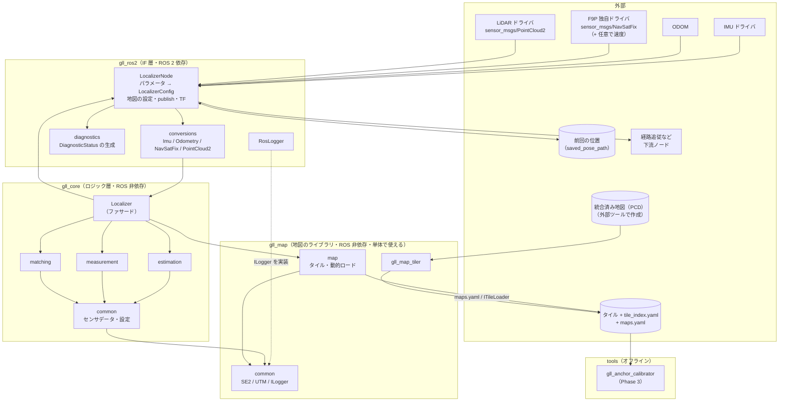

### 2.2 コア内部のコンポーネントとインターフェース

箱はパッケージ（中にクラス名）、六角形 `«interface»` はテストや差し替えのために抽象化した境界、点線はインターフェースの実装を表す。クラス単位の関係は 3 章のクラス図を参照。

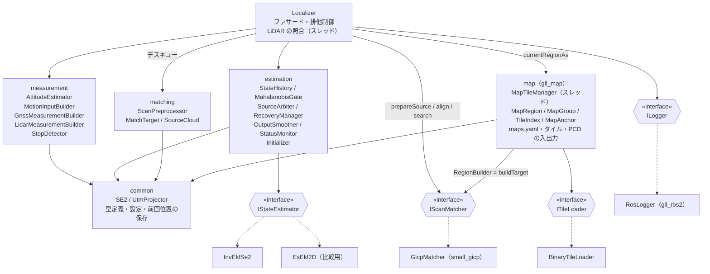

`IScanMatcher` とその入出力の型（`MatchTarget`、`SourceCloud`、`RegistrationResult`）は `matching`（`gll_core`）にある。`map` は `gll_map` パッケージで、`gll_core` の型を参照しない（v0.7）。`MapTileManager` は、読み込んだタイルから「領域」（`MapRegion`）を作る関数（`RegionBuilder`）を受け取る。`gll_core` は `MatchTarget` を `MapRegion` の派生にし、`IScanMatcher::buildTarget` を呼ぶ関数（`targetBuilder(matcher)`）を渡すので、領域がそのまま照合のターゲットになる。

### 2.3 コンポーネントの責務

| コンポーネント | 責務 | 主な依存 |
|---|---|---|
| `Localizer` | 外部 API の窓口。センサデータを受け取り、観測を作らせて推定器に渡し、出力を組み立てる。LiDAR のスキャンを専用スレッドで照合し（追跡・地図上での初期化・再位置推定の 3 つのモード）、結果を遅延観測として適用する。フィルタの状態の排他制御 | 全コンポーネント |
| `measurement` | センサデータを「推定器の入力（`MotionInput`）」と「観測（`Measurement`）」に変換する。採用判定（RTK-FIX、精度、停止、位置合わせの品質など）もここで行う | common, matching（`RegistrationResult`） |
| `estimation` | 推定アルゴリズム（Invariant EKF）、履歴と再伝播、外れ値ゲート、出力整形、状態監視、初期化。GNSS 優先の判断と LiDAR の食い違い判定（`SourceArbiter`）、再アンカー・再位置推定・`LOST` の判定（`RecoveryManager`） | common |
| `matching` | LiDAR の前処理（デスキュー・base_link への変換・クロップ）と、位置合わせのインターフェース。位置合わせ（GICP）、複数の初期値からの探索、品質指標（インライア率・overlap）の計算は `GicpMatcher` が行う | small_gicp, OpenMP, common |
| `map`（`gll_map`） | 地図グループとアンカー（maps.yaml）、タイルの索引とファイル、タイルのロードとアンロード、アクティブグループの決定、領域（`MapRegion`）の構築とダブルバッファ。点群地図のタイル化（`gll_map_tiler` の中身）と PCD の読み書き。単体でも使える（[map/README.md](../map/README.md)） | yaml-cpp, GeographicLib, small_gicp（任意。タイル化の共分散） |
| `common` | `gll_core`: センサデータと出力の型、設定、前回位置の保存と読み込み。`gll_map`: 基本の型と角度（`math.hpp`）、SE(2) 演算、測地変換、ロガーのインターフェース | Eigen, GeographicLib |
| `gll_ros2` | ROS メッセージ ⇔ コアの型の変換、パラメータの読み込み、地図の設定（maps.yaml）、publish、TF、診断、前回位置の定期保存 | rclcpp, gll_core |
| `tools` | `gll_map_tiler`（`gll_map`）: 統合済み地図（PCD）のタイル化（点ごとの共分散の事前計算を含む）。`gll_tile_demo`（`gll_map`）: タイル読み込みのデモの記録。`gll_anchor_calibrator`（Phase 3）: アンカーの較正 | gll_map |

---

## 3. クラス図

### 3.1 common（型・インターフェース）

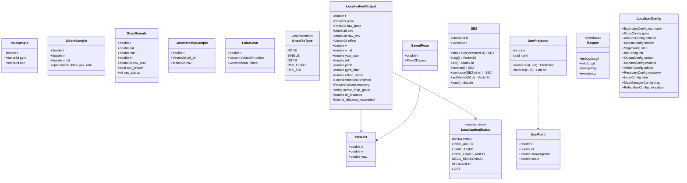

- `LidarScan` の `t` はスキャンの代表時刻（この時刻の base_link にデスキューする）、`times` は点ごとの `t` からの相対時刻 [s]（LiDAR ドライバが出さない場合は空で、そのときはデスキューしない）。`points` は LiDAR 座標系。
- `LocalizationOutput` の `dr_distance` は、最後に位置の観測（GNSS 位置・LiDAR 姿勢・再アンカー）を採用してから走った距離、`dr_distance_exceeded` はそれが `dr_error_distance` を超えたか（初期化の完了後だけ true になる）。IF 層はこれを見て diagnostics を ERROR にする（設計書 3.12 節）。
- `SavedPose` は `savePose` / `loadPose`（`pose_store.hpp`）で読み書きする 1 行のテキスト（`t x y yaw`）。一時ファイルに書いてから置き換えるので、書き込み中に電源が切れても前の内容が残る（設計書 3.11 節）。
- `LocalizerConfig` の各設定の既定値は設計書 8 章。ROS 2 ではパラメータから組み立てる（3.7 節）。

### 3.2 facade（Localizer）

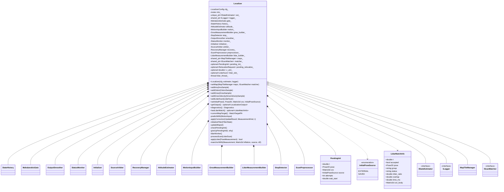

補足:

- `MatchTargetPtr` は `std::shared_ptr<const MatchTarget>` の別名（図の表記を単純にするため）。
- `setMap` は起動時に 1 回呼ぶ（地図を使わない場合は呼ばない）。重なっているグループがあれば WARN を出し（設計書 5.1 節）、`lidar.async` なら LiDAR のワーカースレッドを起こす。
- `addLidarScan` は、非同期ならスキャンを 1 枠のスロット（`lidar_slot_`）に入れてすぐ戻る。処理中に届いたスキャンは最新のものだけを残す（捨てた数は `lidar_dropped`）。
- `processScan` は、mutex を持って照合のモードと初期値を決め、mutex を放して位置合わせを行い、再び mutex を持って結果を適用する。モードは、地図上での初期化を待っていれば `INIT`、再位置推定の依頼があれば（または `LOST` の間の再試行の時刻なら）`RELOCALIZE`、それ以外は `TRACK`（4.2 節・4.3 節）。
- `z_utm_` は base_link の楕円体高。GNSS を採用したとき（アンテナの楕円体高とレバーアームから）と、LiDAR を採用したとき（位置合わせの結果の z）に更新し、照合の初期値の z に使う。無ければ地図の地面の高さ + `base_link_height` を使う。
- `checkPendingInit` は `getOutput` のたびに、地図上での初期化を `init_timeout` より長く待っていないかを確かめる。待ちすぎていれば `giveUpPendingInit` で、外部から与えた初期姿勢はそのまま使い、保存した位置は捨てて GNSS を待つ（設計書 3.11 節）。
- `Diagnostics` は入力数・採用数・棄却理由・照合の処理時間・地図の状態（`MapTileManager::Stats`）・地図グループごとのアンカーずれ（`MismatchStats`）をまとめた値型。`LidarMatchInfo` は直近の照合結果（`~/debug/lidar_pose` の出力用）。

### 3.3 estimation（推定）

#### 3.3.1 推定器と観測

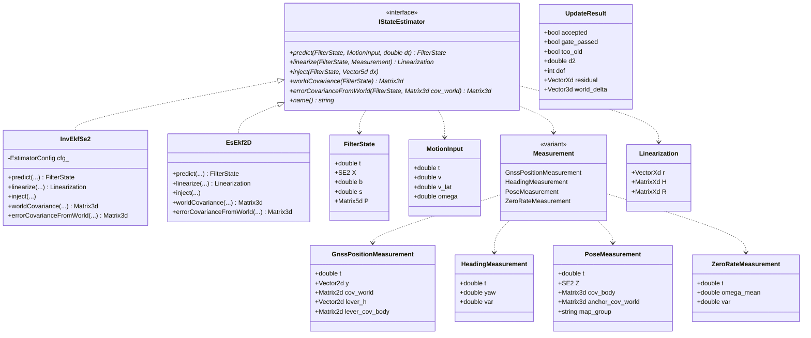

#### 3.3.2 履歴・ゲート・優先度・復帰

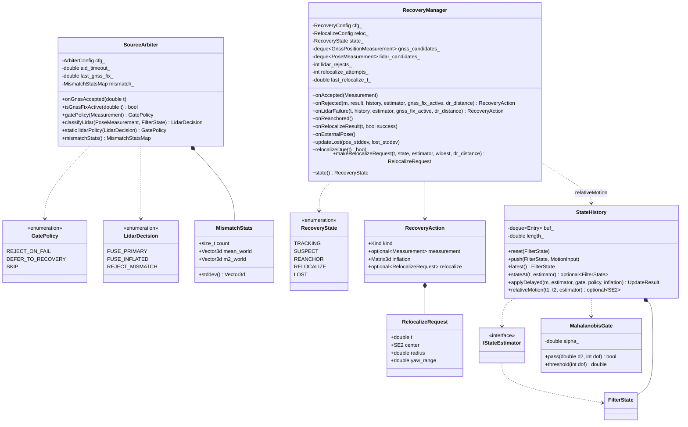

#### 3.3.3 出力整形・状態監視・初期化

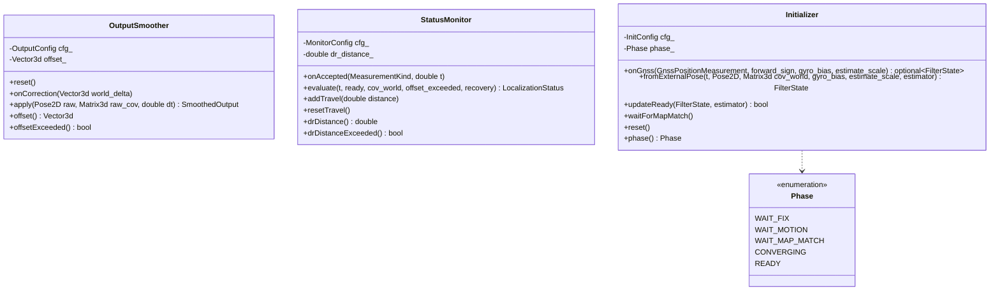

補足:

- `MismatchStatsMap` は `std::map<std::string, MismatchStats>` の別名。`MismatchStats` は平均と分散を逐次に（Welford の方法で）更新する。
- `GnssPositionMeasurement` の `lever_h` は、観測時刻の roll / pitch で水平面に射影したレバーアーム $`\tilde{\mathbf{l}}`$、`lever_cov_body` は roll / pitch の誤差による追加の共分散（設計書 3.6 節）。
- `OutputSmoother::apply` は、出力姿勢と、オフセットの分を加えた共分散 $`\Sigma_w + \mathbf{o}\mathbf{o}^\top`$ の組（`SmoothedOutput`）を返す（設計書 3.10 節）。
- `IStateEstimator` のメソッドはすべて `const` で、状態を持たない。`FilterState` は値型で、`StateHistory` がリングバッファ（既定 2 s）に保持する。`b` はジャイロの鉛直軸バイアス、`s` は ODOM 速度のスケール係数。
- `linearize` は `std::visit` で観測の型ごとに分岐する。Invariant EKF 版は設計書 3.5〜3.7 節の式（機体座標系の残差、定数の H）を実装する。観測更新（Joseph 形式）は推定器によらない共通の関数 `correct(estimator, state, linearization, policy, gate)` で、誤差の注入だけを `inject`（Invariant EKF では $`\hat X \leftarrow \hat X\,\mathrm{Exp}(\delta\xi)`$）で推定器に任せる。`UpdateResult::world_delta` は出力整形用の、世界座標系での移動量。
- `StateHistory::applyDelayed` は、観測を時刻 $`t_z`$ の状態に適用し、それ以降を保存した入力で再伝播する。`inflation` を与えると、更新の前に姿勢の誤差共分散に加える（再アンカー。`Localizer::reanchorWith` が `GatePolicy::SKIP` で呼ぶ）。
- `GatePolicy` は `SourceArbiter` が観測ごとに決める。RTK-FIX の GNSS は `DEFER_TO_RECOVERY`（ゲートで落ちたら再アンカーの候補にするだけ）。LiDAR は、先に `classifyLidar` で GNSS FIX 中かどうかと食い違いを判定し、`lidarPolicy` でゲートの扱いを決める（GNSS FIX 中に整合した LiDAR は固定閾値で判定済みなので `SKIP`、それ以外は `DEFER_TO_RECOVERY`）。
- `RecoveryManager` は設計書 3.13.5 節の状態遷移を持つ。棄却された観測を候補として溜め、各候補の「観測 − その時刻の推定値」が互いに一致するかを判定し（推定値がずれているなら、このずれはほぼ一定になる）、再アンカーを指示する（`RecoveryAction`）。LiDAR の棄却（ゲートと品質の条件の両方。品質で落ちたものは `onLidarFailure`）が `after_rejects` 回続けば、再位置推定を指示する（`RelocalizeRequest`）。探索の半径は、推定値の共分散の 3σ と、位置の観測なしで走った距離の `radius_per_dr_distance` 倍の大きい方を `[min_radius, max_radius]` に収めたもの（設計書 3.13.4 節）。
- `StatusMonitor` のデッドレコニング距離（設計書 3.12 節）: `Localizer` が予測のたびに `addTravel` で走行距離（$`\sqrt{(\hat s v)^2 + v_{\mathrm{lat}}^2}\,\Delta t`$）を足す。`onAccepted` が位置の観測（`GNSS_POSITION`、`POSE`）で 0 に戻し、フィルタの初期化と外部の初期姿勢では `resetTravel` で 0 に戻す。進行方位の観測と ZARU では戻さない。
- `Initializer` の `WAIT_MAP_MATCH` は、地図の近くで初期姿勢を与えられ、その周りでの位置合わせを待っている状態。この間は GNSS による初期化を行わない（設計書 3.11 節）。

### 3.4 measurement（センサデータ → 入力・観測）

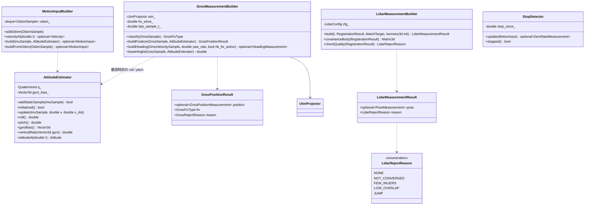

- `GnssMeasurementBuilder` は、RTK-FIX に入った時刻 `fix_since_` から安定待ちを数える。FIX でないメッセージが来たときに加えて、メッセージの間隔が `settle_reset_gap`（既定 3 s）を超えたとき（`last_sample_t_` との差で判定）も、安定待ちをやり直す（設計書 3.6 節、v0.9）。`baseHeight` は、アンテナの楕円体高からレバーアームの鉛直成分（roll / pitch で回したもの）を引いた、base_link の楕円体高（LiDAR の照合の z の初期値に使う）。
- `LidarMeasurementBuilder::build` は、品質の条件（収束・インライア率・overlap）と、照合の初期値からの移動量（`max_jump_xy` / `max_jump_yaw`）を確かめ、**ターゲットのグループのアンカー**（`MatchTarget::anchor`）で UTM の姿勢観測にする（設計書 5.5 節・6.2 節）。観測共分散は $`\kappa\,N_{\mathrm{in}}\,H^{-1}`$ の (x, y, yaw) の成分に下限を足したもの（`covarianceBody`、設計書 6.2 節）。

### 3.5 matching（スキャンマッチング）

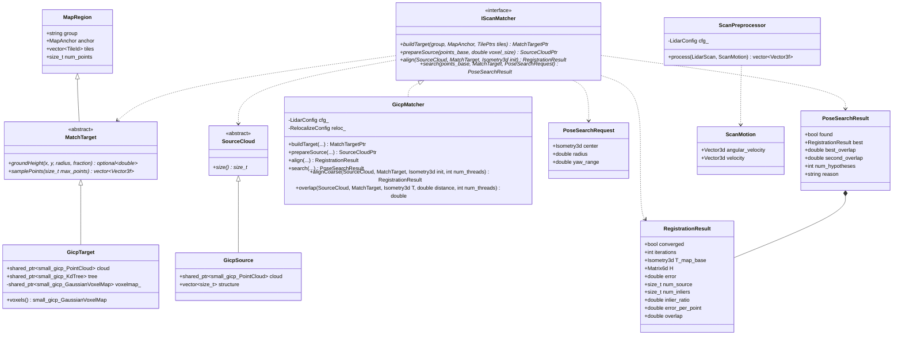

補足:

- `MatchTargetPtr` は `std::shared_ptr<const MatchTarget>`、`SourceCloudPtr` は `std::shared_ptr<const SourceCloud>`、`TilePtrs` は `std::vector<std::shared_ptr<const TileData>>`、`points_base` は base_link 座標系の点（`std::vector<Vector3f>`）。
- `GicpTarget` と `GicpSource` は `gicp_matcher.cpp` の中だけで定義し、small_gicp の型（図では `small_gicp_PointCloud` のように書いた）を外に出さない。`GicpMatcher` は受け取った `MatchTarget` / `SourceCloud` を `dynamic_cast` で自分の型に戻す（ほかの実装が作ったものなら例外）。
- `buildTarget` は、タイルの点と事前計算した共分散（タイル化のときに計算。設計書 6.2 節）を結合して KdTree を作る。粗い位置合わせ用のボクセル地図（VGICP）は、地図上での初期化と再位置推定のときだけ要るので、`voxels()` の初回に作る（`std::call_once`）。
- `prepareSource` は、スキャンを `source_voxel_size` で間引き、点ごとの共分散を計算する。あわせて、法線が鉛直に近くない点（壁・柱など、水平でない面の点）の添字を `structure` に覚えておく（overlap の計算に使う）。
- `align` は GICP（Levenberg–Marquardt、OpenMP で並列化）。`RegistrationResult::H` は機体座標系側の摂動（$`T \leftarrow T\,\mathrm{Exp}(\delta)`$。$`\delta`$ の並びは回転 3 → 並進 3）の情報行列で、観測共分散の計算に使う。`overlap` は、位置合わせ後のスキャンの点のうち `overlap_distance` 以内に地図の点があるものの割合（`structure` の点で数える。設計書 6.2 節）。
- `search` は、探索の中心の周りに位置の格子 × yaw の初期値を並べ、粗い位置合わせ（`alignCoarse`、初期値ごとに並列）→ 上位の候補を GICP で詰める → 最良と次点（十分離れた解）の overlap の比で一意性を確かめる（設計書 6.4 節）。
- `ScanPreprocessor::process` は、点ごとの時刻と `ScanMotion`（バイアス補正済みのジャイロと ODOM の速度。スキャンの間は一定とみなす）から、各点をスキャン時刻の base_link 座標系に移す（SE(3) の指数写像による回転と並進の補正。設計書 6.1 節）。その後、距離と箱でクロップする。

### 3.6 map（地図管理）

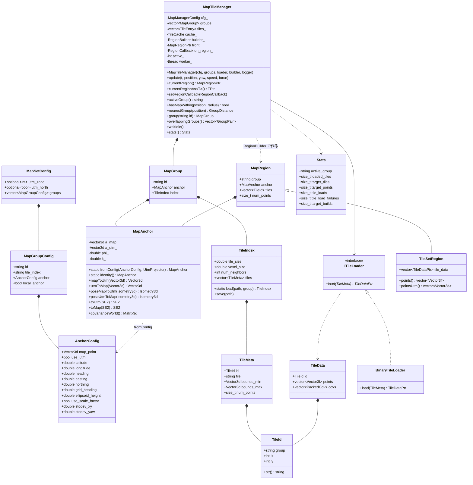

関数（クラスに属さないもの）:

| 関数 | ヘッダ | 内容 |
|---|---|---|
| `loadMapSetConfig(path)` | `map_config.hpp` | maps.yaml を読む（相対パスは maps.yaml のディレクトリから解決。ID の重複を検出） |
| `loadMapGroups(MapSetConfig, UtmProjector)` | `map_config.hpp` | 各グループのアンカーを作り、tile_index.yaml を読んで `MapGroup` の一覧にする |
| `writeTileFile` / `readTileFile` | `tile.hpp` | タイルファイル（独自のバイナリ形式。設計書 5.2 節）の読み書き |
| `tileMap(points, TilerOptions, group)` / `writeTiles(dir, TilerResult)` | `map_tiler.hpp` | 点群を間引き（`voxelDownsample`）、点ごとの共分散を付けて（small_gicp があるとき）タイルに分け、ファイルに書く（`gll_map_tiler` の中身） |
| `buildTileSetRegion(group, anchor, tiles)` | `map_region.hpp` | 既定の `RegionBuilder`（読み込んだタイルを並べるだけの `TileSetRegion`） |
| `readPcd(path)` / `writePcd(path, points, format)` | `pcd_io.hpp` | PCD（ascii / binary / binary_compressed）の読み書き。PCL には依存しない |

補足:

- `TileCache` は `std::map<std::size_t, TileDataPtr>`（キーは全グループのタイルの通し番号）、`TileDataPtr` は `std::shared_ptr<const TileData>`、`GroupPair` は `std::pair<std::string, std::string>`、`GroupDistance` は（グループ ID, 距離）の組、`Stats` は `MapTileManager::Stats` の別名。`PackedCov` は点ごとの共分散の上三角 6 要素（float）。`MapRegionPtr` は `std::shared_ptr<const MapRegion>`、`RegionBuilder` は（グループ ID、アンカー、読み込み済みタイル）から領域を作る `std::function`、`RegionCallback` は領域が差し替わったときに呼ぶ `std::function`。
- この節のクラスと関数はすべて `gll_map`（`map/`）にある（v0.7）。`gll_core` の `MatchTarget` は `MapRegion` の派生で、`Localizer` は `currentRegionAs<MatchTarget>()` で照合のターゲットを受け取る。
- `TileId` は（グループ ID, ix, iy）の組。タイルの番号はグループの中でしか一意でないため、グループ ID を含める（設計書 5.2 節、v0.9）。
- `MapAnchor` は、地図グループの座標系 ⇔ map（UTM）の相似変換（回転 $`\varphi`$、縮尺 $`k`$）。緯度経度・方位で与える、UTM で直接与える、`anchor: local`（地図の座標をそのまま出力する）の 3 通りの与え方がある（設計書 4.2 節）。
- `overlappingGroups` は、起動時にグループどうしのタイルの範囲（UTM での四隅）の重なりを調べる。重なりがあれば `Localizer::setMap` が WARN を出す（運用上の前提では重ならない。設計書 5.1 節）。
- `update` は `update_distance`（既定 1 m）以上動いたか `update_interval`（既定 1 s）以上たったときだけ見直す。**アクティブグループ**は**現在位置**（先読みを含まない）から決める。各グループのタイルまでの距離が `load_radius` 以内のグループのうち最も近いものとし、今のグループより `group_switch_margin`（既定 10 m）以上近いグループが現れたときだけ切り替える（設計書 5.5 節）。**必要なタイル**は、現在位置と先読みした位置（`lookahead_time` 秒先）のどちらかから `load_radius` 以内のもの（全グループ。次に入るグループのタイルも前もって読んでおく）。
- `update` は、必要なタイルかアクティブグループが変わったときだけワーカーに通知してすぐ戻る。ワーカーは不足しているタイルを読み込み、現在位置から `unload_radius` より遠いタイルを捨て、アクティブグループのロード済みタイルだけで `RegionBuilder` を呼んで新しい領域を作る（`gll_core` では `IScanMatcher::buildTarget`）。点が `min_target_points` 未満の領域は使わない。完成したら `front_` を差し替え（ダブルバッファ）、`RegionCallback` があれば呼ぶ。
- 照合中のスレッドは `shared_ptr` でターゲットを保持しているので、差し替えの影響を受けない。照合の結果は、そのターゲットが持つアンカー（`MatchTarget::anchor`）で UTM に変換する。`activeGroup()` は照合の途中で切り替わりうるので使わない（設計書 5.5 節、v0.9）。

### 3.7 gll_ros2（IF 層）

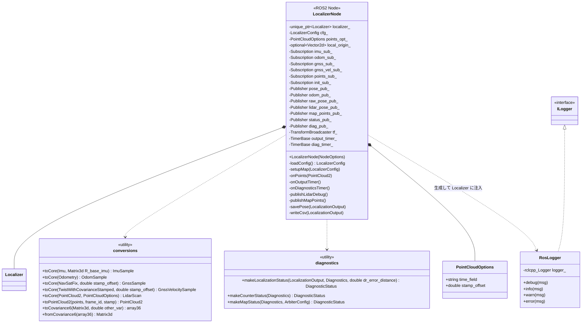

- `conversions` と `diagnostics` は、`conversions.hpp` / `diagnostics.hpp` の自由関数の集まり（図では `<<utility>>` のクラスとして書いた）。`array36` は `std::array<double, 36>`。
- IMU・ODOM・GNSS・初期姿勢のコールバックは、コンストラクタの中のラムダで書いている（変換して `Localizer` に渡すだけ）。
- `setupMap` は `map.config_path` の maps.yaml を `loadMapSetConfig` / `loadMapGroups` で読み、`MapTileManager`（`BinaryTileLoader`、`targetBuilder(GicpMatcher)`）を作って `Localizer::setMap` に渡す。maps.yaml の UTM ゾーンが GNSS の設定と違えば起動を止める。可視化用の `map_local` の原点を指定していなければ、最初のグループのアンカー付近（100 m 単位に丸める）にする。
- `toCore(PointCloud2, PointCloudOptions)` は、点ごとの時刻のフィールドを自動で判別する（`time` / `t` / `timestamp` / `time_stamp` / `offset_time`。単位は型と値の大きさから決める。設計書 6.1 節）。最初のスキャンで、使ったフィールドをログに出す。
- `makeLocalizationStatus` は、`LocalizationOutput` から `DiagnosticStatus` を作る（設計書 3.12 節）。状態からレベルを決め（`DEGRADED` と `INITIALIZING` は WARN、`LOST` は ERROR）、`dr_distance_exceeded` のときは状態にかかわらず ERROR にして、メッセージに `dead reckoning for <距離> m without GNSS / LiDAR position (limit <上限> m)` を付ける。`makeMapStatus` は、アクティブグループとロード済みタイルを出し、地図グループのアンカーずれ（GNSS FIX 中の LiDAR との差の平均）が閾値を超えたら WARN「anchor of map group ... needs calibration」、タイルの読み込みに失敗していても WARN にする。ROS に依存するのはメッセージ型だけなので、単体テスト（`test_diagnostics`）で条件を確かめている。
- `savePose` は、出力が `INITIALIZING` / `LOST` でなければ `init.save_interval`（既定 1 s）ごとに、フィルタの推定値を `init.saved_pose_path` に保存する。デストラクタでも保存する。起動時に `init.use_saved_pose` なら読み込んで、`InitialPoseSource::SAVED` として `setInitialPose` に渡す。
- `ExtrinsicsLoader`（TF から取り付け位置を読む）は未実装。IMU の取り付け回転、アンテナのレバーアーム、LiDAR の取り付け位置と回転はパラメータで与える。

ROS 1 版（`gll_ros1`）は、この図の `rclcpp` を `roscpp` に置き換えた同じ構成になる。`Localizer` から下は共通である。

---

## 4. 主要な処理の流れ

### 4.1 IMU 受信（予測）と GNSS 受信（更新）

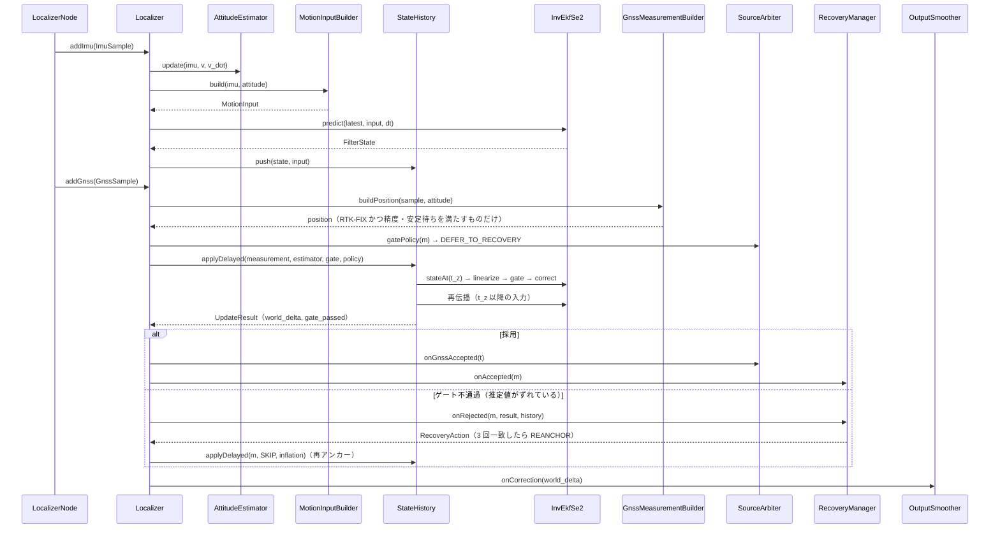

### 4.2 LiDAR 受信（追跡: 非同期の位置合わせ → 遅延観測）

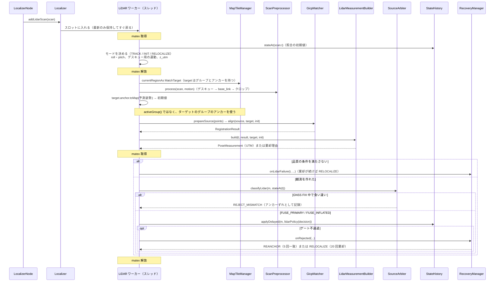

### 4.3 地図上での初期化と再位置推定

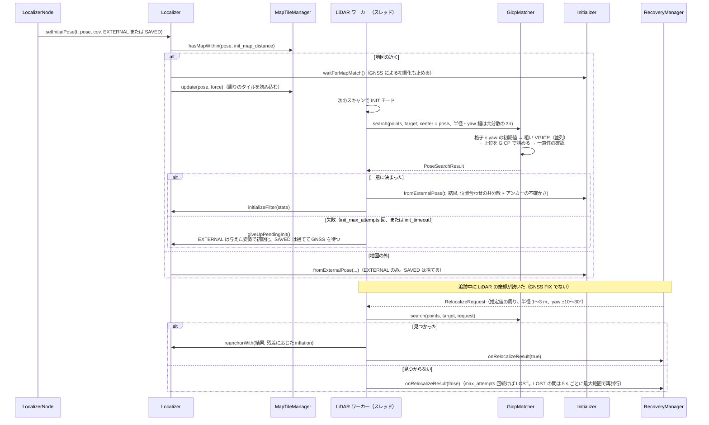

### 4.4 地図タイルの更新

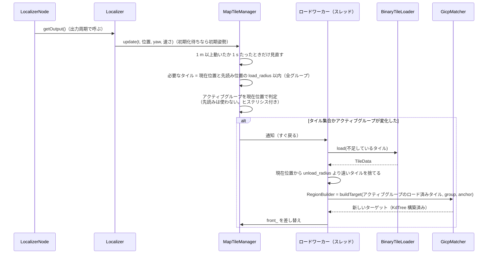

---

## 5. ディレクトリとクラスの対応

| ディレクトリ | クラス / ファイル |
|---|---|
| `core/include/gll/common/` | `types.hpp`（センサデータ・出力の型）、`config.hpp`（`LocalizerConfig`）、`pose_store.hpp`（`SavedPose`、`savePose`、`loadPose`）。SE(2)・測地変換・ロガーは gll_map の `gll/common/` |
| `core/include/gll/estimation/` | `state.hpp`（`FilterState`、`MotionInput`、`Measurement`、`UpdateResult`）、`state_estimator.hpp`（`IStateEstimator`、`correct`）、`inv_ekf_se2.hpp`、`es_ekf_2d.hpp`、`state_history.hpp`、`mahalanobis_gate.hpp`、`output_smoother.hpp`、`status_monitor.hpp`、`initializer.hpp`、`source_arbiter.hpp`、`recovery_manager.hpp` |
| `core/include/gll/measurement/` | `attitude_estimator.hpp`、`motion_input_builder.hpp`、`gnss_measurement_builder.hpp`、`lidar_measurement_builder.hpp`、`stop_detector.hpp` |
| `core/include/gll/matching/` | `scan_matcher.hpp`（`IScanMatcher`、`MatchTarget`、`SourceCloud`、`RegistrationResult`、`PoseSearchRequest`、`PoseSearchResult`）、`gicp_matcher.hpp`（`GicpMatcher`）、`scan_preprocessor.hpp`（`ScanPreprocessor`、`ScanMotion`） |
| `map/include/gll/map/`（gll_map） | `map_anchor.hpp`（`AnchorConfig`、`MapAnchor`）、`map_config.hpp`（`MapSetConfig`、`MapGroup`、`loadMapGroups`）、`tile.hpp`（`TileId`、`TileMeta`、`TileData`、`TileIndex`、`ITileLoader`、`BinaryTileLoader`）、`map_region.hpp`（`MapRegion`、`TileSetRegion`、`RegionBuilder`）、`map_manager_config.hpp`、`map_tile_manager.hpp`、`map_tiler.hpp`（`tileMap`、`writeTiles`、`voxelDownsample`）、`pcd_io.hpp` |
| `map/include/gll/common/`（gll_map） | `math.hpp`（基本の型・角度・`Pose2D`）、`se2.hpp`（`SE2`）、`geodesy.hpp`（`UtmProjector`）、`logger.hpp`（`ILogger`） |
| `map/tools/`・`map/examples/`・`map/test/` | `gll_map_tiler`、`gll_tile_demo`、`find_package(gll_map)` で使う例、gll_map の単体テスト |
| `core/include/gll/` | `localizer.hpp`（`Localizer`、`Diagnostics`、`LidarMatchInfo`） |
| `core/src/` | 上のヘッダの実装。small_gicp を使うのは `gicp_matcher.cpp` と `map_tiler.cpp` だけ |
| `core/test/` | 単体テストと統合シミュレーション（`sim_world.hpp` の合成環境へのレイキャストで LiDAR を模擬し、`lidar_sim.hpp` で Localizer 全体を動かす） |
| `ros2/gll_ros2/` | `localizer_node.cpp`（`LocalizerNode`、`RosLogger`）、`conversions.cpp`（メッセージ ⇔ コアの型）、`diagnostics.cpp`（`DiagnosticStatus` の生成）、`main.cpp`、`config/localizer.yaml`、`launch/localizer.launch.py` |
| `tools/anchor_calibrator/` | `gll_anchor_calibrator`（Phase 3） |
| `tools/i2nav/` | i2Nav-Robot の変換・事前確認・アンカー決定・真値の位置合わせ・障害注入・評価のスクリプト（[検証計画](./validation_i2nav.md)） |
| `docker/` | `Dockerfile`（`dev` / `runtime` ステージ）、`compose.yaml`（設計書 7.8 節） |
| `.devcontainer/` | VS Code 用の設定（任意） |
| `.github/workflows/` | CI（Docker の `dev` ステージでの colcon ビルドと単体テスト、ROS なしでのコア単体のビルドとテスト） |

## 6. 実装の範囲

| Phase | 実装したクラス |
|---|---|
| 1 | **common**: 全クラス（前回位置の保存を除く）。**estimation**: `IStateEstimator`、`InvEkfSe2`、`EsEkf2D`（比較用）、`StateHistory`、`MahalanobisGate`、`OutputSmoother`、`StatusMonitor`（デッドレコニング距離の監視を含む）、`Initializer`（GNSS 区間の初期化と外部の初期姿勢）、`SourceArbiter`（GNSS 部分）、`RecoveryManager`（GNSS の再アンカーと `LOST` の判定）。**measurement**: `AttitudeEstimator`、`MotionInputBuilder`、`GnssMeasurementBuilder`、`StopDetector`。**facade**: `Localizer`。**gll_ros2**: LiDAR 以外 |
| 2 | **matching**: `IScanMatcher`、`GicpMatcher`、`ScanPreprocessor`。**map**: `MapAnchor`、maps.yaml と tile_index.yaml の読み込み、タイルファイル、`MapTileManager`、タイル化（`tileMap`）、PCD の入出力。**measurement**: `LidarMeasurementBuilder`。**estimation**: `SourceArbiter` / `RecoveryManager` の LiDAR 部分（食い違い判定、アンカーずれの記録、LiDAR の再アンカー、再位置推定）、`Initializer` の `WAIT_MAP_MATCH`。**facade**: `Localizer` の LiDAR の照合（追跡・地図上での初期化・再位置推定）。**common**: 前回位置の保存。**tools**: `gll_map_tiler`。**gll_ros2**: PointCloud2 の入力、`~/debug/lidar_pose`・`~/debug/map_points`、地図の診断、前回位置の保存 |
| 2 の後（v0.7） | 地図の部分（タイル、動的ロード、アンカー、maps.yaml、PCD、タイル化）と基本の型・SE(2)・測地変換・ロガーを、単体で使えるライブラリ `gll_map` に切り出した。`MapTileManager` の出力を、差し替えられる `RegionBuilder` で作る `MapRegion` にした |
| 3（予定） | `gll_anchor_calibrator`、実データでのパラメータ調整に合わせた修正 |
