# ソフトウェア構成: コンポーネント図・クラス図

- 関連文書: [要件定義](./requirements.md) / [設計書](./design.md)（v0.5）
- 状態: ドラフト（v0.3。設計書 v0.5 の GNSS 入力 `sensor_msgs/NavSatFix` を反映）

本書は、設計書 7 章のアーキテクチャを、実装に入れる粒度のコンポーネント図・クラス図に落としたものである。クラス名・メソッド名は実装時の名前の案で、引数や戻り値の細部は実装時に調整する。

---

## 1. 構成の原則

| 原則 | 内容 |
|---|---|
| 依存の方向 | `ros2`（IF 層） → `core`（ロジック層）の一方向だけ。`core` は ROS のヘッダ・型・時刻・ログ・パラメータを一切参照しない |
| 時刻 | `core` 内の時刻はすべて、データに付いたタイムスタンプ（`double` 秒）で扱う。システム時計は参照しない |
| 外部への口 | `core` が外部に依存する箇所は、インターフェース（`ILogger`、`ITileLoader`、`IScanMatcher`、`IStateEstimator`）で抽象化し、テストで差し替えられるようにする |
| 推定器は状態を持たない | `IStateEstimator` は `FilterState` を受け取って返す純粋関数の集まりにする。状態は `StateHistory` が保持するので、遅延観測の再伝播（replay）が簡単になる |
| 観測はデータ型 | 観測は `std::variant` のデータ型（`Measurement`）で表す。線形化（残差・H・R の計算）は推定器側で行う。Invariant EKF と ESEKF で誤差の定義が異なり、H も変わるため |
| スレッド | `core` が持つスレッドはスキャンマッチング用と地図ロード用の 2 本だけ。フィルタの状態は `Localizer` 内の 1 つの mutex で保護する |

---

## 2. コンポーネント図

### 2.1 全体

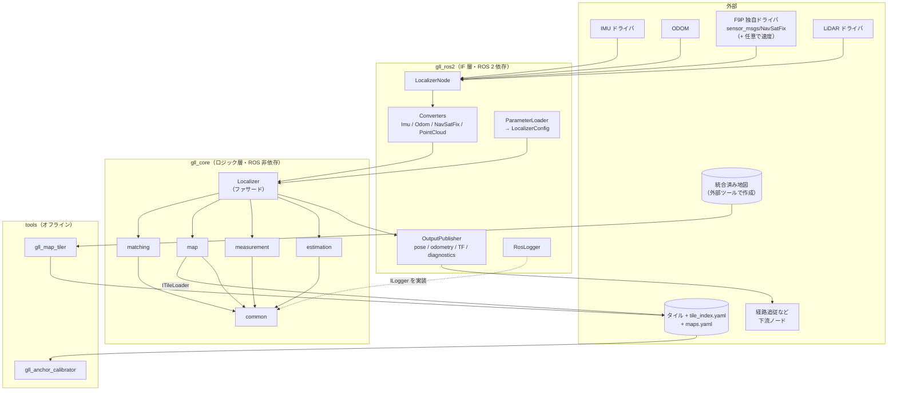

### 2.2 コア内部のコンポーネントとインターフェース

箱はパッケージ（中にクラス名）、六角形 `«interface»` はテストや差し替えのために抽象化した境界、点線はインターフェースの実装を表す。クラス単位の関係は 3 章のクラス図を参照。

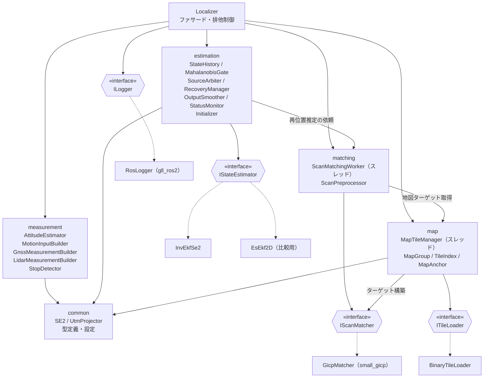

### 2.3 コンポーネントの責務

| コンポーネント | 責務 | 主な依存 |
|---|---|---|
| `Localizer` | 外部 API の窓口。センサデータを受け取り、観測を作らせて推定器に渡し、出力を組み立てる。フィルタの状態の排他制御 | 全コンポーネント |
| `measurement` | センサデータを「推定器の入力（`MotionInput`）」と「観測（`Measurement`）」に変換する。採用判定（RTK-FIX、精度、停止など）もここで行う | common |
| `estimation` | 推定アルゴリズム（Invariant EKF）、履歴と再伝播、外れ値ゲート、出力整形、状態監視、初期化。GNSS 優先の判断と LiDAR の食い違い判定（`SourceArbiter`）、再アンカー・再位置推定の状態遷移（`RecoveryManager`） | common |
| `matching` | LiDAR の前処理と位置合わせ。専用スレッドで非同期に実行する | small_gicp, common |
| `map` | 地図グループとアンカー、タイルのロードとアンロード、位置合わせのターゲットの構築とダブルバッファ | common, matching（ターゲット構築） |
| `common` | 型、設定、SE(2) 演算、測地変換、ロガーのインターフェース | Eigen, GeographicLib |
| `gll_ros2` | ROS メッセージ ↔ コアの型の変換、パラメータの読み込み、publish、TF、診断 | rclcpp, gll_core |
| `tools` | 統合済み地図のタイル化（点ごとの共分散の事前計算を含む）、アンカーの較正 | PCL, small_gicp, gll_core |

---

## 3. クラス図

### 3.1 common（型・インターフェース）

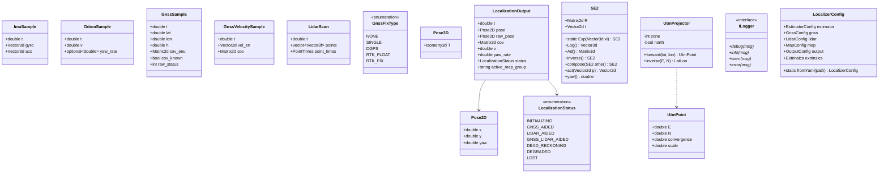

`PointTimes` は `std::vector<float>` の別名（点ごとの時刻。LiDAR ドライバが出さない場合は空）。

### 3.2 facade（Localizer）

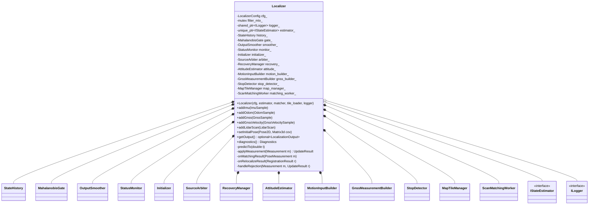

### 3.3 estimation（推定）

#### 3.3.1 推定器と観測

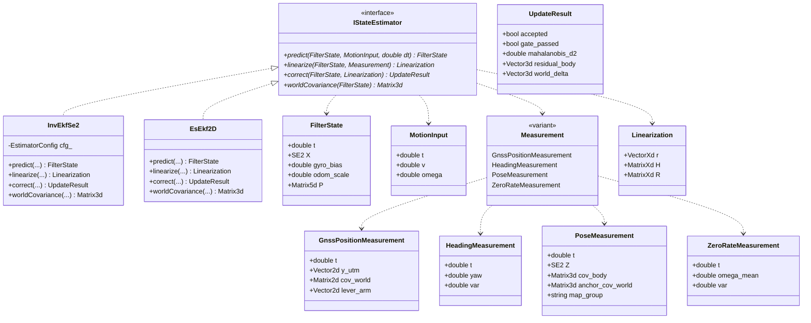

#### 3.3.2 履歴・ゲート・優先度・復帰

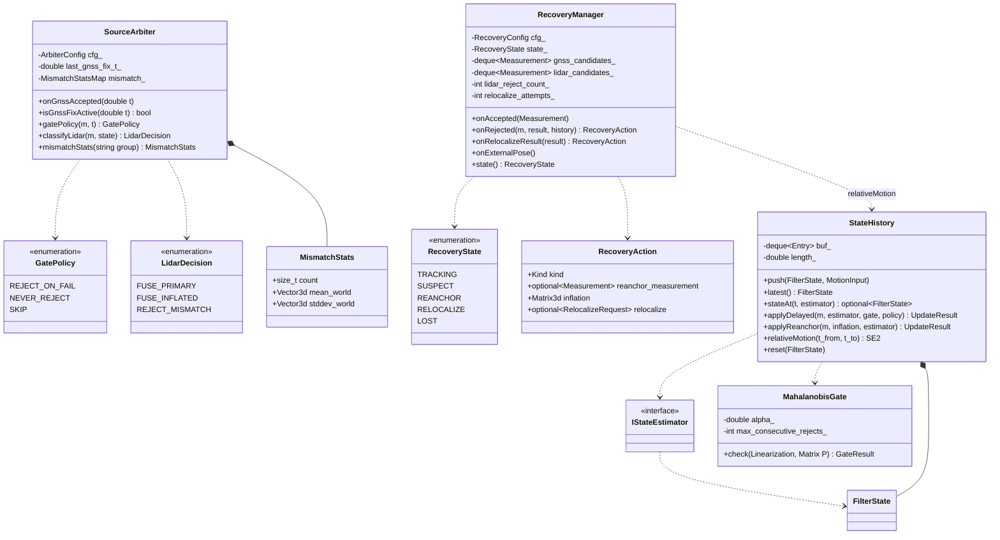

#### 3.3.3 出力整形・状態監視・初期化

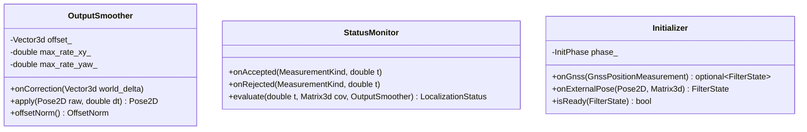

補足:

- `MismatchStatsMap` は `std::map<std::string, MismatchStats>`、`OffsetNorm` は（並進 [m], yaw [rad]）の組の別名。
- `IStateEstimator` のメソッドはすべて `const` で、状態を持たない。`FilterState` は値型で、`StateHistory` がリングバッファ（既定 2 s）に保持する。
- `linearize` は `std::visit` で観測の型ごとに分岐する。Invariant EKF 版は設計書 3.5〜3.7 節の式（機体座標系の残差、定数の H）を実装する。
- `GatePolicy` は `SourceArbiter` が観測ごとに決める。RTK-FIX の GNSS は `NEVER_REJECT`（ゲートで落ちたら再アンカーの候補にするだけ）。GNSS FIX 中の LiDAR は、`classifyLidar` による固定閾値の判定を先に行う。
- `RecoveryManager` は設計書 3.13.5 節の状態遷移を持つ。棄却された観測を候補として溜め、`StateHistory::relativeMotion` で最新時刻にそろえて互いに一致するかを判定し、再アンカーや再位置推定を指示する（`RecoveryAction`）。実際の更新は `Localizer` が `StateHistory::applyReanchor` で行う。
- `correct` は注入（$`\hat X \leftarrow \hat X\,\mathrm{Exp}(\delta\xi)`$）と Joseph 形式の共分散更新を行い、出力整形用に世界座標系での移動量 `world_delta` を返す。

### 3.4 measurement（センサデータ → 入力・観測）

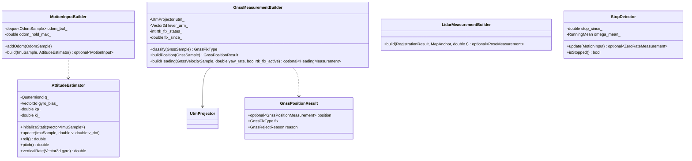

### 3.5 matching（スキャンマッチング）

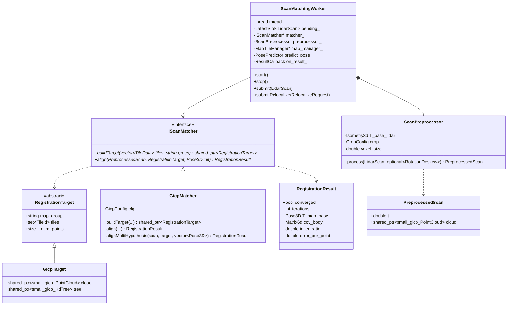

補足:

- `PosePredictor` は `std::function<Pose3D(double)>`、`ResultCallback` は `std::function<void(PoseMeasurement)>` の別名（図の表記を単純にするための型エイリアス）。
- `ScanMatchingWorker` は最新のスキャンだけを保持する（`LatestSlot`。処理中に届いた古いスキャンは捨てる）。
- 初期値は `predict_pose_`（`Localizer` が `StateHistory` からスキャン時刻の予測姿勢を返すコールバック）で取得する。結果は `on_result_` で `Localizer` に戻し、遅延観測として適用する。
- `GicpMatcher` の中に small_gicp の型を閉じ込める。ほかのクラスは `RegistrationTarget` / `PreprocessedScan` を通してだけ扱う。
- `PreprocessedScan` は現状 small_gicp の点群を持っているので、完全には抽象化できていない。ほかのマッチャに差し替えるときに抽象化する。

### 3.6 map（地図管理）

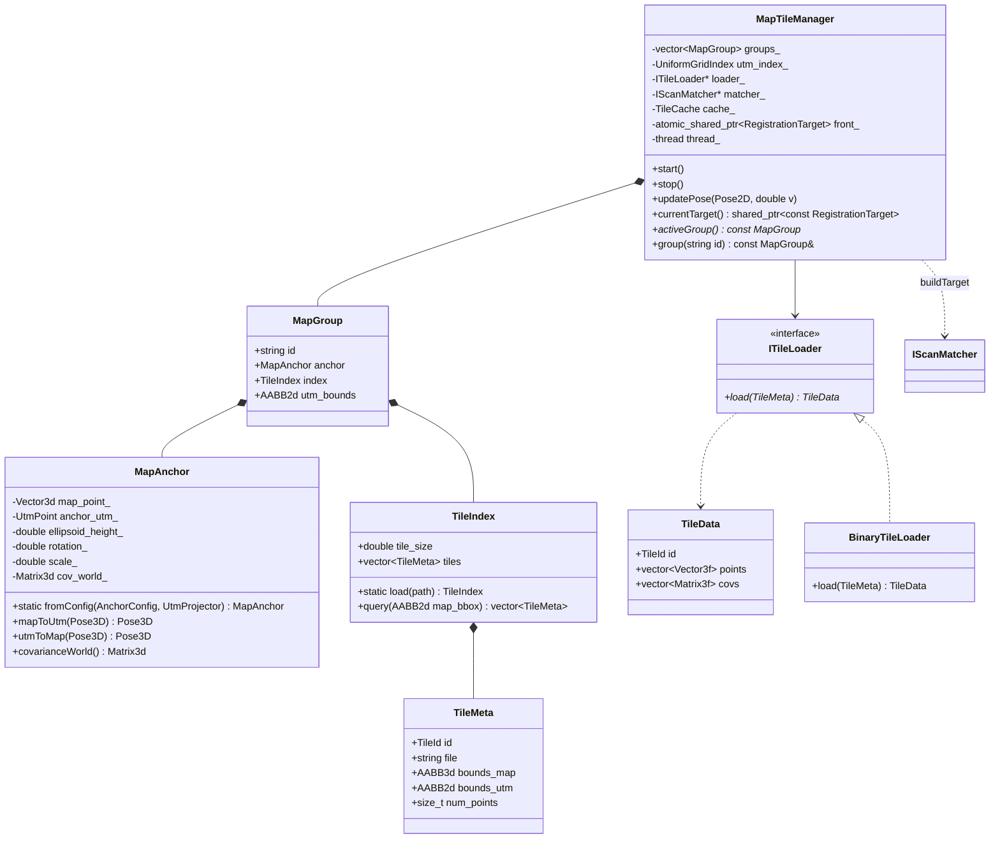

補足:

- `TileCache` は `std::map<TileId, TileData>` の別名。
- `updatePose` は呼び出し側のスレッドで要求中心と必要なタイル集合を計算し、変化があればワーカーに通知するだけにする（すぐに戻る）。
- ワーカーはタイルを読み込み、`IScanMatcher::buildTarget` で新しいターゲットを作る。完成したら `front_` をアトミックに差し替える（ダブルバッファ）。
- 位置合わせ中のスレッドは `shared_ptr` でターゲットを保持しているので、差し替えの影響を受けない。

### 3.7 gll_ros2（IF 層）

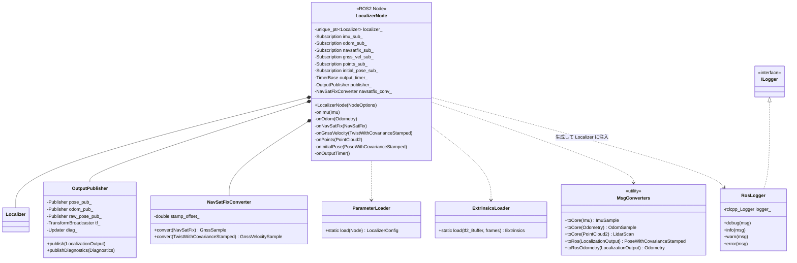

ROS 1 版（`gll_ros1`）は、この図の `rclcpp` を `roscpp` に置き換えた同じ構成になる。`Localizer` から下は共通である。

---

## 4. 主要な処理の流れ

### 4.1 IMU 受信（予測）と GNSS 受信（更新）

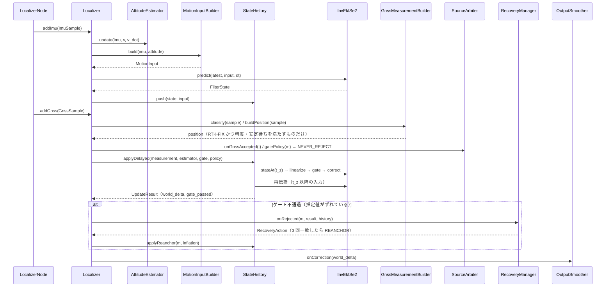

### 4.2 LiDAR 受信（非同期の位置合わせ → 遅延観測）

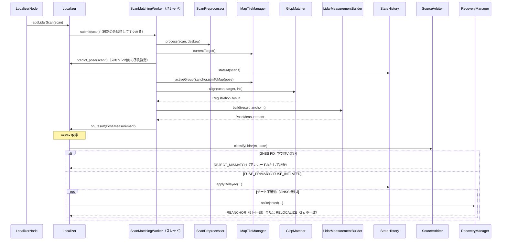

### 4.3 地図タイルの更新

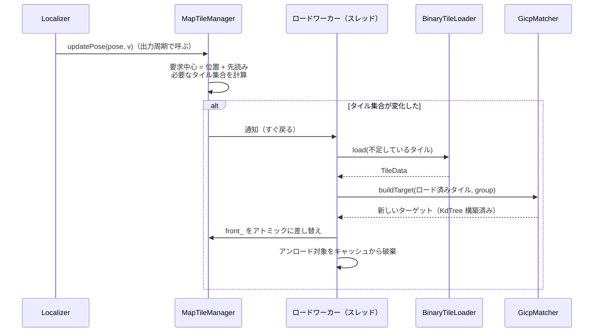

---

## 5. ディレクトリとクラスの対応

| ディレクトリ | クラス / ファイル |
|---|---|
| `core/include/gll/common/` | `types.hpp`（センサデータ・出力の型）、`se2.hpp`（`SE2`）、`geodesy.hpp`（`UtmProjector`）、`logger.hpp`（`ILogger`）、`config.hpp`（`LocalizerConfig`） |
| `core/include/gll/estimation/` | `state_estimator.hpp`（`IStateEstimator`、`FilterState`、`Measurement`）、`inv_ekf_se2.hpp`、`es_ekf_2d.hpp`、`state_history.hpp`、`mahalanobis_gate.hpp`、`output_smoother.hpp`、`status_monitor.hpp`、`initializer.hpp`、`source_arbiter.hpp`、`recovery_manager.hpp` |
| `core/include/gll/measurement/` | `attitude_estimator.hpp`、`motion_input_builder.hpp`、`gnss_measurement_builder.hpp`、`lidar_measurement_builder.hpp`、`stop_detector.hpp` |
| `core/include/gll/matching/` | `scan_matcher.hpp`（`IScanMatcher`、`RegistrationTarget`、`RegistrationResult`）、`gicp_matcher.hpp`、`scan_preprocessor.hpp`、`scan_matching_worker.hpp` |
| `core/include/gll/map/` | `map_anchor.hpp`、`map_group.hpp`（`MapGroup`、`TileIndex`、`TileMeta`）、`tile_loader.hpp`（`ITileLoader`、`BinaryTileLoader`、`TileData`）、`map_tile_manager.hpp` |
| `core/include/gll/` | `localizer.hpp`（`Localizer`） |
| `ros2/gll_ros2/` | `localizer_node.cpp`、`parameter_loader.cpp`、`extrinsics_loader.cpp`、`ros_logger.hpp`、`navsatfix_converter.cpp`、`msg_converters.cpp`、`output_publisher.cpp` |
| `tools/map_tiler/` | `gll_map_tiler`（統合済み地図 → タイル + 点ごとの共分散） |
| `tools/anchor_calibrator/` | `gll_anchor_calibrator` |

## 6. Phase 1 で実装する範囲

設計書 10 章の Phase 1 に対応して、次のクラスを実装する。

- **common**: 全クラス
- **estimation**: `IStateEstimator`、`InvEkfSe2`、`EsEkf2D`（比較用）、`StateHistory`、`MahalanobisGate`、`OutputSmoother`、`StatusMonitor`、`Initializer`（GNSS 区間の初期化のみ）、`SourceArbiter`（GNSS 部分）、`RecoveryManager`（GNSS の再アンカーと `LOST` の判定）
- **measurement**: `AttitudeEstimator`、`MotionInputBuilder`、`GnssMeasurementBuilder`、`StopDetector`
- **facade**: `Localizer`（LiDAR / 地図関連のメンバは空の実装にしておく）
- **gll_ros2**: LiDAR 以外の全クラス

`matching` と `map`、`LidarMeasurementBuilder`、`tools`、`SourceArbiter` / `RecoveryManager` の LiDAR 部分（食い違い判定、LiDAR の再アンカー、再位置推定）は Phase 2 で実装する。
