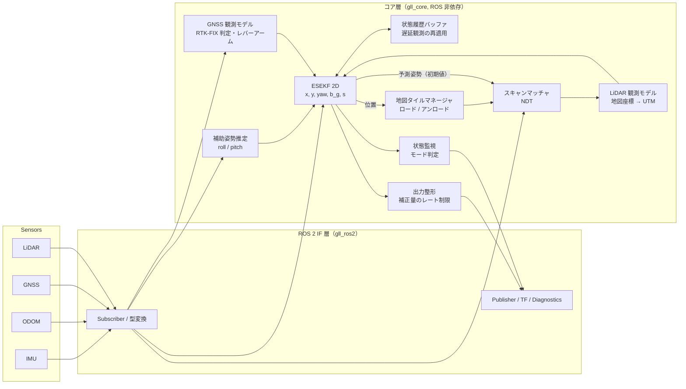
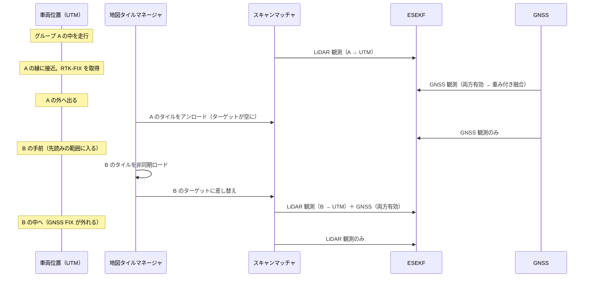
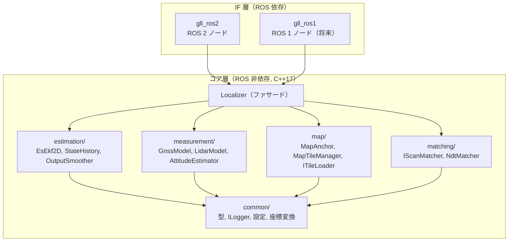

# 設計書: GNSS / LiDAR 統合自己位置推定

- 関連文書: [要件定義](./requirements.md)
- 状態: ドラフト（v0.1）

---

## 1. 設計方針のまとめ

| # | 論点 | 決定 | 主な理由 |
|---|---|---|---|
| D-1 | 推定器の構成（要件③） | **単一の推定器で全センサを融合する**（推定器の切り替えは行わない） | 出力の連続性（FR-4）を構造的に確保しやすい。GNSS と LiDAR が同時に有効な区間では両方を重み付きで使える |
| D-2 | 推定アルゴリズム | **Error-State EKF（ESEKF）** | 計算が軽く決定的で、ROS に依存しない形で実装しやすい。将来の 3D 化（姿勢を SO(3) で扱う 15 状態 INS）へそのまま拡張できる |
| D-3 | 状態の自由度 | **Phase 1 は平面 2D（x, y, yaw）+ バイアス類**。roll / pitch / z はフィルタ外の補助推定で扱う | 出力要件が x, y, yaw のため。3D 化は Phase 4 の拡張として設計上の余地を残す（3.2 節） |
| D-4 | 推定器の座標系 | **状態は常に UTM**（地図座標系ではない） | 地図を切り替えても状態の座標系が変わらないため、地図の切り替えが「観測の座標変換の切り替え」に帰着し、状態は飛ばない |
| D-5 | スキャンマッチング | **NDT（タイル単位で追加・削除できる実装）** | 地図タイルの動的な追加・削除と相性がよく、実績も多い。インターフェースを抽象化し、GICP 系にも差し替えられるようにする |
| D-6 | 地図の単位（要件④） | 直接つながる地図群は**1 つの「地図グループ」として統合**し、タイル分割して動的ロードする。GNSS 区間で隔てられた地図は別グループとし、それぞれのアンカーで UTM に固定する | アンカーを地図間で連鎖させることによる誤差の蓄積を避ける |
| D-7 | 地図の読み込みタイミング | **UTM 上の位置と先読み距離から必要なタイルを決め、バックグラウンドでロードしてダブルバッファで差し替える** | 状態が UTM で表されているため、どのグループのタイルが必要かも UTM 上の幾何計算だけで決まる |
| D-8 | 出力の連続性 | ① 観測の Mahalanobis ゲート、② 補正量をレート制限して吸収する出力整形層、③ 地図アンカーの事前較正 の 3 段で担保する | 観測更新で生じる補正ステップを、経路追従に影響しない大きさに抑えるため |
| D-9 | ソフトウェア構成（要件⑥） | **ROS 非依存のコアライブラリ（C++17 + Eigen）** と、薄い ROS 2 インターフェースノードに分離する | ROS 1 への移行は IF 層を差し替えるだけで済む |

---

## 2. システム構成



データの流れ:

1. IMU（角速度）と ODOM（速度）で**予測**（デッドレコニング）を行う。
2. RTK-FIX の GNSS を**位置観測**として更新する。
3. LiDAR スキャンを、現在の予測姿勢を初期値として地図タイルにマッチングする。得られた地図座標系の姿勢を UTM に変換し、**姿勢観測**として更新する。
4. GNSS と LiDAR の観測は同じフィルタに入るため、両方が有効な区間（地図の縁など）では共分散に応じて重み付き融合される。どちらも無い区間はデッドレコニングでつなぐ。

---

## 3. 推定アルゴリズム

### 3.1 方式の比較と選定

| 方式 | 連続性 | 計算コスト | 遅延観測 | 実装・保守 | 評価 |
|---|---|---|---|---|---|
| (A) GNSS localizer と LiDAR localizer の切り替え | × 切り替え時の差分を別途吸収する仕組みが必要 | ○ | △ | △ 切り替えロジックが肥大化しやすい | 不採用 |
| (B-1) EKF | ○ | ◎ | △（履歴バッファで対応） | ◎ | 2D なら ESEKF と実質同等 |
| **(B-2) ESEKF** | ○ | ◎ | △（履歴バッファで対応） | ◎ | **採用** |
| (B-3) UKF | ○ | ○ | △ | ○ | 非線形性が弱く、利点が小さい |
| (B-4) ファクターグラフ（iSAM2 / 固定ラグ平滑化） | ◎ | △ | ◎ | △ GTSAM 等への依存が重い | 将来の選択肢 |

ESEKF を選ぶ理由:

- 誤差状態は常に 0 付近にあり小さいため、線形化誤差が小さい。
- 姿勢を 3D に拡張したとき（SO(3)）、誤差状態を 3 次元の回転ベクトルで扱えるため、クォータニオンの正規化制約をフィルタに持ち込まずに済む。
- 補足: **Phase 1 の 2D では yaw が 1 次元のため、ESEKF と通常の EKF は数式上ほぼ一致する**。それでも ESEKF の構造（名目状態・誤差状態・注入・リセット）で実装しておけば、Phase 4 で 3D 15 状態 INS に拡張するときに枠組みを作り直さずに済む。

### 3.2 状態の自由度と roll / pitch について

要件どおり、出力は x, y, yaw とする。ただし、roll / pitch の可観測性については次の点に注意する。

- **「GNSS・IMU・ODOM では roll / pitch に観測補正がかからない」は、条件によっては成り立たない**。加速度計を使う 3D INS では、ODOM の速度（または車両の非ホロノミック拘束）で速度が拘束されると、比力と重力の関係から roll / pitch は可観測になる（加速度バイアスとは相関が残る）。また、NDT は 6 自由度の姿勢を返すので、地図区間では roll / pitch も直接観測できる。
- 一方、Phase 1 の出力には roll / pitch は不要で、加速度計を使う 3D INS は調整項目が増える。そこで Phase 1 では roll / pitch をフィルタの状態に含めず、次の用途に限った**補助推定**（3.9 節）として扱う。
  - IMU の角速度を鉛直軸まわりのヨーレートに射影する（傾斜補正）。
  - ODOM の速度を水平成分に射影する（坂道で v·cos(pitch)）。
  - NDT の 6 自由度初期値に使う。
- 急な坂が多い、または z / roll / pitch も出力が必要になった場合は、Phase 4 で 15 状態 ESEKF（p, v, q, b_a, b_g）に拡張する。

### 3.3 状態ベクトル

名目状態:

$$
\mathbf{x} = \begin{bmatrix} p_x & p_y & \theta & b_\omega & s \end{bmatrix}^\top
$$

| 記号 | 意味 | 単位 |
|---|---|---|
| $p_x, p_y$ | base_link 原点の UTM 座標（Easting, Northing） | m |
| $\theta$ | UTM グリッド座標系での yaw（x 軸 = East から反時計回り） | rad |
| $b_\omega$ | ジャイロの鉛直軸バイアス | rad/s |
| $s$ | ODOM 速度のスケール係数（名目値 1.0） | - |

誤差状態:

$$
\delta\mathbf{x} = \begin{bmatrix} \delta p_x & \delta p_y & \delta\theta & \delta b_\omega & \delta s \end{bmatrix}^\top,\quad \mathbf{P} = \mathrm{Cov}(\delta\mathbf{x}) \in \mathbb{R}^{5\times5}
$$

真値 = 名目状態 ⊕ 誤差状態（2D では、θ を $[-\pi, \pi)$ に正規化する以外は加算）。

$s$ は初期段階では推定を無効にできる設定とする（推定する量が増えると、GNSS と LiDAR が両方無い区間での振る舞いが不安定になりうるため）。

### 3.4 予測（IMU・ODOM 駆動）

入力:

- $\omega_m$: 傾斜補正済みのヨーレート（IMU、3.9 節）
- $v_o$: 傾斜補正済みの前進速度（ODOM）

予測は IMU のタイムスタンプで駆動する（100〜200 Hz）。ODOM の速度は、最新 2 サンプルの線形補間（外挿は最大 `odom_hold_max` 秒まで）で IMU の時刻にそろえる。IMU が途切れた場合は、ODOM のヨーレートで代替する（診断で WARN を出す）。

名目状態の伝播（中点法）:

$$
\bar\theta = \theta_k + \tfrac{1}{2}(\omega_m - b_\omega)\Delta t
$$

$$
\begin{aligned}
p_{x,k+1} &= p_{x,k} + s\,v_o\,\Delta t \cos\bar\theta \\
p_{y,k+1} &= p_{y,k} + s\,v_o\,\Delta t \sin\bar\theta \\
\theta_{k+1} &= \theta_k + (\omega_m - b_\omega)\Delta t \\
b_{\omega,k+1} &= b_{\omega,k},\quad s_{k+1} = s_k
\end{aligned}
$$

誤差状態の遷移行列（$c = \cos\bar\theta,\ \sigma = \sin\bar\theta$）:

$$
\mathbf{F} = \begin{bmatrix}
1 & 0 & -s v_o \Delta t\,\sigma & \tfrac{1}{2} s v_o \Delta t^2 \sigma & v_o \Delta t\, c \\
0 & 1 & \ \ s v_o \Delta t\, c & -\tfrac{1}{2} s v_o \Delta t^2 c & v_o \Delta t\, \sigma \\
0 & 0 & 1 & -\Delta t & 0 \\
0 & 0 & 0 & 1 & 0 \\
0 & 0 & 0 & 0 & 1
\end{bmatrix}
$$

プロセスノイズ（入力ノイズ $\sigma_v, \sigma_\omega$ と、ランダムウォーク $\sigma_{b}, \sigma_{s}$）:

$$
\mathbf{G} = \begin{bmatrix}
s\Delta t\, c & -\tfrac{1}{2} s v_o \Delta t^2 \sigma \\
s\Delta t\, \sigma & \ \ \tfrac{1}{2} s v_o \Delta t^2 c \\
0 & \Delta t \\
0 & 0 \\
0 & 0
\end{bmatrix},\quad
\mathbf{Q} = \mathbf{G}\,\mathrm{diag}(\sigma_v^2, \sigma_\omega^2)\,\mathbf{G}^\top + \mathrm{diag}(0,0,0,\sigma_b^2\Delta t, \sigma_s^2\Delta t)
$$

$$
\mathbf{P} \leftarrow \mathbf{F}\mathbf{P}\mathbf{F}^\top + \mathbf{Q}
$$

停止中（|v_o| と |ω| が閾値未満の状態が一定時間続いたとき）は、ゼロ速度・ゼロ角速度の擬似観測（ZUPT / ZARU）で $b_\omega$ を推定する。これにより、停止中にヨーがドリフトしなくなる。

### 3.5 観測更新（共通手順）

すべての観測に共通の手順:

1. 観測時刻 $t_z$ の状態を履歴バッファから取り出す（3.8 節）。
2. 残差 $\mathbf{r} = \mathbf{z} - h(\mathbf{x})$ を計算する（yaw 成分は $[-\pi, \pi)$ に正規化）。
3. $\mathbf{S} = \mathbf{H}\mathbf{P}\mathbf{H}^\top + \mathbf{R}$ から Mahalanobis 距離 $d^2 = \mathbf{r}^\top \mathbf{S}^{-1}\mathbf{r}$ を求める。$d^2 > \chi^2_{\mathrm{dof}}(1-\alpha)$ なら棄却する（既定 α = 0.001 → 2 自由度: 13.8、3 自由度: 16.3）。
   - ただし棄却が `max_consecutive_rejects` 回続いた場合は、フィルタ側が間違っている可能性がある。この場合は観測を採用せず、状態監視に通知して共分散を膨らませる（4 章の再収束手順へ）。
4. $\mathbf{K} = \mathbf{P}\mathbf{H}^\top\mathbf{S}^{-1}$、$\delta\mathbf{x} = \mathbf{K}\mathbf{r}$
5. 注入: $\mathbf{x} \leftarrow \mathbf{x} \oplus \delta\mathbf{x}$
6. 共分散（Joseph 形式）: $\mathbf{P} \leftarrow (\mathbf{I}-\mathbf{K}\mathbf{H})\mathbf{P}(\mathbf{I}-\mathbf{K}\mathbf{H})^\top + \mathbf{K}\mathbf{R}\mathbf{K}^\top$
7. リセット: 2D ではリセットのヤコビアンは単位行列（3D 化したときに $\mathbf{G}_{reset}$ を入れる場所として関数を分けておく）。
8. $t_z$ 以降の入力を再適用して、現在時刻まで伝播し直す。
9. 注入した補正量 $\delta\mathbf{x}$ を出力整形層に通知する（3.10 節）。

### 3.6 GNSS 観測

**採用条件**（すべて満たすときだけ更新に使う）:

- 受信機が報告する解の種別が `RTK_FIX` である（受信機ドライバごとの表現の違いは IF 層で吸収し、コアでは `GnssFixType` 列挙型で扱う）。
- 報告された水平標準偏差が `gnss_max_stddev`（既定 0.05 m）以下。
- FIX に遷移してから `gnss_fix_settle_time`（既定 1.0 s）が経過している（FIX 直後の誤 FIX 対策）。
- FLOAT / DGPS / SINGLE は既定では使わない（設定で、大きな共分散を付けて使えるようにする余地を残す）。

**位置観測**: 緯度経度を、サイトで固定した 1 つの UTM ゾーンの (E, N) に変換する。ゾーンは設定値で固定し、ゾーン境界をまたいでも切り替えない。アンテナのレバーアーム $\mathbf{l} = (l_x, l_y)$（base_link 座標系）を考慮する:

$$
h(\mathbf{x}) = \begin{bmatrix} p_x \\ p_y \end{bmatrix} + \mathbf{R}(\theta)\,\mathbf{l},\qquad
\mathbf{H} = \begin{bmatrix} 1 & 0 & -l_x\sin\theta - l_y\cos\theta & 0 & 0 \\ 0 & 1 & \ \ l_x\cos\theta - l_y\sin\theta & 0 & 0 \end{bmatrix}
$$

$\mathbf{R}$ は受信機が報告する共分散を下限値 `gnss_min_stddev` でクリップして使う（受信機が報告する値は楽観的なことが多いため）。

**方位（任意）**: デュアルアンテナのヘディングが得られる場合は、$h = \theta + \psi_{\mathrm{mount}}$ の 1 自由度観測として追加する。シングルアンテナの場合、yaw は走行中の位置の系列から間接的に観測される（停止中は観測されない）。

### 3.7 LiDAR 観測

スキャンマッチング（6 章）の結果として、地図グループ $g$ の座標系での base_link の 6 自由度姿勢 $\mathbf{T}^{g}_{\mathrm{base}}$ とその共分散が得られる。

1. 地図 → UTM 変換 $\mathbf{T}^{\mathrm{utm}}_{g}$（4.2 節）で UTM に変換する。
2. x, y, yaw を取り出して 3 自由度の観測 $\mathbf{z} = (x, y, \psi)$ とする。

$$
h(\mathbf{x}) = \begin{bmatrix} p_x & p_y & \theta \end{bmatrix}^\top,\qquad
\mathbf{H} = \begin{bmatrix} \mathbf{I}_3 & \mathbf{0}_{3\times2} \end{bmatrix}
$$

観測共分散:

$$
\mathbf{R} = \mathbf{J}\,\boldsymbol{\Sigma}_{\mathrm{ndt}}\,\mathbf{J}^\top + \boldsymbol{\Sigma}_{\mathrm{anchor}} + \boldsymbol{\Sigma}_{\mathrm{floor}}
$$

- $\boldsymbol{\Sigma}_{\mathrm{ndt}}$: NDT のヘッセ行列から求めた共分散（ラプラス近似）に、スケール係数を掛けたもの。
- $\mathbf{J}$: 地図座標から UTM への回転（とスケール）。
- $\boldsymbol{\Sigma}_{\mathrm{anchor}}$: アンカーの不確かさ。
- $\boldsymbol{\Sigma}_{\mathrm{floor}}$: 下限値。

**注意**: アンカー誤差は時間的に相関するバイアスで、白色雑音ではない。上の式はそれを保守的に近似しているだけである。GNSS と LiDAR が両方有効な区間で、両者の差からアンカー誤差をオンライン推定する拡張（状態に地図グループごとのオフセットを追加する）は Phase 4 の検討事項とする。

**採用条件**:

- NDT が収束した（反復回数が上限未満）。
- スコア（NVTL: nearest voxel transformation likelihood）が `ndt_min_score` 以上。
- 地図と重なる点の割合が `ndt_min_overlap_ratio` 以上。
- 3.5 節の Mahalanobis ゲートを通過した。

### 3.8 遅延観測の扱い

LiDAR 観測は「スキャン時刻 + マッチングの処理時間（数十 ms）」だけ遅れて届き、GNSS にも受信機の遅延がある。そこで、次の**状態履歴バッファ**で遅延観測を扱う。

- 予測ステップごとに $(t, \mathbf{x}, \mathbf{P}, \mathbf{u})$ をリングバッファ（既定 2.0 s）に保存する。
- 時刻 $t_z$ の観測が届いたら、$t_z$ の直前のエントリから $t_z$ まで伝播し、そこで更新する。その後、保存しておいた入力 $\mathbf{u}$ で現在時刻まで再伝播する。
- 状態が 5 次元と小さいため、2 秒分（IMU 200 Hz で 400 ステップ）を再伝播しても 1 ms 未満で済む見込み。
- バッファより古い観測は破棄し、カウンタを診断に出す。

スキャンマッチングの初期値も、この履歴から得た**スキャン時刻の予測姿勢**を使う。

### 3.9 補助推定: roll / pitch / z

フィルタの状態には含めないが、傾斜補正と NDT の初期値に必要な量:

| 量 | GNSS 区間 | 地図区間 |
|---|---|---|
| roll / pitch | IMU の姿勢出力（IMU が AHRS 機能を持つ場合）、または加速度計とジャイロの相補フィルタ（Mahony 等） | 同左。NDT が収束したら、その roll / pitch で補正する（相補的にブレンド） |
| z | GNSS の楕円体高 → アンカーの高さ基準で地図の z に変換 | 直前の NDT 結果の z（次の NDT までは保持） |

傾斜補正:

- ヨーレート: $\omega_m = [\mathbf{R}_{wb}(\phi, \vartheta)\,\boldsymbol{\omega}_{imu}]_z$
- 前進速度: $v_o = v_{odom}\cos\vartheta$（$\phi$: roll、$\vartheta$: pitch）

### 3.10 出力の連続性（FR-4）

単一フィルタにすれば推定ソースの切り替えによる不連続は無くなるが、**観測更新そのものによる補正ステップ**は残る。例えば LiDAR が 10 Hz で数 cm ずつ補正すると、出力はその都度数 cm 動く。長いデッドレコニングの後や、地図アンカーに誤差がある場合は、補正ステップが大きくなりうる。これを次の 3 段で抑える。

1. **ゲートと共分散**（3.5 節）: 外れ値は取り込まない。共分散が妥当なら、1 回の補正量はもともと小さい。
2. **出力整形層（補正オフセット吸収方式）**:
   - 観測更新で名目状態が $\delta\mathbf{x}$ だけ動いたら、出力側のオフセット $\mathbf{o}$ に $-\delta\mathbf{x}_{(x,y,\theta)}$ を加える。
   - 出力は $\mathbf{y} = \mathbf{x}_{(x,y,\theta)} + \mathbf{o}$ とする。
   - $\mathbf{o}$ は毎周期、最大 `max_correction_rate_xy`（既定 0.2 m/s）と `max_correction_rate_yaw`（既定 2 deg/s）の速さで 0 に近づける。
   - これにより、出力の変化は「デッドレコニングによる滑らかな移動 + レート制限された補正」だけになる。
   - $\|\mathbf{o}\|$ が `offset_error_threshold`（既定 1.0 m / 5 deg）を超えた場合は、黙って飛ばさずに状態を `DEGRADED` にして下流に通知する。
   - フィルタの生の推定値もデバッグ用に別トピックで出す。
   - 補正を遅らせることは、真の誤差の修正を遅らせることと表裏一体である。そのため、レートは車速や経路追従の特性に合わせて調整する（パラメータを大きくすれば素通しになる）。
3. **地図アンカーの事前較正**: GNSS と LiDAR の両方が有効な区間（地図の縁）での両者の差を小さくしておくことが、切り替え時の滑らかさに最も効く。GNSS ログと NDT 結果の差を最小二乗で推定するアンカー較正ツールを用意する（10 章 Phase 3）。

### 3.11 初期化

| 開始地点 | 手順 |
|---|---|
| GNSS 区間 | RTK-FIX を待つ → 位置を初期化する → yaw はデュアルアンテナのヘディング、なければ直進時の GNSS 軌跡（`init_heading_min_distance` 既定 3 m）から決める。外部から初期姿勢が与えられた場合はそれを優先する |
| 地図区間 | 外部から初期姿勢を与えるか、前回終了時の姿勢を保存しておいて使う → その周辺で、yaw を N 通り（既定 12 通り）× 位置格子 の初期値から NDT を試し、最良スコアの結果で初期化する |
| 共通 | 初期化が完了するまでは、出力を `INITIALIZING` として下流に使わせない |

### 3.12 状態監視（モード）

推定器は 1 つだが、どの観測が効いているかを状態として公開し、監視・デバッグに使う。

| 状態 | 条件 |
|---|---|
| `INITIALIZING` | 初期化が未完了 |
| `GNSS_AIDED` | 直近 `aid_timeout`（既定 1.0 s）以内に GNSS 観測だけを採用した |
| `LIDAR_AIDED` | 直近 `aid_timeout` 以内に LiDAR 観測だけを採用した |
| `GNSS_LIDAR_AIDED` | 両方を採用した |
| `DEAD_RECKONING` | どちらも採用していない。ただし位置の標準偏差が `dr_max_stddev`（既定 0.3 m）未満 |
| `DEGRADED` | 位置の標準偏差が `dr_max_stddev` 以上、または出力オフセットが閾値を超えた |
| `LOST` | 位置の標準偏差が `lost_stddev`（既定 1.0 m）以上、または棄却が連続した → 再初期化が必要 |

経路追従側は `DEGRADED` で減速、`LOST` で停止する、といった使い方を想定する（振る舞いは下流側の設計で決める）。

---

## 4. 座標系

### 4.1 フレーム

| フレーム | 定義 |
|---|---|
| `utm` | 固定した UTM ゾーンの (Easting, Northing, 楕円体高)。**推定器の状態と出力はこの座標系** |
| `map_<group_id>` | 地図グループごとの点群地図の座標系。点群とタイルはこの座標系で保存する |
| `base_link` | 車両の基準。センサの外部パラメータは base_link 基準で与える |
| `imu`, `lidar`, `gnss_antenna` | 各センサ。base_link からの静的な変換は IF 層が読み込み、コアにパラメータとして渡す |

### 4.2 地図 → UTM 変換（アンカー）

各地図グループについて、次の値を設定ファイルで与える。

- アンカー点の地図座標 $\mathbf{a}^{g}$
- アンカー点の緯度・経度・楕円体高
- 地図の x 軸の方位 $\psi$（**真北から時計回り**）

変換の手順:

1. 緯度経度 → UTM で $(E_a, N_a)$、子午線収差 $\gamma$、点縮尺係数 $k$ を得る（GeographicLib）。
2. グリッド方位 $\alpha = \psi - \gamma$（$\gamma$ はグリッド北の真北からの時計回り角）。
3. UTM の x 軸（East）基準の回転角 $\varphi = \pi/2 - \alpha$。
4. 水平成分:
   $$
   \begin{bmatrix} E \\ N \end{bmatrix} = \begin{bmatrix} E_a \\ N_a \end{bmatrix} + k\,\mathbf{R}(\varphi)\left(\mathbf{p}^{g}_{xy} - \mathbf{a}^{g}_{xy}\right)
   $$
   鉛直成分: $h = h_a + (p^g_z - a^g_z)$

**縮尺係数 $k$ を入れる理由**: UTM のグリッド距離は実距離と最大で約 0.04〜0.1% ずれる（中央子午線付近で 0.9996）。1 km 離れると 0.4〜1 m のずれになる。SLAM で作った地図は実距離なので、グループ全体を 1 つの $k$ で縮尺補正する。地図グループの東西の広がりが数 km に及ぶ場合は $k$ の変化も無視できなくなるので、グループの分割を検討する（11 章の未決事項）。

この変換は剛体変換ではなく**相似変換**になる。変換はコア内で `MapAnchor` クラスとしてまとめ、NDT の初期値計算（UTM → 地図）と結果の変換（地図 → UTM）の両方に同じものを使う。

### 4.3 数値精度

UTM 座標は $10^5$〜$10^6$ m のオーダーになる。`float32` では有効桁が足りず、0.1〜0.5 m 程度に丸められる。そこで次のように扱う。

- 点群とタイルは**地図グループの座標系（原点付近）で `float32` のまま保持**する。NDT も地図座標系で実行する。
- UTM 座標を扱う状態・観測・出力はすべて `double` にする（`geometry_msgs` も float64）。
- RViz での可視化用に、固定原点の `utm_local` フレーム（UTM − 原点オフセット）も TF で出せるようにする。

---

## 5. 点群地図の管理

### 5.1 地図グループ

- **地図グループ** = 1 つの座標系と 1 つのアンカーを持つ、統合済みの点群地図。
- 直接つながる（間に GNSS 区間を挟まない）地図は、**オフライン工程で 1 つのグループに統合**する。例えば、重なり領域を含めて 1 回の SLAM で作る、または重なり領域で位置合わせしてからポーズグラフで全体を最適化する。これが要件の「部分展開」（動的ロード）の前提になる。
- GNSS 区間で隔てられた地図は別のグループとし、それぞれが GNSS 区間に接する位置でアンカーを持つ。

要件の例との対応:

| 例 | グループ構成 |
|---|---|
| 例1: 地図1 ↔ GNSS ↔ 地図2 | グループ A（地図1）、グループ B（地図2）。どちらも GNSS 区間に接していて、それぞれのアンカーで UTM に固定する |
| 例2: GNSS ↔ 地図1 ↔ 地図2 | 地図1 + 地図2 を統合した**グループ A の 1 つだけ**。アンカーは GNSS 区間に接する側に置く。地図2 は地図1 を経由したアンカーの連鎖ではなく、統合済みの地図の一部として扱う |

補足: 統合した地図の内部にも SLAM のドリフトは残る。アンカーから遠い部分ほど UTM とのずれが大きくなりうるのは、連鎖方式と同じである。ただし、次の点で連鎖方式より有利になる。

- アンカーを 1 回だけ使うので、アンカー誤差が掛け算で増幅されない。
- 地図の作成時に GNSS（RTK-FIX 区間）の位置を拘束条件としてポーズグラフに入れれば、グループ内のドリフトそのものを抑えられる。

地図作成手順の詳細は本書の範囲外とし、11 章で扱う。

### 5.2 タイル化とメタデータ

オフラインツール `gll_map_tiler` で、グループの点群を正方形のタイルに分割する。

- タイルサイズ: 既定 20 m（地図座標系、xy 平面）
- 前処理: ボクセルダウンサンプリング（既定 0.2 m）と外れ値除去
- 出力: `tiles/<ix>_<iy>.pcd` と `tile_index.yaml`

地図設定ファイルの例:

```yaml
# config/maps.yaml
utm:
  zone: 54
  hemisphere: north
map_groups:
  - id: area_a
    tile_index: maps/area_a/tile_index.yaml
    anchor:
      map_point: [0.0, 0.0, 0.0]      # アンカー点の地図座標 [m]
      latitude: 35.681236             # [deg]
      longitude: 139.767125           # [deg]
      ellipsoid_height: 40.0          # [m]
      heading_deg: 90.0               # 地図 x 軸の方位（真北から時計回り）[deg]
      stddev_xy: 0.05                 # アンカーの不確かさ [m]
      stddev_yaw_deg: 0.2
  - id: area_b
    tile_index: maps/area_b/tile_index.yaml
    anchor: { ... }
```

```yaml
# maps/area_a/tile_index.yaml（ツールが生成）
tile_size: 20.0
tiles:
  - id: "3_-1"
    file: tiles/3_-1.pcd
    bounds_min: [60.0, -20.0, -5.2]   # 地図座標
    bounds_max: [80.0,   0.0, 12.3]
    num_points: 18234
```

起動時に `MapTileManager` が全グループのタイルの UTM バウンディングボックスを計算し、2D の空間インデックス（一様グリッドのハッシュ）に登録する。この時点では点群本体は読み込まない。

### 5.3 動的ロード / アンロード

**判定周期**: 前回の判定位置から `reload_distance`（既定 5 m）移動したとき、または 1 Hz のどちらか早い方。

**要求中心**: 現在位置に、進行方向への先読み（速度 × `lookahead_time`、既定 3 s）を加えた点。

| 操作 | 条件 |
|---|---|
| ロード要求 | 要求中心から半径 `load_radius`（既定 60 m）以内と交差するタイル |
| アンロード | 現在位置からの距離が `unload_radius`（既定 90 m）を超えたタイル（ヒステリシスでロードとアンロードの繰り返しを防ぐ） |

処理の流れ:

1. ロードは専用のワーカースレッドで非同期に行う（ファイル読み込み → NDT 用のボクセル化）。
2. 準備ができたタイルは、NDT ターゲットの**ダブルバッファ**の裏側に追加・削除する。
3. 反映が完了したら、スキャンマッチングの合間にポインタをアトミックに差し替える。
4. **マッチングの実行中にターゲットが変わることはない**。

`load_radius` は、LiDAR の有効レンジ（前処理のクロップ範囲、既定 50 m）より大きくする。これで、走行中にタイルの読み込みが間に合わない事態を防ぐ。速度が速い場合は `lookahead_time` で調整する。

### 5.4 地図が無い区間

要求範囲にタイルが無い（GNSS 区間など）場合は、スキャンマッチングを実行しない（LiDAR 観測なし）。ターゲット上の点数が `min_target_points` 未満の場合も同様。

### 5.5 地図グループの切り替え

状態が UTM で表されているため、「どのグループを使うか」は位置から決まる。

- 要求範囲内のタイル数が最も多いグループを**アクティブグループ**とし、NDT ターゲットはアクティブグループのタイルだけで構成する（座標系が異なる点群を混ぜない）。
- 2 つのグループの UTM 範囲が重なる区間（本設計では統合を前提にしているため例外的なケース。統合前の暫定運用など）では、両グループのターゲットを用意する。新しいグループのマッチングが連続 `group_switch_confirm_count`（既定 5）回、スコア条件と Mahalanobis ゲートを通過したら、アクティブグループを切り替える。
- 切り替えても状態は UTM のままなので、状態は飛ばない。ただしアンカーの相対誤差は観測の差として現れる。この差は 3.10 節の出力整形層で吸収し、`DEGRADED` の閾値で監視する。

シーケンス（例1: 地図1 → GNSS → 地図2）:



例2（GNSS → 地図1 + 地図2 の統合グループ A）は、GNSS 区間から A に入る部分だけが上の流れと同じになる。地図1 から地図2 への移動は、同じグループ内でのタイルの入れ替えにすぎない。

---

## 6. スキャンマッチング

### 6.1 前処理

1. 時刻の揃え: スキャンの代表時刻は、スキャン終了時刻または中央時刻（ドライバの仕様に合わせて設定で選ぶ）。
2. 歪み補正（デスキュー）: Phase 1 では行わない。Phase 4 で、フィルタの運動推定を使った点ごとの補正を追加する（低速ならほぼ影響なし）。
3. base_link 座標系への変換 → 車体領域の除去（クロップボックス） → 距離でのクロップ（既定 1.0〜50 m）
4. ボクセルダウンサンプリング（既定 1.0 m）

### 6.2 NDT

- 実装: Autoware の `ndt_omp`（マルチグリッド版）を移植・参考にする。タイル ID 単位でターゲットを追加・削除でき、OpenMP で並列化されている。コアでは `IScanMatcher` インターフェースの 1 実装として扱い、GICP 系（`small_gicp` 等）にも差し替えられるようにする。
- 主なパラメータ（既定値）: 解像度 2.0 m、ステップ幅 0.1、収束判定 0.01、最大反復 30 回、スレッド数 4
- 初期値: 3.8 節のスキャン時刻の予測姿勢（x, y, yaw）と 3.9 節の z / roll / pitch を合わせて地図座標系に変換したもの
- スコア: NVTL と TP（transform probability）の両方を算出し、判定には NVTL を使う
- 共分散: 収束点でのヘッセ行列の逆行列（ラプラス近似）× `ndt_cov_scale`（既定 1.0、実データで調整）。実際より小さく見積もられやすいので、下限値でクリップする
- 失敗判定: 3.7 節の採用条件に加え、初期値からの移動量が `ndt_max_jump`（既定 1.0 m / 5 deg）を超えた場合も棄却する

### 6.3 処理時間の目安

- 前処理 + NDT で 20〜50 ms / スキャン（10 Hz の LiDAR に対して十分）。
- マッチングは専用ワーカースレッドで実行する。処理が追いつかない場合は、最新のスキャンだけを処理する（古いスキャンは捨てる）。

---

## 7. ソフトウェアアーキテクチャ

### 7.1 レイヤ構成



- **依存の向きは IF 層 → コア層の一方向だけ**。コアは ROS のヘッダ、メッセージ型、時刻、ログ、パラメータ API を一切使わない。
- 時刻はすべて、データに付いたタイムスタンプ（`double` 秒）で扱う。コアはシステム時計を参照しない（rosbag の再生やシミュレーションでも同じ動作になる）。
- ログは `ILogger` インターフェースを通して出す（IF 層が `RCLCPP_*` / `ROS_*` に橋渡しする）。
- 設定はプレーンな構造体（`LocalizerConfig`）で受け取る。YAML や ROS パラメータからの読み込みは IF 層の責務とする（コア単体のテスト用に、YAML から読み込むヘルパーは用意する）。

### 7.2 ディレクトリ構成（案）

```
gnss_and_lidar_localization/
├── core/                       # gll_core（純粋な CMake。colcon / catkin からも plain CMake でビルド可能）
│   ├── CMakeLists.txt
│   ├── include/gll/
│   │   ├── common/             # types.hpp, logger.hpp, config.hpp, geodesy.hpp
│   │   ├── estimation/         # es_ekf_2d.hpp, state_history.hpp, output_smoother.hpp
│   │   ├── measurement/        # gnss_model.hpp, lidar_model.hpp, attitude_estimator.hpp
│   │   ├── map/                # map_anchor.hpp, map_tile_manager.hpp, tile_loader.hpp
│   │   ├── matching/           # scan_matcher.hpp, ndt_matcher.hpp
│   │   └── localizer.hpp       # ファサード
│   ├── src/
│   └── test/                   # GoogleTest（ROS 無しで実行可能）
├── ros2/
│   └── gll_ros2/               # ament_cmake パッケージ（ノード、launch、パラメータ）
├── ros1/                       # 将来: gll_ros1（catkin）
├── tools/
│   ├── map_tiler/              # 点群 → タイル + tile_index.yaml
│   └── anchor_calibrator/      # GNSS ログと NDT 結果からアンカーを較正
├── config/
└── docs/
```

### 7.3 コア API（概略）

```cpp
namespace gll {

struct ImuSample   { double t; Eigen::Vector3d gyro; Eigen::Vector3d acc;
                     std::optional<Eigen::Quaterniond> orientation; };
struct OdomSample  { double t; double v; std::optional<double> yaw_rate; };
enum class GnssFixType { NONE, SINGLE, DGPS, RTK_FLOAT, RTK_FIX };
struct GnssSample  { double t; double lat, lon, h; Eigen::Matrix3d cov; GnssFixType fix;
                     std::optional<double> heading; std::optional<double> heading_var; };
struct LidarScan   { double t; std::vector<Eigen::Vector3f> points; };  // lidar 座標系

struct Pose2D      { double x, y, yaw; };
struct LocalizationOutput {
  double t;
  Pose2D pose;                 // 出力整形後（UTM）
  Pose2D raw_pose;             // フィルタの生の推定値
  Eigen::Matrix3d cov;
  double v, yaw_rate;
  LocalizationStatus status;
  std::string active_map_group;
};

class Localizer {
 public:
  Localizer(const LocalizerConfig& cfg,
            std::unique_ptr<IScanMatcher> matcher,
            std::unique_ptr<ITileLoader> tile_loader,
            std::shared_ptr<ILogger> logger);

  void addImu(const ImuSample&);
  void addOdom(const OdomSample&);
  void addGnss(const GnssSample&);
  void addLidarScan(LidarScan);               // 非同期処理（ワーカーに渡す）
  void setInitialPose(const Pose2D&, const Eigen::Matrix3d& cov);

  std::optional<LocalizationOutput> getOutput() const;  // 最新の出力
  Diagnostics diagnostics() const;
};

}  // namespace gll
```

### 7.4 スレッドモデル

| スレッド | 所有者 | 役割 |
|---|---|---|
| 呼び出し側スレッド | IF 層（ROS のコールバック） | `add*` を呼ぶ。IMU / ODOM / GNSS はその場で予測・更新する（mutex で保護。処理は μs オーダー） |
| マッチングワーカー | コア（`std::thread`） | LiDAR の前処理と NDT を行い、結果を観測キューに入れる → フィルタの mutex を取って遅延更新する |
| 地図ロードワーカー | コア（`std::thread`） | タイルの読み込みとボクセル化、ダブルバッファの裏側の更新 |

コアは ROS のタイマーや executor に依存しない。出力の publish 周期（既定 50 Hz）は IF 層のタイマーが決め、`getOutput()` をポーリングする。IMU の受信ごとに publish することもできる。

### 7.5 ROS 2 インターフェース（gll_ros2）

購読:

| トピック（既定） | 型 | 備考 |
|---|---|---|
| `~/input/imu` | `sensor_msgs/Imu` | |
| `~/input/odom` | `nav_msgs/Odometry` または `geometry_msgs/TwistWithCovarianceStamped` | パラメータで選択 |
| `~/input/gnss/fix` | `sensor_msgs/NavSatFix` | RTK-FIX の判定は受信機ドライバに依存する（下記） |
| `~/input/gnss/heading` | 任意 | デュアルアンテナの場合 |
| `~/input/points` | `sensor_msgs/PointCloud2` | |
| `~/input/initial_pose` | `geometry_msgs/PoseWithCovarianceStamped` | |

**RTK-FIX 判定の注意**: `NavSatStatus` には RTK FIX / FLOAT を区別する標準の値が無い。そこで IF 層に `GnssStatusAdapter` を置き、受信機ドライバ固有のメッセージ（u-blox の `NavPVT` の carrier solution、Septentrio の PVTGeodetic mode など）から `GnssFixType` を作る。

配信:

| トピック（既定） | 型 | 備考 |
|---|---|---|
| `~/output/pose` | `geometry_msgs/PoseWithCovarianceStamped` | frame_id = `utm`、出力整形後 |
| `~/output/odometry` | `nav_msgs/Odometry` | 速度・ヨーレートを含む |
| `~/debug/raw_pose` | `geometry_msgs/PoseWithCovarianceStamped` | フィルタの生の推定値 |
| `~/debug/ndt_pose`, `~/debug/ndt_score` | | NDT の結果 |
| `~/debug/loaded_map` | `sensor_msgs/PointCloud2` | frame_id = `utm_local`（低頻度） |
| `/diagnostics` | `diagnostic_msgs/DiagnosticArray` | 状態・棄却数・処理時間 |
| TF | | `utm` → `base_link`（設定で `utm_local` にも出せる） |

### 7.6 ROS 1 への移植

- `gll_ros1` は、`gll_ros2` と同じ構成（購読 → 型変換 → `Localizer` → 配信）を roscpp で書き直すだけで済む。
- 型変換の関数（`fromRosMsg` / `toRosMsg`）はメッセージの定義がほぼ同じなので、ヘッダだけテンプレート化して共有することも検討する。
- コアのビルドは plain CMake なので、catkin からも `find_package(gll_core)` で使える。

### 7.7 外部依存（コア）

| ライブラリ | 用途 |
|---|---|
| Eigen3 | 線形代数 |
| GeographicLib | 緯度経度 ↔ UTM、子午線収差、縮尺係数 |
| PCL（common / io / filters） | 点群の読み込みと前処理（`ITileLoader` と前処理の内側に閉じ込める） |
| ndt_omp（移植） | NDT |
| yaml-cpp | 設定・タイルインデックス |
| GoogleTest | 単体テスト |

---

## 8. パラメータ初期値（抜粋）

| グループ | パラメータ | 既定値 | 備考 |
|---|---|---|---|
| 予測 | `sigma_v` | 0.05 m/s | ODOM 速度のノイズ |
| | `sigma_omega` | 0.01 rad/s | ヨーレートのノイズ |
| | `sigma_bias_rw` | 1e-4 rad/s/√s | ジャイロバイアスのランダムウォーク |
| | `sigma_scale_rw` | 1e-4 /√s | スケールのランダムウォーク（推定を無効にできる） |
| | `odom_hold_max` | 0.1 s | |
| GNSS | `gnss_max_stddev` | 0.05 m | 採用の閾値 |
| | `gnss_min_stddev` | 0.02 m | R の下限 |
| | `gnss_fix_settle_time` | 1.0 s | |
| LiDAR | `ndt_min_score` | 2.3（NVTL） | 実データで調整 |
| | `ndt_min_overlap_ratio` | 0.5 | |
| | `ndt_max_jump` | 1.0 m / 5 deg | |
| ゲート | `gate_alpha` | 0.001 | |
| | `max_consecutive_rejects` | 10 | |
| 出力整形 | `max_correction_rate_xy` | 0.2 m/s | |
| | `max_correction_rate_yaw` | 2 deg/s | |
| | `offset_error_threshold` | 1.0 m / 5 deg | |
| 地図 | `tile_size` | 20 m | ツール側 |
| | `load_radius` / `unload_radius` | 60 m / 90 m | |
| | `lookahead_time` | 3 s | |
| | `reload_distance` | 5 m | |
| 監視 | `aid_timeout` | 1.0 s | |
| | `dr_max_stddev` / `lost_stddev` | 0.3 m / 1.0 m | |
| 履歴 | `history_length` | 2.0 s | |

---

## 9. 検証計画

| レベル | 内容 | 合格基準（案） |
|---|---|---|
| 単体テスト（コア、ROS 無し） | ESEKF のヤコビアンを数値微分と比較する。アンカー変換を往復させる（UTM → 地図 → UTM）。遅延観測の再適用の結果が、時系列順に適用した結果と一致することを確認する | 誤差 1e-9 以内 |
| シミュレーション | 合成軌跡とノイズで、GNSS 区間 → デッドレコニング → 地図区間の遷移を再現する。NEES / NIS で共分散の整合性を確認する | NEES が χ² の 95% 区間内 |
| rosbag 再生 | 実走行データで、RTK-FIX 区間の GNSS を意図的に外して LiDAR のみで推定し、GNSS を真値として比較する | 横方向 RMS < 0.10 m（仮） |
| 連続性 | 出力の周期間差分から、速度・ヨーレートに相当する成分を除いた「補正ステップ」の最大値を評価する | 1 周期あたり < 0.02 m（仮） |
| 地図切り替え | 例1・例2 の経路を想定した走行で、タイルの読み込み遅延や、ターゲットが空になる区間が発生しないことを確認する | マッチングのスキップ 0 回 |
| 負荷 | NDT の処理時間、再伝播の時間、メモリ使用量 | NDT < 80 ms（p99） |

---

## 10. 実装フェーズ

| Phase | 内容 |
|---|---|
| 1 | コアの骨格（型、設定、ロガー）、ESEKF 2D、状態履歴バッファ、GNSS 観測、補助姿勢推定、出力整形、状態監視 / ROS 2 IF（IMU・ODOM・GNSS） / 単体テスト。**GNSS + デッドレコニングで動く状態** |
| 2 | アンカー変換、タイルツール、地図タイルマネージャ（非同期ロード・ダブルバッファ）、NDT 実装と LiDAR 観測、地図区間での初期化 |
| 3 | 地図グループの切り替え、アンカー較正ツール、診断の充実、実走行データでのパラメータ調整 |
| 4（拡張） | 3D 15 状態 ESEKF（z / roll / pitch の出力）、スキャンのデスキュー、地図アンカーオフセットのオンライン推定、ROS 1 IF |

---

## 11. 未決事項・確認事項

1. **GNSS 受信機**: 機種とドライバ（RTK-FIX 判定の方法）、デュアルアンテナの有無（初期 yaw と yaw 観測に影響）。
2. **ODOM の形式**: 車輪速のみか、ヨーレートも出すか。メッセージ型は何か。
3. **IMU**: AHRS として姿勢（roll / pitch）を出力するか。
4. **LiDAR**: 機種、スキャン時刻の定義、点ごとのタイムスタンプの有無。
5. **車速の範囲**: 先読み距離と出力整形のレートを決めるのに使う。
6. **地図の作り方**: 地図グループの統合（例2 の地図1 + 地図2）をどのツールで行うか。地図作成時に GNSS の拘束を入れられるか。
7. **アンカーの高さ**: 楕円体高を与えられるか（地図区間に入るときの NDT の z 初期値に使う）。
8. **地図グループの範囲**: 東西の広がりが数 km を超えるグループがあるか（縮尺係数の変化を無視できるか）。
9. **計算機**: CPU のコア数と、ほかに動かす処理の負荷（NDT のスレッド数の配分）。
10. **下流との約束事**: `DEGRADED` / `LOST` のときに経路追従側がどう振る舞うか。
