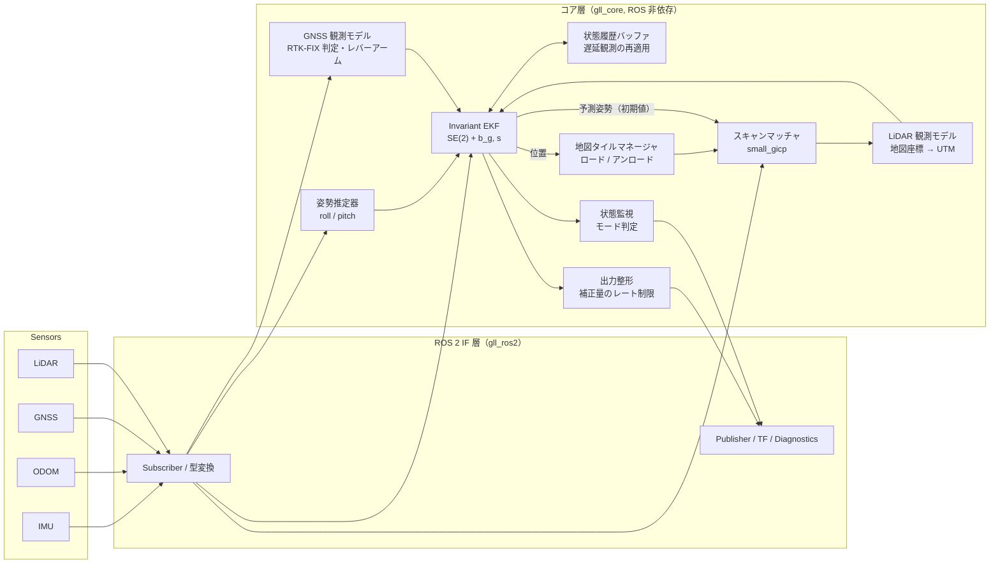
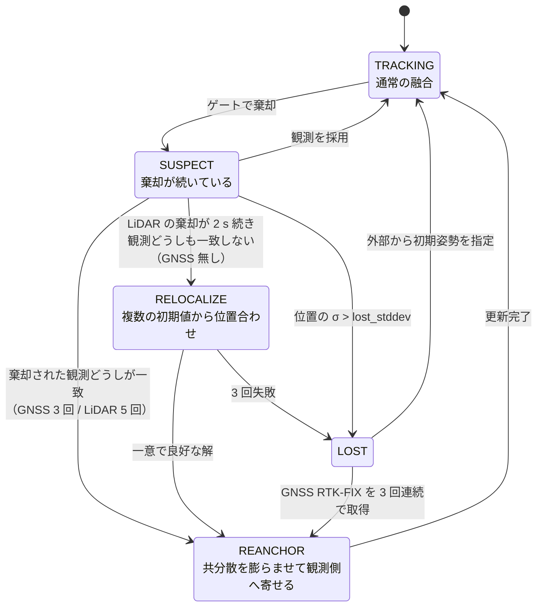
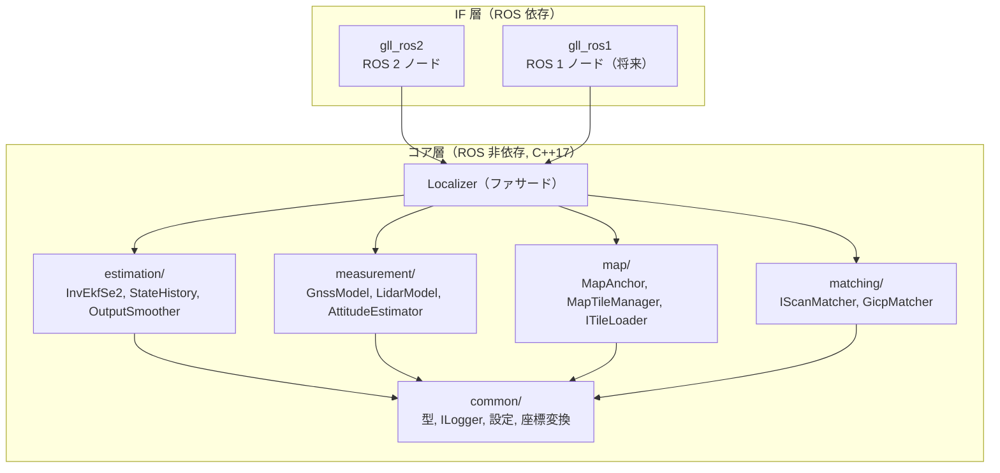

# 設計書: GNSS / LiDAR 統合自己位置推定

- 関連文書: [要件定義](./requirements.md) / [ソフトウェア構成（コンポーネント図・クラス図）](./architecture.md) / [アルゴリズム説明書（Invariant EKF の解説を含む）](./algorithm.md) / [検証計画: i2Nav-Robot](./validation_i2nav.md)
- 状態: ドラフト（v0.7）

| 版 | 変更内容 |
|---|---|
| v0.1 | 初版 |
| v0.2 | 確定したハードウェア前提（u-blox F9P シングルアンテナ、6 軸 IMU、最高速度 6 km/h）を反映。スキャンマッチングを small_gicp に変更。推定器の代替候補として Invariant EKF を追記 |
| v0.3 | 推定器を **Invariant EKF（SE(2)、左不変誤差）に変更**。GNSS 入力を独自ドライバの `ublox_gps/NavPVT` に確定。地図の統合は外部ツールで行い、本システムは統合済みの地図を入力とする前提に変更 |
| v0.7 | 出力の共分散に、出力整形層に残っているオフセットの分（$`\mathbf{o}\mathbf{o}^\top`$）を加えるよう変更（3.10 節） |
| v0.6 | GNSS アンテナのレバーアームを 3 次元（アンテナ高さ $`l_z`$ ≤ 1 m）にし、roll / pitch で水平面に射影して使うよう変更。roll / pitch の誤差を GNSS の観測共分散に加算 |
| v0.5 | GNSS 入力を **`sensor_msgs/NavSatFix`** に変更。RTK-FIX の表現・共分散・高さ・時刻について、ドライバとの取り決めを定義。進行方位の観測は、速度トピックがある場合の任意機能に変更 |
| v0.4 | **RTK-FIX の GNSS を常に信用する方針**を確定。GNSS / LiDAR の優先度、食い違いの判定、再アンカー、再位置推定の節（3.13）を追加 |

### 前提ハードウェア・運用条件（v0.2〜v0.3 で確定）

| 項目 | 内容 | 設計への主な影響 |
|---|---|---|
| GNSS | u-blox ZED-F9P、**シングルアンテナ** | GNSS から直接ヨーは得られない。初期ヨーも走行中のヨーも、GNSS の位置の系列から Invariant EKF の中で推定する（3.6 節）。ドライバは独自実装で、メッセージ型は **`sensor_msgs/NavSatFix`**（v0.5）。RTK-FIX の表現などはドライバとの取り決めで定める |
| 点群地図 | **統合は外部ツールで行う**。本システムには、地図グループごとに統合済みの点群が入力される | 地図の統合・作成は本システムの範囲外（5.1 節） |
| IMU | **加速度と角速度のみ**（姿勢は出力しない） | roll / pitch を自前で推定する姿勢推定器が必要（3.9 節）。ジャイロバイアスは停止中に推定する |
| 車速 | **最高 6 km/h（約 1.7 m/s）** | タイルの先読みは余裕がある。スキャン中の並進による歪みは小さい（0.1 s で 0.17 m 以下）が、旋回時の回転による歪みは残る（6.1 節）。出力整形のレートは車速に合わせて低めに設定する |
| LiDAR マッチング | **small_gicp** | コア層に置ける（ROS 非依存、Eigen ベース）。タイル単位でのターゲット更新は、ロード済みタイルを結合して再構築する方式にする（6 章） |

---

## 1. 設計方針のまとめ

| # | 論点 | 決定 | 主な理由 |
|---|---|---|---|
| D-1 | 推定器の構成（要件③） | **単一の推定器で全センサを融合する**（推定器の切り替えは行わない） | 出力の連続性（FR-4）を構造的に確保しやすい。GNSS と LiDAR が同時に有効な区間では両方を重み付きで使える |
| D-2 | 推定アルゴリズム | **Invariant EKF（SE(2) 上の左不変誤差）**（v0.3 で ESEKF から変更） | 計算量は EKF と同等で、ROS に依存しない形で実装しやすい。遷移行列と GNSS の観測行列が推定中の姿勢に依存しないため、シングルアンテナで yaw の誤差が大きくなる場面でも収束と共分散の整合性を保ちやすい。3D 化では SE₂(3) に拡張できる |
| D-3 | 状態の自由度 | **Phase 1 は平面 2D（x, y, yaw）+ バイアス類**。roll / pitch / z はフィルタ外の補助推定で扱う | 出力要件が x, y, yaw のため。3D 化は Phase 4 の拡張として設計上の余地を残す（3.2 節） |
| D-4 | 推定器の座標系 | **状態は常に UTM**（地図座標系ではない） | 地図を切り替えても状態の座標系が変わらないため、地図の切り替えが「観測の座標変換の切り替え」に帰着し、状態は飛ばない |
| D-5 | スキャンマッチング | **small_gicp（GICP）**。`IScanMatcher` インターフェースで抽象化し、ほかの手法にも差し替えられるようにする | ROS 非依存でコア層に置ける。高速で、ヘッセ行列から観測共分散を得られる |
| D-6 | 地図の単位（要件④） | 直接つながる地図群は**1 つの「地図グループ」として統合**し、タイル分割して動的ロードする。GNSS 区間で隔てられた地図は別グループとし、それぞれのアンカーで UTM に固定する | アンカーを地図間で連鎖させることによる誤差の蓄積を避ける |
| D-7 | 地図の読み込みタイミング | **UTM 上の位置と先読み距離から必要なタイルを決め、バックグラウンドでロードしてダブルバッファで差し替える** | 状態が UTM で表されているため、どのグループのタイルが必要かも UTM 上の幾何計算だけで決まる |
| D-10 | GNSS / LiDAR の優先度（v0.4） | **RTK-FIX の GNSS を常に優先して信用する**。GNSS FIX 中の LiDAR は、整合していれば重みを下げて融合し、食い違えば棄却する。推定値がずれたときは再アンカー、LiDAR が失敗したときは再位置推定で復帰する（3.13 節） | 要件（FIX 区間は GNSS）とユーザ方針に合わせるため。モードの切り替えを持たずに、優先度をフィルタの重みと判定の規則だけで表現できる |
| D-8 | 出力の連続性 | ① 観測の Mahalanobis ゲート、② 補正量をレート制限して吸収する出力整形層、③ 地図アンカーの事前較正 の 3 段で担保する | 観測更新で生じる補正ステップを、経路追従に影響しない大きさに抑えるため |
| D-9 | ソフトウェア構成（要件⑥） | **ROS 非依存のコアライブラリ（C++17 + Eigen）** と、薄い ROS 2 インターフェースノードに分離する | ROS 1 への移行は IF 層を差し替えるだけで済む |

---

## 2. システム構成



データの流れ:

1. IMU（角速度）と ODOM（速度）で**予測**（デッドレコニング）を行う。
2. RTK-FIX の GNSS を**位置観測**として更新する。
3. LiDAR スキャンを、現在の予測姿勢を初期値として地図タイルにマッチングする。得られた地図座標系の姿勢を UTM に変換し、**姿勢観測**として更新する。
4. GNSS と LiDAR の観測は同じフィルタに入るため、両方が有効な区間（地図の縁など）では共分散に応じて重み付き融合される。どちらも無い区間はデッドレコニングでつなぐ。

---

## 3. 推定アルゴリズム

### 3.1 方式の比較と選定

| 方式 | 連続性 | 計算コスト | 遅延観測 | 実装・保守 | 評価 |
|---|---|---|---|---|---|
| (A) GNSS localizer と LiDAR localizer の切り替え | × 切り替え時の差分を別途吸収する仕組みが必要 | ○ | △ | △ 切り替えロジックが肥大化しやすい | 不採用 |
| (B-1) EKF | ○ | ◎ | △（履歴バッファで対応） | ◎ | 2D では (B-2) と実質同等 |
| (B-2) ESEKF | ○ | ◎ | △（履歴バッファで対応） | ◎ | v0.2 までの採用案 |
| (B-3) UKF | ○ | ○ | △ | ○ | 非線形性が弱く、利点が小さい |
| (B-4) ファクターグラフ（iSAM2 / 固定ラグ平滑化） | ◎ | △ | ◎ | △ GTSAM 等への依存が重い | 計算負荷の理由で採用外 |
| **(B-5) Invariant EKF（SE(2)、3D 化時は SE₂(3)）** | ○ | ◎（EKF と同等） | △（履歴バッファで対応） | ○ SE(2) の演算の実装が必要 | **採用（v0.3）** |

**Invariant EKFを選ぶ理由**:

- 本構成は **GNSS がシングルアンテナ**で、起動直後や長いデッドレコニングの後は yaw の誤差が大きくなりうる。通常の EKF / ESEKF は、位置と yaw を別々の誤差として扱う。そのため、遷移行列や GNSS の観測行列が推定中の yaw（$`\hat\theta`$）に依存し、yaw の誤差が大きいと線形化が崩れて、収束の遅れや共分散の過小評価（不整合）が起きやすい。
- Invariant EKF は、姿勢 $`X = (\mathbf{R}(\theta), \mathbf{p}) \in SE(2)`$ の誤差を**群の上で**定義する。本設計の組み合わせ（機体座標系の速度入力による運動と、世界座標系で表される観測）では、次の性質が成り立つ（3.4〜3.7 節）。
  - **遷移行列は入力だけに依存し、推定中の姿勢には依存しない**。
  - **GNSS 位置観測の観測行列は定数になる**。
- その結果、yaw の誤差が大きい状態からでも収束が安定し、共分散の整合性も保ちやすい。計算量は EKF と同じである。
- 注意点: ジャイロバイアス $`b_\omega`$ と ODOM スケール $`s`$ を状態に加えると、厳密な不変性は崩れる（imperfect Invariant EKF）。ただし姿勢の部分の利点はそのまま残る。これは実用上の標準的な構成である。
- 3D 化（Phase 4）では、SE₂(3)（姿勢・速度・位置）上の Invariant EKF に IMU バイアスを加えた構成に拡張する。
- 推定器は `IStateEstimator` インターフェースの背後に置く。比較評価用に ESEKF 版も差し替えられるようにする（10 章 Phase 1 の評価項目）。

### 3.2 状態の自由度と roll / pitch について

要件どおり、出力は x, y, yaw とする。ただし、roll / pitch の可観測性については次の点に注意する。

- **「GNSS・IMU・ODOM では roll / pitch に観測補正がかからない」は、条件によっては成り立たない**。加速度計を使う 3D INS では、ODOM の速度（または車両の非ホロノミック拘束）で速度が拘束されると、比力と重力の関係から roll / pitch は可観測になる（加速度バイアスとは相関が残る）。また、スキャンマッチングは 6 自由度の姿勢を返すので、地図区間では roll / pitch も直接観測できる。
- 一方、Phase 1 の出力には roll / pitch は不要で、加速度計を使う 3D INS は調整項目が増える。そこで Phase 1 では roll / pitch をフィルタの状態に含めず、次の用途に限った**補助推定**（3.9 節）として扱う。
  - IMU の角速度を鉛直軸まわりのヨーレートに射影する（傾斜補正）。
  - ODOM の速度を水平成分に射影する（坂道で v·cos(pitch)）。
  - スキャンマッチングの 6 自由度初期値に使う。
  - GNSS アンテナのレバーアームを水平面に射影する（アンテナ高さの分の水平ずれを補正する。3.6 節）。
- 急な坂が多い、または z / roll / pitch も出力が必要になった場合は、Phase 4 で SE₂(3) の Invariant EKF に拡張する。

### 3.3 状態と誤差の定義

**推定状態**:

```math
\hat{X} = \begin{bmatrix} \mathbf{R}(\hat\theta) & \hat{\mathbf{p}} \\ \mathbf{0}^\top & 1 \end{bmatrix} \in SE(2),\qquad \hat b_\omega,\ \hat s
```

| 記号 | 意味 | 単位 |
|---|---|---|
| $`\hat{\mathbf{p}} = (\hat p_x, \hat p_y)`$ | base_link 原点の UTM 座標（Easting, Northing） | m |
| $`\hat\theta`$ | UTM グリッド座標系での yaw（x 軸 = East から反時計回り） | rad |
| $`\hat b_\omega`$ | ジャイロの鉛直軸バイアス | rad/s |
| $`\hat s`$ | ODOM 速度のスケール係数（名目値 1.0） | - |

**誤差の定義**（左不変誤差。誤差は機体座標系側で定義する）:

```math
X = \hat{X}\,\mathrm{Exp}(\xi),\quad \xi = \begin{bmatrix} \rho_x & \rho_y & \varphi \end{bmatrix}^\top,\qquad b_\omega = \hat b_\omega + \delta b,\quad s = \hat s + \delta s
```

```math
\delta\mathbf{x} = \begin{bmatrix} \rho_x & \rho_y & \varphi & \delta b & \delta s \end{bmatrix}^\top,\qquad \mathbf{P} = \mathrm{Cov}(\delta\mathbf{x}) \in \mathbb{R}^{5\times5}
```

**SE(2) の基本演算**（$`\mathbf{J} = \begin{bmatrix} 0 & -1 \\ 1 & 0 \end{bmatrix}`$）:

```math
\mathrm{Exp}(\rho, \varphi) = \big(\mathbf{R}(\varphi),\ \mathbf{V}(\varphi)\rho\big),\quad
\mathbf{V}(\varphi) = \frac{\sin\varphi}{\varphi}\mathbf{I} + \frac{1-\cos\varphi}{\varphi}\mathbf{J}
```

```math
\mathrm{Ad}_{(\mathbf{R},\mathbf{t})} = \begin{bmatrix} \mathbf{R} & -\mathbf{J}\mathbf{t} \\ \mathbf{0}^\top & 1 \end{bmatrix}
```

$`\mathrm{Log}`$ は $`\mathrm{Exp}`$ の逆写像で、$`\varphi \to 0`$ ではテイラー展開で評価する。これらは `gll/common/se2.hpp` に自前で実装する（数十行程度。単体テストで数値微分と照合する）。外部ライブラリ（manif 等）には依存しない。

$`s`$ の推定は、設定で無効にできるようにする（推定する量が増えると、GNSS と LiDAR が両方無い区間での振る舞いが不安定になりうるため）。

### 3.4 予測（IMU・ODOM 駆動）

入力:

- $`\omega_m`$: 傾斜補正済みのヨーレート（IMU、3.9 節）
- $`v_o`$: 傾斜補正済みの前進速度（ODOM）

予測は IMU のタイムスタンプで駆動する（100〜200 Hz）。ODOM の速度は、最新 2 サンプルの線形補間（外挿は最大 `odom_hold_max` 秒まで）で IMU の時刻にそろえる。IMU が途切れた場合は、ODOM のヨーレートで代替する（診断で WARN を出す）。

**推定状態の伝播**（機体座標系の移動量を群の上で積算する。数値積分の誤差が出ない）:

```math
\Delta\varphi = (\omega_m - \hat b_\omega)\Delta t,\quad \Delta\rho = \begin{bmatrix} \hat s\,v_o\,\Delta t \\ 0 \end{bmatrix},\quad
\hat X_{k+1} = \hat X_k\,\mathrm{Exp}(\Delta\rho, \Delta\varphi),\quad \hat b_{\omega,k+1} = \hat b_{\omega,k},\ \hat s_{k+1} = \hat s_k
```

**誤差の遷移行列**: $`\mathrm{Exp}(\Delta\rho, \Delta\varphi) = (\mathbf{R}_\Delta, \mathbf{t}_\Delta)`$ とおくと

```math
\mathbf{F} = \begin{bmatrix}
\mathbf{R}_\Delta^\top & \mathbf{R}_\Delta^\top \mathbf{J}\,\mathbf{t}_\Delta & \mathbf{0} & \begin{bmatrix} v_o\Delta t \\ 0 \end{bmatrix} \\
\mathbf{0}^\top & 1 & -\Delta t & 0 \\
\mathbf{0}^\top & 0 & 1 & 0 \\
\mathbf{0}^\top & 0 & 0 & 1
\end{bmatrix}
```

（左上の 3×3 は $`\mathrm{Ad}_{\mathrm{Exp}(\Delta\rho,\Delta\varphi)^{-1}}`$。バイアスの列では、右ヤコビアン $`\mathbf{J}_r(\Delta) \approx \mathbf{I}`$ と近似している。IMU の周期が短いので $`|\Delta\varphi| \ll 1`$ となり、この近似は十分成り立つ）

- **$`\mathbf{F}`$ には推定中の姿勢 $`\hat\theta, \hat{\mathbf{p}}`$ が現れない**（入力 $`v_o, \omega_m`$ とバイアス推定値だけで決まる）。これが ESEKF との本質的な違いである。
- 例: 直進中（$`\mathbf{t}_\Delta = (d, 0)`$）は、yaw の誤差 $`\varphi`$ が機体の横方向の誤差 $`\rho_y`$ に $`d\varphi`$ だけ移る。これは直感とも一致する。

**プロセスノイズ**（入力ノイズ $`\sigma_v, \sigma_\omega`$ と、ランダムウォーク $`\sigma_b, \sigma_s`$）:

```math
\mathbf{G} = \begin{bmatrix}
\hat s\,\Delta t & 0 \\
0 & 0 \\
0 & \Delta t \\
0 & 0 \\
0 & 0
\end{bmatrix},\quad
\mathbf{Q} = \mathbf{G}\,\mathrm{diag}(\sigma_v^2, \sigma_\omega^2)\,\mathbf{G}^\top + \mathrm{diag}(0,0,0,\sigma_b^2\Delta t, \sigma_s^2\Delta t),\qquad
\mathbf{P} \leftarrow \mathbf{F}\mathbf{P}\mathbf{F}^\top + \mathbf{Q}
```

横すべりを許容したい場合は、$`\rho_y`$ に横方向の速度ノイズ $`\sigma_{v,lat}`$ を加える（既定 0.02 m/s。非ホロノミック拘束の不確かさに相当する）。

**停止中**（|v_o| と |ω| が閾値未満の状態が一定時間続いたとき）: ODOM の速度が 0 なので位置は動かない。ゼロ角速度の擬似観測（ZARU）$`z = \bar\omega_m`$（停止中の平均）、$`h = \hat b_\omega`$、$`\mathbf{H} = [0\ 0\ 0\ 1\ 0]`$ で $`b_\omega`$ を推定し、停止中の yaw のドリフトを抑える。

### 3.5 観測更新（共通手順）

すべての観測で、**残差を機体座標系（誤差 $`\xi`$ と同じ座標系）で表す**のが Invariant EKF の要点である。

1. 観測時刻 $`t_z`$ の状態を履歴バッファから取り出す（3.8 節）。
2. 観測ごとの式（3.6、3.7 節）で残差 $`\mathbf{r}`$、観測行列 $`\mathbf{H}`$、観測共分散 $`\mathbf{R}`$ を求める。
3. $`\mathbf{S} = \mathbf{H}\mathbf{P}\mathbf{H}^\top + \mathbf{R}`$ から Mahalanobis 距離 $`d^2 = \mathbf{r}^\top \mathbf{S}^{-1}\mathbf{r}`$ を求める。$`d^2 > \chi^2_{\mathrm{dof}}(1-\alpha)`$ なら棄却する（既定 α = 0.001 → 1 自由度: 10.8、2 自由度: 13.8、3 自由度: 16.3）。
   - **例外**: RTK-FIX の GNSS は棄却しない。GNSS FIX 中の LiDAR は、Mahalanobis 距離ではなく固定閾値で食い違いを判定する。棄却が続いたときの再アンカーと再位置推定も含め、3.13 節に従う。
4. $`\mathbf{K} = \mathbf{P}\mathbf{H}^\top\mathbf{S}^{-1}`$、$`\delta\mathbf{x} = \mathbf{K}\mathbf{r} = (\delta\xi, \delta b, \delta s)`$
5. 注入: $`\hat X \leftarrow \hat X\,\mathrm{Exp}(\delta\xi)`$、$`\hat b_\omega \leftarrow \hat b_\omega + \delta b`$、$`\hat s \leftarrow \hat s + \delta s`$
6. 共分散（Joseph 形式）: $`\mathbf{P} \leftarrow (\mathbf{I}-\mathbf{K}\mathbf{H})\mathbf{P}(\mathbf{I}-\mathbf{K}\mathbf{H})^\top + \mathbf{K}\mathbf{R}\mathbf{K}^\top`$
7. リセット: 厳密には $`\mathbf{P} \leftarrow \mathbf{J}_r(\delta\xi)\,\mathbf{P}\,\mathbf{J}_r(\delta\xi)^\top`$ だが、$`\delta\xi`$ は小さいので単位行列で近似する（関数は分けておき、必要なら後で有効化する）。
8. $`t_z`$ 以降の入力を再適用して、現在時刻まで伝播し直す。
9. 更新前後の出力姿勢の差（世界座標系の $`\Delta x, \Delta y, \Delta\theta`$）を出力整形層に通知する（3.10 節）。

**フィルタの推定値の共分散**（世界座標系の x, y, yaw）: $`\Sigma_w = \mathbf{T}\,\mathbf{P}_{1:3,1:3}\,\mathbf{T}^\top`$、$`\mathbf{T} = \mathrm{blkdiag}(\mathbf{R}(\hat\theta), 1)`$。外に出す共分散は、これに出力整形層のオフセットの分を加えたものになる（3.10 節）。

### 3.6 GNSS 観測（u-blox F9P, `sensor_msgs/NavSatFix`）

v0.5 で、GNSS の入力を標準の `sensor_msgs/NavSatFix` に変更した（ROS 1 にも同じ型があるので、移植も容易になる）。ただし `NavSatFix` には、RTK の FIX / FLOAT を区別する標準の値と、速度・進行方位が無い。そこで、**ドライバとの間で次の取り決め**を置く。

**ドライバとの取り決め**（独自ドライバ側で実装してもらう）:

| 項目 | 取り決め |
|---|---|
| RTK-FIX の表現 | UBX-NAV-PVT の `carrSoln == 2`（fixed）かつ `gnssFixOK` のときだけ、`status.status = STATUS_GBAS_FIX (2)` にする。RTK-FLOAT、DGPS、単独測位は `STATUS_FIX (0)` または `STATUS_SBAS_FIX (1)` にする。コア側で使う値はパラメータ `gnss_rtk_fix_status`（既定 2）で変えられる |
| 共分散 | `position_covariance`（ENU、[m²]）に `hAcc²`（E, N）と `vAcc²`（U）を対角で入れ、`position_covariance_type = COVARIANCE_TYPE_DIAGONAL_KNOWN (2)` にする |
| 高さ | `altitude` は WGS84 の楕円体高にする（ROS の標準の定義どおり。平均海面高ではない） |
| 時刻 | `header.stamp` は、できれば測位時刻（GNSS 時刻をシステム時刻に換算したもの）にする。受信時刻を入れる場合は、パラメータ `gnss_stamp_offset`（既定 0 s。負の値で過去側に補正）で遅延を補正する |
| 速度（任意） | 進行方位の観測を使いたい場合だけ、別トピックで `geometry_msgs/TwistWithCovarianceStamped` を出す（`twist.linear.x` = 東向き速度、`y` = 北向き速度 [m/s]、共分散は `sAcc²`） |

**採用条件**（すべて満たすときだけ RTK-FIX として更新に使う）:

- `status.status == gnss_rtk_fix_status`（既定 2）
- `position_covariance_type` が UNKNOWN 以外で、水平の標準偏差 $`\sqrt{\max(\Sigma_{EE}, \Sigma_{NN})}`$ が `gnss_max_stddev`（既定 0.05 m）以下。取り決めがずれていて RTK-FLOAT が status 2 で届いても、FLOAT は通常 σ が数 cm〜数十 cm なので、ここで落ちる（二重の安全策）
- FIX に遷移してから `gnss_fix_settle_time`（既定 1.0 s）が経過している（FIX 直後の誤 FIX 対策）
- `position_covariance_type == UNKNOWN` の場合は精度を確認できないので、既定では採用しない。`gnss_accept_unknown_covariance: true` にすると、`gnss_default_stddev` を使って採用する（その場合は WARN を出す）

**位置観測**:

- 緯度経度を、サイトで固定した 1 つの UTM ゾーンの $`\mathbf{y} = (E, N)`$ に変換する。ゾーンは設定値で固定し、ゾーン境界をまたいでも切り替えない。
- アンテナのレバーアームを 3 次元で $`\mathbf{l} = (l_x, l_y, l_z)`$（base_link 座標系、`gnss_lever_arm`）とする。**アンテナ高さ $`l_z`$ は未定だが 1 m 以内**の想定（v0.6）。
- **傾きによるアンテナの水平方向のずれ**: 車両が傾くと、高い位置にあるアンテナは水平方向にずれる。$`l_z`$ = 1 m なら、傾き 1° で約 1.7 cm、5° の坂で約 8.7 cm ずれ、RTK の精度（数 cm）から見て無視できない。そこで、姿勢推定器（3.9 節）の roll $`\phi`$ / pitch $`\vartheta`$（観測時刻の値）で、レバーアームを水平面に射影してから使う。

```math
\tilde{\mathbf{l}} = \big[\mathbf{R}_y(\vartheta)\,\mathbf{R}_x(\phi)\,\mathbf{l}\big]_{xy} \;\approx\; \begin{bmatrix} l_x + \vartheta\,l_z \\ l_y - \phi\,l_z \end{bmatrix}
```

  （$`\tilde{\mathbf{l}}`$ は、yaw だけ回した水平な座標系で見たアンテナの位置。実装では近似ではなく左辺の厳密な式で計算する）

- 観測モデルは $`\mathbf{y} = \mathbf{p} + \mathbf{R}(\theta)\tilde{\mathbf{l}} + \mathbf{n}`$ で、これは $`\mathbf{y} = X\,(\tilde{\mathbf{l}}, 1)`$ という**左不変観測**の形になる。そのため、残差を機体座標系で取ると観測行列が定数になる（$`\tilde{\mathbf{l}}`$ は姿勢推定器から与えられる既知の量として扱う）。

```math
\mathbf{r} = \mathbf{R}(\hat\theta)^\top\big(\mathbf{y} - \hat{\mathbf{p}} - \mathbf{R}(\hat\theta)\tilde{\mathbf{l}}\big),\qquad
\mathbf{H} = \begin{bmatrix} \mathbf{I}_2 & \mathbf{J}\tilde{\mathbf{l}} & \mathbf{0} & \mathbf{0} \end{bmatrix} = \begin{bmatrix} 1 & 0 & -\tilde l_y & 0 & 0 \\ 0 & 1 & \ \ \tilde l_x & 0 & 0 \end{bmatrix}
```

```math
\mathbf{R} = \mathbf{R}(\hat\theta)^\top\,\Sigma_{\mathrm{gnss}}\,\mathbf{R}(\hat\theta) + l_z^2\,\mathrm{diag}\big(\sigma_\vartheta^2,\ \sigma_\phi^2\big),\qquad \Sigma_{\mathrm{gnss}} = \max\!\big(\Sigma_{EN},\ \sigma_{\min}^2\mathbf{I}_2\big)
```

- 第 2 項は、roll / pitch の推定誤差（標準偏差 $`\sigma_\phi, \sigma_\vartheta`$、既定 `attitude_stddev` = 0.5°）がアンテナの水平位置の誤差になる分である。$`l_z`$ = 1 m、0.5° なら約 0.9 cm。残差と同じ機体座標系で表されているので、回転せずにそのまま加える。
- $`\Sigma_{EN}`$ は `position_covariance` の東・北の 2×2 ブロック。$`\max`$ は対角要素ごとに下限を取る意味。
- $`\sigma_{\min}`$ = `gnss_min_stddev`（既定 0.02 m）。受信機が報告する精度は楽観的なことが多いので下限を設ける。
- UTM 座標は、グリッドの東・北方向と ENU の東・北方向の違い（子午線収差 γ、数度以内）で共分散を回転させるのが厳密である。ただし等方的な共分散（E と N の分散が同じ）なら影響しないので、無視する。
- 導出: $`X\,\mathrm{Exp}(\xi)\cdot\tilde{\mathbf{l}} \approx \hat X\cdot(\tilde{\mathbf{l}} + \rho + \varphi\mathbf{J}\tilde{\mathbf{l}})`$ より、$`\mathbf{R}(\hat\theta)^\top(\mathbf{y}-\hat{\mathbf{y}}) \approx \rho + \varphi\mathbf{J}\tilde{\mathbf{l}} + \text{noise}`$。
- ESEKF では $`\mathbf{H}`$ が $`\hat\theta`$ に依存していた。Invariant EKF では yaw の推定誤差が大きくても、観測行列そのものは誤らない。

**ヨーの観測**（F9P はシングルアンテナのため、ヘディングを直接は得られない）:

- **位置観測の系列（主）**: 走行中は、$`\mathbf{F}`$ の結合項（yaw 誤差 → 横方向誤差）を通して、位置観測からヨーが推定される。停止中は観測されない（ZARU でドリフトだけを抑える）。`NavSatFix` だけを使う既定の構成では、これが唯一の GNSS 由来のヨーの情報源になる。Invariant EKF はこの形の推定に強いので、実用上は十分と見込む（Phase 1 のシミュレーションで確認する）。
- **進行方位の観測（任意、既定は無効）**: ドライバが速度トピック（上の取り決め）を出す場合だけ、`use_gnss_velocity: true` で有効にする。
  - 条件: RTK-FIX 中で、水平速度 $`|\mathbf{v}| >`$ `cog_min_speed`（既定 0.5 m/s）、|ヨーレート| < `cog_max_yaw_rate`（既定 5 deg/s。レバーアームによる速度成分の影響を避けるため）、かつ前進中。
  - $`z = \mathrm{atan2}(v_N, v_E) + \gamma`$（ENU の角度をグリッドの角度に変換。$`\gamma`$ は子午線収差）
  - $`r = \mathrm{wrap}(z - \hat\theta)`$、$`\mathbf{H} = [0\ 0\ 1\ 0\ 0]`$
  - 分散: $`\sigma_\psi \approx \sigma_v / |\mathbf{v}|`$。最高速の 1.7 m/s でも、$`\sigma_v`$ = 0.05 m/s なら約 1.7° で、**補助的な観測**にとどまる。
  - 後退中は使わない。

### 3.7 LiDAR 観測

スキャンマッチング（6 章）の結果として、地図グループ $`g`$ の座標系での base_link の 6 自由度姿勢 $`\mathbf{T}^{g}_{\mathrm{base}}`$ と、その共分散が得られる。共分散は機体座標系側の摂動に対するもので、small_gicp の定義による。

1. 地図 → UTM 変換 $`\mathbf{T}^{\mathrm{utm}}_{g}`$（4.2 節）で UTM に変換する。
2. x, y, yaw を取り出して、SE(2) の観測 $`Z = (\mathbf{R}(\psi_z), \mathbf{p}_z)`$ とする。

```math
\mathbf{r} = \mathrm{Log}\big(\hat X^{-1} Z\big) \in \mathbb{R}^3,\qquad \mathbf{H} = \begin{bmatrix} \mathbf{I}_3 & \mathbf{0}_{3\times2} \end{bmatrix}
```

（$`\mathrm{Log}`$ のヤコビアンは $`\mathbf{I}`$ で近似する）

観測共分散（すべて機体座標系で表す）:

```math
\mathbf{R} = \Sigma_{\mathrm{reg}} + \mathbf{T}^\top\Sigma_{\mathrm{anchor}}\mathbf{T} + \Sigma_{\mathrm{floor}},\qquad \mathbf{T} = \mathrm{blkdiag}(\mathbf{R}(\hat\theta), 1)
```

- $`\Sigma_{\mathrm{reg}}`$: スキャンマッチングの共分散（6.2 節）から、(x, y, yaw) の成分を取り出したもの。small_gicp の共分散はもともと機体座標系側の摂動で表されているので、**座標変換をせずにそのまま使える**。これも左不変誤差を選んだ利点である（roll / pitch が小さいことを前提に、SE(3) → SE(2) の射影として近似する）。
- $`\Sigma_{\mathrm{anchor}}`$: アンカーの不確かさ（世界座標系で与える）。
- $`\Sigma_{\mathrm{floor}}`$: 下限値。

**注意**: アンカー誤差は時間的に相関するバイアスで、白色雑音ではない。上の式はそれを保守的に近似しているだけである。GNSS と LiDAR が両方有効な区間で、両者の差からアンカー誤差をオンライン推定する拡張（状態に地図グループごとのオフセットを追加する）は Phase 4 の検討事項とする。

**採用条件**:

- 位置合わせが収束した（反復回数が上限未満）。
- インライア率と、1 点あたりの残差が閾値を満たす（6.2 節）。
- 3.5 節の Mahalanobis ゲートを通過した。

### 3.8 遅延観測の扱い

LiDAR 観測は「スキャン時刻 + マッチングの処理時間（数十 ms）」だけ遅れて届き、GNSS にも受信機の遅延がある。そこで、次の**状態履歴バッファ**で遅延観測を扱う。

- 予測ステップごとに $`(t, \mathbf{x}, \mathbf{P}, \mathbf{u})`$ をリングバッファ（既定 2.0 s）に保存する。
- 時刻 $`t_z`$ の観測が届いたら、$`t_z`$ の直前のエントリから $`t_z`$ まで伝播し、そこで更新する。その後、保存しておいた入力 $`\mathbf{u}`$ で現在時刻まで再伝播する。
- 状態が 5 次元と小さいため、2 秒分（IMU 200 Hz で 400 ステップ）を再伝播しても 1 ms 未満で済む見込み。
- バッファより古い観測は破棄し、カウンタを診断に出す。

スキャンマッチングの初期値も、この履歴から得た**スキャン時刻の予測姿勢**を使う。

### 3.9 補助推定: roll / pitch / z

フィルタの状態には含めないが、傾斜補正とスキャンマッチングの初期値に必要な量:

| 量 | GNSS 区間 | 地図区間 |
|---|---|---|
| roll / pitch | 姿勢推定器 `AttitudeEstimator`（下記） | 同左。スキャンマッチングが収束したら、その roll / pitch で補正する（相補的にブレンド） |
| z | GNSS の楕円体高からアンテナ高さ分を引く（$`h - [\mathbf{R}_y(\vartheta)\mathbf{R}_x(\phi)\mathbf{l}]_z`$）→ アンカーの高さ基準で地図の z に変換 | 直前のスキャンマッチング結果の z（次の結果までは保持） |

**姿勢推定器 `AttitudeEstimator`**（IMU が姿勢を出力しないため自前で実装）:

- 方式: Mahony 型の相補フィルタ。ジャイロ 3 軸で姿勢を積分し、加速度計から推定した重力方向で roll / pitch を補正する。ヨーはこの推定器では扱わない（Invariant EKF 側で扱う）。
- 運動加速度の補償: 加速度計の値から、車両の運動による加速度を差し引いてから重力方向を求める。機体座標系で次のように近似する（低速なので十分）。
  ```math
  \mathbf{a}_{\mathrm{lin}} \approx \begin{bmatrix} \dot v_o & v_o\,\omega_z & 0 \end{bmatrix}^\top,\qquad \mathbf{g}_b \approx \mathbf{a}_m - \mathbf{a}_{\mathrm{lin}}
  ```
  （$`\dot v_o`$ は ODOM 速度の差分を平滑化したもの。$`v_o\omega_z`$ は向心加速度）
- 補正ゲインの調整: $`\big|\|\mathbf{g}_b\| - g\big|`$ が大きいとき（段差や衝撃）は補正ゲインを下げる。
- ジャイロバイアス: 起動時に静止状態で `imu_static_init_time`（既定 3 s）の平均から 3 軸のバイアスを求める。以後は停止を検出するたびに更新する（鉛直軸のバイアスは Invariant EKF の $`b_\omega`$ でも推定する）。

傾斜補正:

- ヨーレート: $`\omega_m = [\mathbf{R}_{wb}(\phi, \vartheta)\,\omega_{imu}]_z`$
- 前進速度: $`v_o = v_{odom}\cos\vartheta`$（$`\phi`$: roll、$`\vartheta`$: pitch）

### 3.10 出力の連続性（FR-4）

単一フィルタにすれば推定ソースの切り替えによる不連続は無くなるが、**観測更新そのものによる補正ステップ**は残る。例えば LiDAR が 10 Hz で数 cm ずつ補正すると、出力はその都度数 cm 動く。長いデッドレコニングの後や、地図アンカーに誤差がある場合は、補正ステップが大きくなりうる。これを次の 3 段で抑える。

1. **ゲートと共分散**（3.5 節、3.13 節）: 外れ値は取り込まない。共分散が妥当なら、1 回の補正量はもともと小さい。再アンカーのように推定値を大きく寄せ直す場合も、推定値の変化は次の出力整形層で吸収する。
2. **出力整形層（補正オフセット吸収方式）**:
   - 観測更新で推定姿勢が世界座標系で $`(\Delta x, \Delta y, \Delta\theta)`$ だけ動いたら（3.5 節の手順 9）、出力側のオフセット $`\mathbf{o}`$ からその分を引く。
   - 出力は $`\mathbf{y} = \mathbf{x}_{(x,y,\theta)} + \mathbf{o}`$ とする。
   - $`\mathbf{o}`$ は毎周期、最大 `max_correction_rate_xy`（既定 0.1 m/s）と `max_correction_rate_yaw`（既定 2 deg/s）の速さで 0 に近づける。
   - これにより、出力の変化は「デッドレコニングによる滑らかな移動 + レート制限された補正」だけになる。
   - $`\|\mathbf{o}\|`$ が `offset_error_threshold`（既定 1.0 m / 5 deg）を超えた場合は、黙って飛ばさずに状態を `DEGRADED` にして下流に通知する。
   - フィルタの生の推定値もデバッグ用に別トピックで出す。
   - **出力の共分散**: オフセットが残っている間、出力はフィルタの推定値（その時点での最良推定）から $`\mathbf{o}`$ だけずれている。この既知のずれを、出力の誤差の 2 乗平均に含めて公開する。

     ```math
     \Sigma_{\mathrm{out}} = \Sigma_w + \mathbf{o}\,\mathbf{o}^\top
     ```

     - $`\Sigma_w`$ はフィルタの推定値の共分散（3.5 節）。$`\mathbf{o} = (o_x, o_y, o_\theta)`$ は世界座標系のオフセット。
     - $`\mathbf{o}\mathbf{o}^\top`$ は、オフセットの方向にだけ不確かさを広げる（例: 横方向に 0.3 m のオフセットが残っていれば、フィルタの σ が数 cm でも、出力の横方向の標準偏差は $`\sqrt{\sigma^2 + 0.3^2} \approx`$ 0.3 m になる）。オフセットが吸収されて 0 に戻れば、フィルタの共分散と一致する。
     - これにより、下流（経路追従など）は、再アンカーの直後など「出力がまだ最良推定に追いついていない」間の不確かさを、共分散から正しく読み取れる。
     - `DEGRADED` の判定（オフセットが閾値を超えたとき）は従来どおり。共分散の増加は、それより小さいオフセットのときにも連続的に反映される点が異なる。
   - 補正を遅らせることは、真の誤差の修正を遅らせることと表裏一体である。そのため、レートは車速や経路追従の特性に合わせて調整する（パラメータを大きくすれば素通しになる）。
3. **地図アンカーの事前較正**: GNSS と LiDAR の両方が有効な区間（地図の縁）での両者の差を小さくしておくことが、切り替え時の滑らかさに最も効く。GNSS ログとスキャンマッチング結果の差を最小二乗で推定するアンカー較正ツールを用意する（10 章 Phase 3）。

### 3.11 初期化

| 開始地点 | 手順 |
|---|---|
| GNSS 区間 | ① RTK-FIX を待つ → 位置を初期化する。② 走行して `init_heading_min_distance`（既定 1 m）進んだら、GNSS の変位の向きから粗い yaw を決め、$`\sigma_\varphi`$ = `init_yaw_stddev`（既定 15°）でフィルタを始動する。③ 以後は Invariant EKF が位置観測と進行方位の観測で yaw を詰める。$`\sigma_\varphi`$ < `ready_yaw_stddev`（既定 2°）かつ位置の σ < `ready_pos_stddev`（既定 0.1 m）になったら初期化完了とする。外部から初期姿勢が与えられた場合はそれを優先する。シングルアンテナのため、停止したままでは yaw を決められない。Invariant EKF は yaw の誤差が大きくても線形化が崩れにくいので、粗い yaw から始めても安定して収束する |
| 地図区間 | 外部から初期姿勢を与えるか、前回終了時の姿勢を保存しておいて使う → その周辺で、yaw を N 通り（既定 12 通り）× 位置格子 の初期値からスキャンマッチングを試し、最良の結果で初期化する。GICP は収束する範囲が狭いので、粗い VGICP（ボクセル 2.0 m）で候補を絞ってから GICP で詰める 2 段階にする |
| 共通 | 初期化が完了するまでは、出力を `INITIALIZING` として下流に使わせない |

### 3.12 状態監視（モード）

推定器は 1 つだが、どの観測が効いているかを状態として公開し、監視・デバッグに使う。

| 状態 | 条件 |
|---|---|
| `INITIALIZING` | 初期化が未完了 |
| `GNSS_AIDED` | 直近 `aid_timeout`（既定 1.0 s）以内に GNSS 観測だけを採用した |
| `LIDAR_AIDED` | 直近 `aid_timeout` 以内に LiDAR 観測だけを採用した |
| `GNSS_LIDAR_AIDED` | 両方を採用した |
| `DEAD_RECKONING` | どちらも採用していない。ただし位置の標準偏差が `dr_max_stddev`（既定 0.3 m）未満 |
| `DEGRADED` | 位置の標準偏差が `dr_max_stddev` 以上、または出力オフセットが閾値を超えた |
| `LOST` | 位置の標準偏差が `lost_stddev`（既定 1.0 m）以上、または棄却が連続した → 再初期化が必要 |

経路追従側は `DEGRADED` で減速、`LOST` で停止する、といった使い方を想定する（振る舞いは下流側の設計で決める）。

### 3.13 GNSS / LiDAR の優先度・食い違いの判定・復帰（v0.4）

推定器は 1 つで、GNSS と LiDAR を切り替える「モード」は持たない。そのため、ここでいう「切り替えのロジック」は、次の 3 つからなる。

1. どちらの観測を優先するか
2. 両方が有効なときに食い違ったらどうするか
3. 推定値がずれて観測を受け付けなくなったとき、どう復帰するか

#### 3.13.1 優先度の方針

**RTK-FIX の GNSS は常に信用する**（v0.4 で確定）。ここでいう RTK-FIX は、3.6 節の採用条件（status が RTK-FIX を表す値、水平精度、FIX 後の安定待ち）を満たしたものを指す。

| 状況 | GNSS（RTK-FIX） | LiDAR |
|---|---|---|
| GNSS のみ有効 | 融合する | — |
| 両方有効で、整合している | 融合する（主） | 共分散を `lidar_cov_inflation_under_fix`（既定 4.0）倍に膨らませて融合する。主に yaw の補強（シングルアンテナの弱点を補う） |
| 両方有効で、食い違っている | 融合する（主）。推定値と食い違う場合は再アンカー（3.13.3 節） | **棄却する**。地図グループごとの食い違いとして記録する（3.13.2 節） |
| LiDAR のみ有効 | — | 融合する（主）。ゲートと復帰は 3.13.3 節 |
| どちらも無効 | デッドレコニング。共分散の増加に応じて状態を `DEGRADED` / `LOST` にする（3.12 節） | |

- 「両方有効」とは、直近 `aid_timeout`（既定 1.0 s）以内に RTK-FIX の GNSS を採用していることを指す。
- **残るリスク**: マルチパスによる誤った FIX も「信用」されるため、推定値がそちらに引っぱられる。ただし出力の変化は出力整形層でレート制限されるので、出力が飛ぶことはない（FR-4）。補正量が閾値を超えれば `DEGRADED` を通知する。このリスクは、方針として受け入れる。

#### 3.13.2 食い違いの判定（GNSS FIX 中の LiDAR）

GNSS FIX 中は、推定値はほぼ GNSS で決まっている。そこで、LiDAR の観測 $`Z`$ と推定値との差を「GNSS と LiDAR の食い違い」とみなす。

```math
\mathbf{e} = \mathrm{Log}\big(\hat X^{-1} Z\big) = (e_x, e_y, e_\psi)
```

- $`\mathbf{e}`$ は機体座標系で表される。
- $`\|(e_x, e_y)\| \le`$ `consistency_xy`（既定 0.15 m）かつ $`|e_\psi| \le`$ `consistency_yaw`（既定 1.0°）なら**整合**とする → 共分散を膨らませて融合する。
- それ以外は**食い違い**とする → LiDAR を棄却する。
- 判定は Mahalanobis 距離ではなく、固定の閾値で行う。GNSS FIX 中は $`\mathbf{P}`$ が小さく、Mahalanobis 距離では数 cm の差でも棄却されてしまうため。

**アンカーずれの記録**: 食い違いの有無にかかわらず、GNSS FIX 中の $`\mathbf{e}`$ を地図グループごとに蓄積する（移動平均、標準偏差、件数）。

- 世界座標系に直した平均が `anchor_mismatch_warn`（既定 0.10 m / 0.5°）を超えたら、診断で WARN「地図グループ X のアンカー較正が必要」を出す。
- 蓄積したデータはログに書き出し、`gll_anchor_calibrator` の入力にする。
- アンカーずれがあると、FIX が外れて LiDAR だけになった瞬間に、推定値と LiDAR の間に差が生じる。この差は 3.13.3 節の再アンカーで LiDAR 側に寄せ、出力整形層で滑らかに吸収する。

#### 3.13.3 ゲートの例外と再アンカー

通常の Mahalanobis ゲート（3.5 節）は、「推定値は正しく、観測が外れている」という前提で観測を落とす。しかし、デッドレコニングが続いた後やアンカーずれがあるときは、**推定値の方がずれている**ことがある。そのまま観測を落とし続けると復帰できなくなる。そこで、次の**再アンカー**の手順を設ける。

**再アンカー**（推定値を観測側に寄せ直す手順）:

1. 候補の観測列 $`\{Z_i\}`$ を、StateHistory の相対運動（オドメトリの変位）を使って最新時刻にそろえる。
2. そろえた観測どうしのばらつきが `reanchor_consistency`（既定 0.10 m / 1.0°）以内なら、「観測どうしは互いに一致している（外れているのは推定値の方）」と判断する。
3. 共分散を膨らませる: $`\mathbf{P}_{\xi\xi} \leftarrow \mathbf{P}_{\xi\xi} + \mathrm{diag}(e_x^2, e_y^2, e_\psi^2) + \Sigma_{\mathrm{reanchor}}`$（$`\mathbf{e}`$ は最新の観測と推定値の差）
4. 最新の観測で通常の更新を行う。推定値は観測側へ強く寄る。
5. 棄却のカウンタをリセットする。イベント `REANCHOR(source, |e|)` を診断に出す。
6. 推定値の変化は出力整形層が吸収する（出力は飛ばない）。オフセットが `offset_error_threshold` を超えている間は `DEGRADED` にする。

**観測ごとの扱い**:

| 観測 | ゲートで落ちたとき | 再アンカーの条件 |
|---|---|---|
| GNSS（RTK-FIX） | **棄却しない**（FIX は信用する方針）。推定値がずれていると判断し、再アンカーの候補にする | 連続 `reanchor_confirm_gnss`（既定 3 サンプル = 10 Hz で 0.3 s）が互いに一致したら再アンカーする。単発の外れ値だけを除くための確認で、FIX を疑う目的ではない |
| GNSS の進行方位 | 棄却する（補助的な観測のため） | なし |
| LiDAR（GNSS FIX 中） | 3.13.2 節の固定閾値で判定する（食い違いなら棄却） | なし（GNSS を優先する） |
| LiDAR（GNSS 無し） | Mahalanobis ゲートで棄却し、再アンカーの候補にする | 連続 `reanchor_confirm_lidar`（既定 5 スキャン = 0.5 s）が互いに一致し、かつ各スキャンが品質条件（6.2 節）を満たしたら再アンカーする |

- **GNSS → LiDAR の引き継ぎ**（FIX が外れた直後）では、アンカーずれがあると LiDAR がゲートで落ちる。上の LiDAR の再アンカーが働き、0.5 秒ほどで LiDAR 側に寄る。
- **LiDAR → GNSS の引き継ぎ**（FIX が戻ったとき）では、FIX が安定待ち（1 s）を経て採用される。推定値とずれていれば、GNSS の再アンカーで 0.3 秒ほどで GNSS 側に寄る。

#### 3.13.4 LiDAR の失敗と再位置推定

GNSS が無い区間で LiDAR の観測が互いに一致しない場合は、推定値ではなく位置合わせの方が失敗している（誤った局所解）と判断する。

1. LiDAR を使わずにデッドレコニングを続ける（共分散は増えていく）。
2. 棄却が `relocalize_after_rejects`（既定 20 スキャン = 2 s）続き、かつ GNSS FIX が無い場合は、**再位置推定**を行う。
   - 推定位置の周辺（半径 3σ、yaw ±3σ。上限は `relocalize_max_radius` 既定 3 m / 30°）に初期値の候補を並べる。
   - 各候補から位置合わせを行う（`GicpMatcher::alignMultiHypothesis`。粗い VGICP → GICP の 2 段階）。
3. 最良の結果が品質条件を満たし、かつ 2 番目に良い候補（最良から 1 m または 10° 以上離れたもの）よりスコアが十分良い場合（`relocalize_uniqueness_ratio` 既定 1.5）だけ採用し、再アンカーする。一意に決まらない場合は採用しない（対称な構造での取り違えを防ぐ）。
4. `relocalize_max_attempts`（既定 3）回失敗したら `LOST` にする。
5. `LOST` からは、GNSS の再アンカー（FIX が得られた時点で自動的に復帰）、または外部から与えた初期姿勢でのみ復帰する。

#### 3.13.5 状態遷移のまとめ



- この状態は、3.12 節の状態（どの観測が効いているか）とは**別の軸**である。診断には両方を出す。
- `LocalizationStatus` との対応: `REANCHOR` の後でオフセットを吸収している間は `DEGRADED`、`LOST` は `LOST`、それ以外は 3.12 節の判定に従う。


---

## 4. 座標系

### 4.1 フレーム

| フレーム | 定義 |
|---|---|
| `utm` | 固定した UTM ゾーンの (Easting, Northing, 楕円体高)。**推定器の状態と出力はこの座標系** |
| `map_<group_id>` | 地図グループごとの点群地図の座標系。点群とタイルはこの座標系で保存する |
| `base_link` | 車両の基準。センサの外部パラメータは base_link 基準で与える |
| `imu`, `lidar`, `gnss_antenna` | 各センサ。base_link からの静的な変換は IF 層が読み込み、コアにパラメータとして渡す |

### 4.2 地図 → UTM 変換（アンカー）

各地図グループについて、次の値を設定ファイルで与える。

- アンカー点の地図座標 $`\mathbf{a}^{g}`$
- アンカー点の緯度・経度・楕円体高
- 地図の x 軸の方位 $`\psi`$（**真北から時計回り**）

変換の手順:

1. 緯度経度 → UTM で $`(E_a, N_a)`$、子午線収差 $`\gamma`$、点縮尺係数 $`k`$ を得る（GeographicLib）。
2. グリッド方位 $`\alpha = \psi - \gamma`$（$`\gamma`$ はグリッド北の真北からの時計回り角）。
3. UTM の x 軸（East）基準の回転角 $`\varphi = \pi/2 - \alpha`$。
4. 水平成分:
   ```math
   \begin{bmatrix} E \\ N \end{bmatrix} = \begin{bmatrix} E_a \\ N_a \end{bmatrix} + k\,\mathbf{R}(\varphi)\left(\mathbf{p}^{g}_{xy} - \mathbf{a}^{g}_{xy}\right)
   ```
   鉛直成分: $`h = h_a + (p^g_z - a^g_z)`$

**縮尺係数 $`k`$ を入れる理由**: UTM のグリッド距離は実距離と最大で約 0.04〜0.1% ずれる（中央子午線付近で 0.9996）。1 km 離れると 0.4〜1 m のずれになる。SLAM で作った地図は実距離なので、グループ全体を 1 つの $`k`$ で縮尺補正する。地図グループの東西の広がりが数 km に及ぶ場合は $`k`$ の変化も無視できなくなるので、グループの分割を検討する（11 章の未決事項）。

この変換は剛体変換ではなく**相似変換**になる。変換はコア内で `MapAnchor` クラスとしてまとめ、スキャンマッチングの初期値計算（UTM → 地図）と結果の変換（地図 → UTM）の両方に同じものを使う。

### 4.3 数値精度

UTM 座標は $`10^5`$〜$`10^6`$ m のオーダーになる。`float32` では有効桁が足りず、0.1〜0.5 m 程度に丸められる。そこで次のように扱う。

- 点群とタイルは**地図グループの座標系（原点付近）で `float32` のまま保持**する。スキャンマッチングも地図座標系で実行する。
- UTM 座標を扱う状態・観測・出力はすべて `double` にする（`geometry_msgs` も float64）。
- RViz での可視化用に、固定原点の `utm_local` フレーム（UTM − 原点オフセット）も TF で出せるようにする。

---

## 5. 点群地図の管理

### 5.1 地図グループ

- **地図グループ** = 1 つの座標系と 1 つのアンカーを持つ、統合済みの点群地図。
- 直接つながる（間に GNSS 区間を挟まない）地図は、1 つのグループに統合されている必要がある。**統合は外部ツールで行い、本システムは統合済みの地図グループを入力として受け取る**（v0.3）。これが要件の「部分展開」（動的ロード）の前提になる。
- 本システムへの入力は、地図グループごとの「統合済みの点群ファイル（地図座標系）」と「アンカー」（4.2 節）である。
- GNSS 区間で隔てられた地図は別のグループとし、それぞれが GNSS 区間に接する位置でアンカーを持つ。

要件の例との対応:

| 例 | グループ構成 |
|---|---|
| 例1: 地図1 ↔ GNSS ↔ 地図2 | グループ A（地図1）、グループ B（地図2）。どちらも GNSS 区間に接していて、それぞれのアンカーで UTM に固定する |
| 例2: GNSS ↔ 地図1 ↔ 地図2 | 地図1 + 地図2 を統合した**グループ A の 1 つだけ**。アンカーは GNSS 区間に接する側に置く。地図2 は地図1 を経由したアンカーの連鎖ではなく、統合済みの地図の一部として扱う |

補足: 統合した地図の内部にも SLAM のドリフトは残る。アンカーから遠い部分ほど UTM とのずれが大きくなりうるのは、連鎖方式と同じである。ただし、次の点で連鎖方式より有利になる。

- アンカーを 1 回だけ使うので、アンカー誤差が掛け算で増幅されない。
- 地図の作成時に GNSS（RTK-FIX 区間）の位置を拘束条件としてポーズグラフに入れれば、グループ内のドリフトそのものを抑えられる（外部ツール側で対応できるなら推奨）。

地図の作成・統合の手順は本書の範囲外とする。

### 5.2 タイル化とメタデータ

オフラインツール `gll_map_tiler` で、外部ツールが出力した統合済みの点群を正方形のタイルに分割する。

- タイルサイズ: 既定 20 m（地図座標系、xy 平面）
- 前処理: ボクセルダウンサンプリング（既定 0.2 m）と外れ値除去
- 出力: `tiles/<ix>_<iy>.pcd` と `tile_index.yaml`

地図設定ファイルの例:

```yaml
# config/maps.yaml
utm:
  zone: 54
  hemisphere: north
map_groups:
  - id: area_a
    tile_index: maps/area_a/tile_index.yaml
    anchor:
      map_point: [0.0, 0.0, 0.0]      # アンカー点の地図座標 [m]
      latitude: 35.681236             # [deg]
      longitude: 139.767125           # [deg]
      ellipsoid_height: 40.0          # [m]
      heading_deg: 90.0               # 地図 x 軸の方位（真北から時計回り）[deg]
      stddev_xy: 0.05                 # アンカーの不確かさ [m]
      stddev_yaw_deg: 0.2
  - id: area_b
    tile_index: maps/area_b/tile_index.yaml
    anchor: { ... }
```

```yaml
# maps/area_a/tile_index.yaml（ツールが生成）
tile_size: 20.0
tiles:
  - id: "3_-1"
    file: tiles/3_-1.pcd
    bounds_min: [60.0, -20.0, -5.2]   # 地図座標
    bounds_max: [80.0,   0.0, 12.3]
    num_points: 18234
```

起動時に `MapTileManager` が全グループのタイルの UTM バウンディングボックスを計算し、2D の空間インデックス（一様グリッドのハッシュ）に登録する。この時点では点群本体は読み込まない。

### 5.3 動的ロード / アンロード

**判定周期**: 前回の判定位置から `reload_distance`（既定 5 m）移動したとき、または 1 Hz のどちらか早い方。

**要求中心**: 現在位置に、進行方向への先読み（速度 × `lookahead_time`、既定 3 s）を加えた点。

| 操作 | 条件 |
|---|---|
| ロード要求 | 要求中心から半径 `load_radius`（既定 60 m）以内と交差するタイル |
| アンロード | 現在位置からの距離が `unload_radius`（既定 90 m）を超えたタイル（ヒステリシスでロードとアンロードの繰り返しを防ぐ） |

処理の流れ:

1. ロードは専用のワーカースレッドで非同期に行う（タイルファイルの読み込み → 結合点群と KdTree の再構築）。
2. 準備ができたら、スキャンマッチングのターゲットの**ダブルバッファ**の裏側を差し替え対象として構築する。
3. 反映が完了したら、スキャンマッチングの合間にポインタをアトミックに差し替える。
4. **マッチングの実行中にターゲットが変わることはない**。

`load_radius` は、LiDAR の有効レンジ（前処理のクロップ範囲、既定 50 m）より大きくする。これで、走行中にタイルの読み込みが間に合わない事態を防ぐ。速度が速い場合は `lookahead_time` で調整する。最高 6 km/h では、先読みは 3 s × 1.7 m/s ≈ 5 m 程度で、タイルの入れ替えも数秒〜数十秒に 1 回と少ない。

### 5.4 地図が無い区間

要求範囲にタイルが無い（GNSS 区間など）場合は、スキャンマッチングを実行しない（LiDAR 観測なし）。ターゲット上の点数が `min_target_points` 未満の場合も同様。

### 5.5 地図グループの切り替え

状態が UTM で表されているため、「どのグループを使うか」は位置から決まる。

- 要求範囲内のタイル数が最も多いグループを**アクティブグループ**とし、ターゲットはアクティブグループのタイルだけで構成する（座標系が異なる点群を混ぜない）。
- 2 つのグループの UTM 範囲が重なる区間（本設計では統合を前提にしているため例外的なケース。統合前の暫定運用など）では、両グループのターゲットを用意する。新しいグループのマッチングが連続 `group_switch_confirm_count`（既定 5）回、スコア条件と Mahalanobis ゲートを通過したら、アクティブグループを切り替える。
- 切り替えても状態は UTM のままなので、状態は飛ばない。ただしアンカーの相対誤差は観測の差として現れる。この差は 3.10 節の出力整形層で吸収し、`DEGRADED` の閾値で監視する。

シーケンス（例1: 地図1 → GNSS → 地図2）:


例2（GNSS → 地図1 + 地図2 の統合グループ A）は、GNSS 区間から A に入る部分だけが上の流れと同じになる。地図1 から地図2 への移動は、同じグループ内でのタイルの入れ替えにすぎない。

---

## 6. スキャンマッチング

### 6.1 前処理

1. 時刻の揃え: スキャンの代表時刻は、スキャン終了時刻または中央時刻（ドライバの仕様に合わせて設定で選ぶ）。
2. 歪み補正（デスキュー）:
   - 並進による歪みは、6 km/h では 0.1 s のスキャン中に最大 0.17 m で、影響は小さい。
   - 一方、旋回中の回転による歪み（例: 30 deg/s なら 3°、30 m 先で約 1.6 m）は無視できない。
   - そこで Phase 2 で、**ジャイロだけを使う回転の歪み補正**を入れる（LiDAR が点ごとのタイムスタンプを出す場合）。並進の補正は Phase 4 とする。
3. base_link 座標系への変換 → 車体領域の除去（クロップボックス） → 距離でのクロップ（既定 1.0〜50 m）
4. ボクセルダウンサンプリング（既定 1.0 m）

### 6.2 small_gicp による位置合わせ（v0.2 で NDT から変更）

**手法**: GICP（平面どうしの位置合わせ）。ソースとターゲットの両方で点ごとの共分散を使う。初期化時の粗い探索には VGICP を使う（3.11 節）。

**ターゲット（地図）の構成**: small_gicp には、タイル ID 単位でターゲットの点を削除する仕組みが無い。そこで次のようにする。

1. **点ごとの共分散はオフラインで計算**する。`gll_map_tiler` がグループ全体の点群に対して近傍 k 点（既定 20）から共分散を求め、タイルファイルに保存する。**分割前の点群で計算する**ことで、タイル境界で近傍点が欠けて共分散が劣化するのを防ぐ。
2. タイルファイルは独自のバイナリ形式（`float32` の xyz と、共分散の上三角 6 要素）とする。コアから PCL への依存を無くすため。
3. ロード済みタイルの集合が変わったら、地図ロードワーカーが**結合した点群と KdTree を再構築**し、ダブルバッファで差し替える（5.3 節）。6 km/h ではタイル集合が変わるのは数秒〜数十秒に 1 回で、再構築（数十万点で数十 ms 程度の見込み）は十分に間に合う。

**ソース（スキャン）の前処理**: `voxelgrid_sampling`（既定 0.5 m）→ `estimate_covariances_omp`（k = 10）

**主なパラメータ**（既定値。実データで調整する）:

| パラメータ | 既定値 |
|---|---|
| `max_correspondence_distance` | 1.0 m |
| 収束判定（回転 / 並進） | 1e-3 rad / 1e-3 m |
| 最大反復回数 | 20 回 |
| スレッド数 | 4 |

**初期値**: 3.8 節のスキャン時刻の予測姿勢（x, y, yaw）と、3.9 節の z / roll / pitch を合わせて地図座標系に変換したもの。

**品質指標**（small_gicp の `RegistrationResult` から計算する）:

- `converged` かつ反復回数が上限未満
- インライア率（`num_inliers` / ソース点数）≥ `gicp_min_inlier_ratio`（既定 0.6）
- インライア 1 点あたりの残差（`error` / `num_inliers`）≤ `gicp_max_error_per_point`

**共分散**:

- 収束点でのヘッセ行列 $`\mathbf{H}`$（6×6）から、$`\Sigma \approx \hat\sigma^2 \mathbf{H}^{-1}`$ を求める。
- $`\hat\sigma^2`$ は正規化した残差から推定するか、固定のスケール `gicp_cov_scale` を使う。
- small_gicp の $`\mathbf{H}`$ は**機体座標系側の摂動**に対するもので、成分の並びは回転 → 並進である（実装時にバージョンごとの定義を確認する）。これを随伴変換で地図座標系の (x, y, yaw) に変換してから使う。
- GICP の共分散は実際より小さく見積もられやすいので、3.7 節の $`\Sigma_{\mathrm{floor}}`$ でクリップする。
- 退化した環境（長い廊下やトンネル）では $`\mathbf{H}`$ の固有値が小さい方向に分散が大きくなり、その方向の補正は自動的に弱まる。

**失敗判定**: 3.7 節の採用条件に加え、初期値からの移動量が `gicp_max_jump`（既定 1.0 m / 5 deg）を超えた場合も棄却する。

### 6.3 処理時間の目安

- 前処理 + GICP で 10〜30 ms / スキャン（10 Hz の LiDAR に対して十分）。
- マッチングは専用ワーカースレッドで実行する。処理が追いつかない場合は、最新のスキャンだけを処理する（古いスキャンは捨てる）。

---

## 7. ソフトウェアアーキテクチャ

### 7.1 レイヤ構成

実装の粒度のコンポーネント図・クラス図・シーケンス図は [ソフトウェア構成](./architecture.md) を参照。



- **依存の向きは IF 層 → コア層の一方向だけ**。コアは ROS のヘッダ、メッセージ型、時刻、ログ、パラメータ API を一切使わない。
- 時刻はすべて、データに付いたタイムスタンプ（`double` 秒）で扱う。コアはシステム時計を参照しない（rosbag の再生やシミュレーションでも同じ動作になる）。
- ログは `ILogger` インターフェースを通して出す（IF 層が `RCLCPP_*` / `ROS_*` に橋渡しする）。
- 設定はプレーンな構造体（`LocalizerConfig`）で受け取る。YAML や ROS パラメータからの読み込みは IF 層の責務とする（コア単体のテスト用に、YAML から読み込むヘルパーは用意する）。

### 7.2 ディレクトリ構成（案）

```
gnss_and_lidar_localization/
├── core/                       # gll_core（純粋な CMake。colcon / catkin からも plain CMake でビルド可能）
│   ├── CMakeLists.txt
│   ├── include/gll/
│   │   ├── common/             # types.hpp, logger.hpp, config.hpp, geodesy.hpp, se2.hpp
│   │   ├── estimation/         # state_estimator.hpp, inv_ekf_se2.hpp, state_history.hpp, output_smoother.hpp
│   │   ├── measurement/        # gnss_model.hpp, lidar_model.hpp, attitude_estimator.hpp
│   │   ├── map/                # map_anchor.hpp, map_tile_manager.hpp, tile_loader.hpp
│   │   ├── matching/           # scan_matcher.hpp, gicp_matcher.hpp
│   │   └── localizer.hpp       # ファサード
│   ├── src/
│   └── test/                   # GoogleTest（ROS 無しで実行可能）
├── ros2/
│   └── gll_ros2/               # ament_cmake パッケージ（ノード、launch、パラメータ）
├── ros1/                       # 将来: gll_ros1（catkin）
├── tools/
│   ├── map_tiler/              # 点群 → タイル + tile_index.yaml
│   └── anchor_calibrator/      # GNSS ログとスキャンマッチング結果からアンカーを較正
├── config/
└── docs/
```

### 7.3 コア API（概略）

```cpp
namespace gll {

struct ImuSample   { double t; Eigen::Vector3d gyro; Eigen::Vector3d acc;
                     std::optional<Eigen::Quaterniond> orientation; };
struct OdomSample  { double t; double v; std::optional<double> yaw_rate; };
enum class GnssFixType { NONE, SINGLE, DGPS, RTK_FLOAT, RTK_FIX };
struct GnssSample  { double t; double lat, lon, h; Eigen::Matrix3d cov; GnssFixType fix;
                     std::optional<double> heading; std::optional<double> heading_var; };
struct LidarScan   { double t; std::vector<Eigen::Vector3f> points; };  // lidar 座標系

struct Pose2D      { double x, y, yaw; };
struct LocalizationOutput {
  double t;
  Pose2D pose;                 // 出力整形後（UTM）
  Pose2D raw_pose;             // フィルタの生の推定値
  Eigen::Matrix3d cov;         // 出力整形後の共分散 Σ_w + o oᵀ（世界座標系の x, y, yaw）
  Eigen::Matrix3d raw_cov;     // フィルタの推定値の共分散 Σ_w
  double v, yaw_rate;
  LocalizationStatus status;
  std::string active_map_group;
};

class Localizer {
 public:
  Localizer(const LocalizerConfig& cfg,
            std::unique_ptr<IScanMatcher> matcher,
            std::unique_ptr<ITileLoader> tile_loader,
            std::shared_ptr<ILogger> logger);

  void addImu(const ImuSample&);
  void addOdom(const OdomSample&);
  void addGnss(const GnssSample&);
  void addLidarScan(LidarScan);               // 非同期処理（ワーカーに渡す）
  void setInitialPose(const Pose2D&, const Eigen::Matrix3d& cov);

  std::optional<LocalizationOutput> getOutput() const;  // 最新の出力
  Diagnostics diagnostics() const;
};

}  // namespace gll
```

### 7.4 スレッドモデル

| スレッド | 所有者 | 役割 |
|---|---|---|
| 呼び出し側スレッド | IF 層（ROS のコールバック） | `add*` を呼ぶ。IMU / ODOM / GNSS はその場で予測・更新する（mutex で保護。処理は μs オーダー） |
| マッチングワーカー | コア（`std::thread`） | LiDAR の前処理と GICP を行い、結果を観測キューに入れる → フィルタの mutex を取って遅延更新する |
| 地図ロードワーカー | コア（`std::thread`） | タイルの読み込みとボクセル化、ダブルバッファの裏側の更新 |

コアは ROS のタイマーや executor に依存しない。出力の publish 周期（既定 50 Hz）は IF 層のタイマーが決め、`getOutput()` をポーリングする。IMU の受信ごとに publish することもできる。

### 7.5 ROS 2 インターフェース（gll_ros2）

購読:

| トピック（既定） | 型 | 備考 |
|---|---|---|
| `~/input/imu` | `sensor_msgs/Imu` | |
| `~/input/odom` | `nav_msgs/Odometry` または `geometry_msgs/TwistWithCovarianceStamped` | パラメータで選択 |
| `~/input/gnss/fix` | `sensor_msgs/NavSatFix` | 独自ドライバ。3.6 節の取り決めに従う |
| `~/input/gnss/velocity` | `geometry_msgs/TwistWithCovarianceStamped` | 任意（`use_gnss_velocity: true` のときだけ購読） |
| `~/input/points` | `sensor_msgs/PointCloud2` | |
| `~/input/initial_pose` | `geometry_msgs/PoseWithCovarianceStamped` | |

**NavSatFix の変換**（IF 層の `NavSatFixConverter`）: `status.status`、`position_covariance(_type)`、`altitude`、`header.stamp` を 3.6 節の取り決めに従ってコアの `GnssSample` に変換する（RTK-FIX の判定そのものはコアの `GnssMeasurementBuilder` で行う）。速度トピックは `GnssVelocitySample` に変換する。

配信:

| トピック（既定） | 型 | 備考 |
|---|---|---|
| `~/output/pose` | `geometry_msgs/PoseWithCovarianceStamped` | frame_id = `utm`、出力整形後 |
| `~/output/odometry` | `nav_msgs/Odometry` | 速度・ヨーレートを含む |
| `~/debug/raw_pose` | `geometry_msgs/PoseWithCovarianceStamped` | フィルタの生の推定値 |
| `~/debug/gicp_pose`, `~/debug/gicp_quality` | | スキャンマッチングの結果・品質指標 |
| `~/debug/loaded_map` | `sensor_msgs/PointCloud2` | frame_id = `utm_local`（低頻度） |
| `/diagnostics` | `diagnostic_msgs/DiagnosticArray` | 状態・棄却数・処理時間 |
| TF | | `utm` → `base_link`（設定で `utm_local` にも出せる） |

### 7.6 ROS 1 への移植

- `gll_ros1` は、`gll_ros2` と同じ構成（購読 → 型変換 → `Localizer` → 配信）を roscpp で書き直すだけで済む。
- 型変換の関数（`fromRosMsg` / `toRosMsg`）はメッセージの定義がほぼ同じなので、ヘッダだけテンプレート化して共有することも検討する。
- コアのビルドは plain CMake なので、catkin からも `find_package(gll_core)` で使える。

### 7.7 外部依存（コア）

| ライブラリ | 用途 |
|---|---|
| Eigen3 | 線形代数 |
| GeographicLib | 緯度経度 ↔ UTM、子午線収差、縮尺係数 |
| small_gicp | スキャンマッチング（GICP / VGICP）、ダウンサンプリング、共分散推定、KdTree |
| （PCL） | コアでは使わない。`gll_map_tiler`（オフラインツール）と IF 層での PointCloud2 変換だけで使う |
| yaml-cpp | 設定・タイルインデックス |
| GoogleTest | 単体テスト |

---

## 8. パラメータ初期値（抜粋）

| グループ | パラメータ | 既定値 | 備考 |
|---|---|---|---|
| 予測 | `sigma_v` | 0.05 m/s | ODOM 速度のノイズ |
| | `sigma_omega` | 0.01 rad/s | ヨーレートのノイズ |
| | `sigma_bias_rw` | 1e-4 rad/s/√s | ジャイロバイアスのランダムウォーク |
| | `sigma_scale_rw` | 1e-4 /√s | スケールのランダムウォーク（推定を無効にできる） |
| | `odom_hold_max` | 0.1 s | |
| GNSS | `gnss_max_stddev` | 0.05 m | 採用の閾値 |
| | `gnss_min_stddev` | 0.02 m | R の下限 |
| | `gnss_fix_settle_time` | 1.0 s | |
| GNSS | `cog_min_speed` / `cog_max_yaw_rate` | 0.5 m/s / 5 deg/s | 進行方位観測の採用条件 |
| LiDAR | `gicp_min_inlier_ratio` | 0.6 | 実データで調整 |
| | `gicp_max_error_per_point` | 要調整 | |
| | `max_correspondence_distance` | 1.0 m | |
| | `gicp_max_jump` | 1.0 m / 5 deg | |
| 姿勢推定 | `imu_static_init_time` | 3 s | 起動時のジャイロバイアス推定 |
| 予測 | `sigma_v_lat` | 0.02 m/s | 横すべり（非ホロノミック拘束の不確かさ） |
| GNSS | `gnss_rtk_fix_status` | 2（`STATUS_GBAS_FIX`） | RTK-FIX を表す `status.status` の値 |
| | `gnss_stamp_offset` | 0.0 s | `header.stamp` が受信時刻の場合の遅延補正 |
| | `gnss_accept_unknown_covariance` / `gnss_default_stddev` | false / 0.03 m | 共分散が UNKNOWN のときの扱い |
| | `use_gnss_velocity` | false | 進行方位の観測を使うか |
| | `gnss_lever_arm` | [l_x, l_y, l_z]（未定。l_z ≤ 1 m） | base_link から見たアンテナ位置 [m]。TF から取得してもよい |
| 姿勢推定 | `attitude_stddev` | 0.5 deg | roll / pitch の推定誤差の想定値（GNSS 観測共分散への加算に使う） |
| 初期化 | `init_heading_min_distance` | 1.0 m | 粗い yaw を決めるための走行距離 |
| | `init_yaw_stddev` | 15 deg | フィルタ始動時の yaw の σ |
| | `ready_yaw_stddev` / `ready_pos_stddev` | 2 deg / 0.1 m | 初期化完了の条件 |
| ゲート | `gate_alpha` | 0.001 | |
| | `max_consecutive_rejects` | 10 | |
| 出力整形 | `max_correction_rate_xy` | 0.1 m/s | 最高速 1.7 m/s に対して控えめに設定。経路追従の挙動を見て調整する |
| | `max_correction_rate_yaw` | 2 deg/s | |
| | `offset_error_threshold` | 1.0 m / 5 deg | |
| 地図 | `tile_size` | 20 m | ツール側 |
| | `load_radius` / `unload_radius` | 60 m / 90 m | |
| | `lookahead_time` | 3 s | |
| | `reload_distance` | 5 m | |
| 優先度・食い違い | `lidar_cov_inflation_under_fix` | 4.0 | GNSS FIX 中の LiDAR の共分散の倍率 |
| | `consistency_xy` / `consistency_yaw` | 0.15 m / 1.0 deg | GNSS FIX 中の LiDAR の食い違い判定 |
| | `anchor_mismatch_warn` | 0.10 m / 0.5 deg | アンカー較正の警告 |
| 復帰 | `reanchor_confirm_gnss` / `reanchor_confirm_lidar` | 3 / 5 | 再アンカーに必要な、互いに一致する連続観測数 |
| | `reanchor_consistency` | 0.10 m / 1.0 deg | 観測どうしの一致判定 |
| | `relocalize_after_rejects` | 20 | 再位置推定を始める LiDAR の連続棄却数 |
| | `relocalize_max_radius` | 3 m / 30 deg | 候補の探索範囲の上限 |
| | `relocalize_uniqueness_ratio` | 1.5 | 最良と次点のスコア比 |
| | `relocalize_max_attempts` | 3 | |
| 監視 | `aid_timeout` | 1.0 s | |
| | `dr_max_stddev` / `lost_stddev` | 0.3 m / 1.0 m | |
| 履歴 | `history_length` | 2.0 s | |

---

## 9. 検証計画

公開データセット i2Nav-Robot を使った具体的な検証手順（データの変換、地図の作成、評価の指標、シナリオ）は [検証計画: i2Nav-Robot](./validation_i2nav.md) にまとめた。

| レベル | 内容 | 合格基準（案） |
|---|---|---|
| 単体テスト（コア、ROS 無し） | SE(2) の Exp / Log / Ad の恒等式、Invariant EKF の遷移行列・観測行列を数値微分と比較する。アンカー変換を往復させる（UTM → 地図 → UTM）。遅延観測の再適用の結果が、時系列順に適用した結果と一致することを確認する | 誤差 1e-9 以内 |
| シミュレーション | 合成軌跡とノイズで、GNSS 区間 → デッドレコニング → 地図区間の遷移を再現する。NEES / NIS で共分散の整合性を確認する | NEES が χ² の 95% 区間内 |
| rosbag 再生 | 実走行データで、RTK-FIX 区間の GNSS を意図的に外して LiDAR のみで推定し、GNSS を真値として比較する | 横方向 RMS < 0.10 m（仮） |
| 連続性 | 出力の周期間差分から、速度・ヨーレートに相当する成分を除いた「補正ステップ」の最大値を評価する | 1 周期あたり < 0.02 m（仮） |
| 食い違い・復帰 | シミュレーションで、アンカーずれ（0.1〜0.5 m / 0.5〜2°）、誤った FIX、LiDAR の誤った局所解、長いデッドレコニングを注入し、再アンカー・再位置推定・`LOST` への遷移が 3.13 節どおりに起きることを確認する | 全シナリオで出力の補正ステップが上の基準以内、かつ想定どおりに状態遷移する |
| 地図切り替え | 例1・例2 の経路を想定した走行で、タイルの読み込み遅延や、ターゲットが空になる区間が発生しないことを確認する | マッチングのスキップ 0 回 |
| 負荷 | GICP の処理時間、ターゲット再構築の時間、再伝播の時間、メモリ使用量 | GICP < 60 ms（p99） |

---

## 10. 実装フェーズ

| Phase | 内容 |
|---|---|
| 1 | コアの骨格（型、設定、ロガー）、SE(2) 演算、Invariant EKF、状態履歴バッファ、GNSS 観測、補助姿勢推定、出力整形、状態監視、GNSS の再アンカー / ROS 2 IF（IMU・ODOM・GNSS） / 単体テスト。**GNSS + デッドレコニングで動く状態**。シミュレーションで yaw の初期誤差に対する収束を ESEKF 版と比較し、Invariant EKF の優位を確認する |
| 2 | アンカー変換、タイルツール、地図タイルマネージャ（非同期ロード・ダブルバッファ）、GICP の実装と LiDAR 観測、回転の歪み補正、地図区間での初期化、GNSS FIX 中の LiDAR の食い違い判定と LiDAR の再アンカー、再位置推定 |
| 3 | 地図グループの切り替え、アンカー較正ツール、診断の充実、実走行データでのパラメータ調整 |
| 4（拡張） | SE₂(3) 上の 3D Invariant EKF + IMU バイアス（z / roll / pitch の出力）、スキャンのデスキュー、地図アンカーオフセットのオンライン推定、ROS 1 IF |

---

## 11. 未決事項・確認事項

1. ~~GNSS 受信機~~ → u-blox F9P、シングルアンテナ、独自ドライバ、`sensor_msgs/NavSatFix`（v0.5 で確定）。**残り**: 3.6 節の取り決め（status の値、共分散、楕円体高、stamp の意味）にドライバを合わせられるか。速度トピックを出せるか。出力レート。
2. **ODOM の形式**: 車輪速のみか、ヨーレートも出すか。メッセージ型は何か。
3. ~~IMU~~ → 加速度と角速度のみ（v0.2 で確定）。
4. **LiDAR**: 機種、スキャン時刻の定義、点ごとのタイムスタンプの有無。
5. ~~車速の範囲~~ → 最高 6 km/h（v0.2 で確定）。
6. ~~地図の作り方~~ → 外部ツールで統合済みの地図が入力される（v0.3 で確定）。**残り**: 入力の点群ファイル形式（PCD を想定）と、アンカー情報の受け渡し形式。
7. **アンカーの高さ**: 楕円体高を与えられるか（地図区間に入るときのスキャンマッチングの z 初期値に使う）。
8. **地図グループの範囲**: 東西の広がりが数 km を超えるグループがあるか（縮尺係数の変化を無視できるか）。
9. **計算機**: CPU のコア数と、ほかに動かす処理の負荷（GICP のスレッド数の配分）。
10. **下流との約束事**: `DEGRADED` / `LOST` のときに経路追従側がどう振る舞うか。
11. **GNSS アンテナの取り付け位置**: base_link から見たアンテナ位置（特に高さ $`l_z`$。1 m 以内の想定）を決める。
