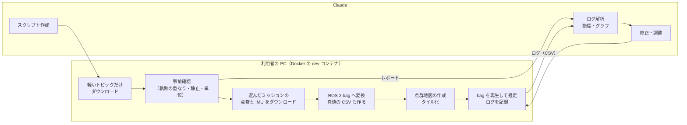

# 検証計画: GrandTour を使った LiDAR 自己位置推定の検証

- 関連文書: [要件定義](./requirements.md) / [設計書](./design.md)（v0.13。9 章「検証計画」） / [アルゴリズム説明書](./algorithm.md) / [tiled_pcd_map](../tiled_pcd_map/README.md)
- 状態: ドラフト（v0.2。サンプルのノートブックで配列名を確かめ、1.2 節の要確認の一部を解消した。ダウンロードと事前確認のスクリプト（`tools/grandtour/`）を作った）

本書は、公開データセット **GrandTour**（ETH Zürich の Robotic Systems Lab。四足ロボット ANYmal に多数のセンサを載せたデータセット）を使って、本システムの **LiDAR による自己位置推定**（Phase 2 で実装した部分）を実データで検証する計画である。GNSS 区間と地図区間の切り替わりは、この後の第 2 段階とし、6.3 節に概要だけを書く。

データセットの情報は、GrandTour の論文（arXiv 2602.18164。ミッションの一覧は同論文の Table 3）、公式ページ（grand-tour.leggedrobotics.com）、GitHub のリポジトリ（leggedrobotics/grand_tour_dataset）の README とサンプルコード（`examples_hugging_face`。ノートブック `explore.ipynb` に、全トピックの配列名と説明の一覧がある）、Hugging Face のファイル一覧とメタデータ（ミッション `2024-11-11-12-42-47` の `metadata/*.yaml`）で確認した内容に基づく。実データを開かないと分からない点は「要確認」とし、3.3 節の事前確認（`tools/grandtour/inspect_grandtour.py`）で決める。

---

## 1. データセットの概要

### 1.1 本システムとの対応

| 項目 | GrandTour | 本システムの想定 | 扱い |
|---|---|---|---|
| 機体 | 四足ロボット ANYmal（歩行。1 ミッション 3〜16 分、36〜470 m） | 車輪型、最高 6 km/h | 速度は低く、想定より遅い側。歩行による胴体の揺れ（roll / pitch の周期的な変化）がある（1.2 節） |
| LiDAR | **Livox Mid-360**（10 Hz。本番と同じ機種。**上下逆さまに取り付け**）。ほかに Hesai XT-32、Velodyne VLP-16 | Livox Mid-360 | **Mid-360 を使う**。脚のオドメトリで動き補正した版（`livox_points_undistorted`）と、補正前の版（`livox_points`）がある。**点ごとの時刻は無い**（1.2 節） |
| IMU | 7 種類以上（ADIS16475 200 Hz、STIM320 500 Hz、Livox 内蔵、ANYmal 内蔵 400 Hz など） | 6 軸 IMU | まず ADIS16475 を使う（6.2 節） |
| ODOM | **車輪は無い**。ANYmal の状態推定器（脚の運動学と IMU）のオドメトリ `anymal_state_odometry` | 前進速度（`nav_msgs/Odometry` の twist） | twist を ODOM として使う。横方向の速度も入る（本システムは横速度にも対応済み。設計書 v0.8） |
| GNSS | NovAtel SPAN CPT7（アンテナ 2 本、RTK）。**配布されているのは Inertial Explorer で処理した解**: `ie_tc`（後処理の密結合解。最も精度が高い）と `ie_rt`（リアルタイムの PPP 解。精度が低い）。形式は、姿勢（`cpt7_ie_*_odometry`）、緯度経度（`navsatfix_cpt7_ie_tc`）、ECEF の位置と標準偏差・方位（`gnss_raw_cpt7_ie_*`） | u-blox F9P の RTK-FIX（リアルタイム） | 第 1 段階では**入力に使わず、`ie_tc` を真値として使う**。第 2 段階で、`gnss_raw_cpt7_ie_tc` から GNSS 入力を作る（6.3 節） |
| 真値 | ① CPT7 の後処理解（屋外。全ミッション共通の地球座標に載る）、② Leica MS60 トータルステーションでのプリズム位置（±2 mm。ミッションごとの局所座標、見通しのある区間だけ） | — | 評価には ① を使う。② は ① の品質確認に使う（5.1 節） |
| 点群地図 | **ミッションごとに DLIO（LiDAR 慣性オドメトリ）で作った点群**（`point_cloud_maps/<ミッション>_dlio.ply`。Hesai から作ったもの） | 統合済みの地図（外部ツールで作る） | 地図の作り方の候補の 1 つにする（4 章） |
| 時刻同期 | LiDAR は PTP（ns 級）、IMU はハードウェアトリガ（1 ms 未満）、基準は CPT7 | — | 時刻ずれの補正は、まず要らない前提で始める |
| 形式 | Hugging Face 上は **Zarr**（トピックごとの `.tar`）。ROS1 bag は別の配布元（要登録）。ROS 2（MCAP）は「近日公開」 | ROS 2 | Hugging Face の Zarr から ROS 2 bag（MCAP）を作る（3.2 節） |
| ライセンス | 公式ページではデータは **CC BY-SA 4.0**、ソフトウェアは MIT（Hugging Face のカードの表記は MIT） | — | 商用利用もできる。出典の表示が必要。データを加工して配布する場合（地図の公開など）は同じライセンスにする（9 章） |
| 入手 | Hugging Face（`leggedrobotics/grand_tour_dataset`）。ミッション × トピック単位で落とせる | — | 必要なミッションとトピックだけを落とす（3.1 節） |

### 1.2 データセットの注意点

- **座標系**: 本システムでは **base_link = ANYmal の `base` フレーム**とする。センサは `base` → `box_base`（センサを載せた箱）→ 各センサ、の静的 TF（`tf`）でつながっている。CPT7 の IMU は `box_base` と同じ位置・向きである（`cpt7_ie_tc_tf` のメタデータ）。変換スクリプトで、IMU のデータを `base` の向きに回し、LiDAR の外部パラメータ（`lidar.extrinsic_*`）を `base` から見た値に直して出力する。
- **姿勢と静的 TF の約束事（要確認）**: 静的 TF（`tf` の属性）は、GrandTour のサンプルの `get_static_transform` と同じ解釈で読む（各項目の値は、ROS の tf とは逆向きに格納されているように読める）。オドメトリの姿勢と速度（twist）がどの座標系で表されているかも、サンプルの間で扱いがそろっていない。どちらも決め打ちせず、事前確認で**データから確かめる**: オドメトリは、位置を微分した速度と twist の一致から姿勢の解釈と速度の座標系を決める。静的 TF は、真値（`box_base` の姿勢）と脚のオドメトリ（`base` の姿勢）の回転の変化から `base` → `box_base` の向きを求め、TF から計算したものと比べる（3.3 節のレポートの 3.1・3.2 節）。
- **真値の座標**: CPT7 の後処理解は `enu_origin` フレーム（局所 ENU）で、原点はミッションごとに違う可能性がある。ミッションをまたいで比べるため、**緯度経度（`navsatfix_cpt7_ie_tc`）を UTM に投影して共通の座標にする**。姿勢（yaw）は ENU の東が基準なので、子午線収差を補正して UTM のグリッド基準にする（スイスは UTM の 32 帯。走行地の経度により約 0.3〜0.7°）。
- **`ie_tc` と `ie_rt`**: ノートブックの説明によれば、`ie_tc` は Inertial Explorer の密結合の後処理解（最も精度が高い）、`ie_rt` はリアルタイムの PPP 解（精度が低い）。真値には `ie_tc` を使う。両者の差は 3.3 節のレポートに出る。
- **Livox の点群**: 列は `points`（座標）、`intensity`、`line`、`tag`、`valid`（スキャンごとの有効な点数）、`timestamp`（スキャンの時刻）。**点ごとの時刻は無い**ので、本システムのデスキューは使えない。データセット側で脚のオドメトリを使って動き補正した `livox_points_undistorted` を、デスキューなしで使う。Mid-360 は**上下逆さまに取り付けられている**（説明の記載）。取り付けの向きは静的 TF に入っているので、変換スクリプトで `base` から見た値に直せばよい。
- **IMU の単位（要確認）**: 各 IMU の列は `lin_acc`、`ang_vel`、`orien`（と共分散）。Livox 内蔵の IMU（TDK ICM40609）は、ドライバの出力のままなら加速度が g 単位である（本システムでは `imu.acc_scale: 9.80665`）。ADIS16475 は m/s² のはず。どちらも静止時の加速度の大きさで確かめる（3.3 節のレポートの 4 節）。本システムは、静止時に z 方向へ約 +9.8 m/s² が出る比力を前提にしている。
- **歩行による揺れ**: 四足歩行では、胴体が歩調に合わせて揺れる。roll / pitch の推定（`AttitudeEstimator`）と、LiDAR の点群を水平面に投影するときの傾き補正に効く。車輪の車両より厳しい条件なので、結果を見るときに考慮する。
- **階段と段差**: 本システムは x, y, yaw の 2 次元で推定し、同じ水平位置に高さの違う地図が重なる構成は対象外である（要件定義 4 章）。**最初は、タグに階段（Stairs）が無く、屋外の平らなミッションを選ぶ**（1.3 節）。
- **起動時の静止**: 本システムは、起動直後の `attitude.static_init_time`（既定 3 s）の IMU の平均から、roll / pitch とジャイロのバイアスを決める（この間に動いていても判定しない）。ミッションの最初にロボットが止まっているかを 3.3 節で確かめる。止まっていなければ、止まっている時刻から bag を始めるか、`static_init_time` を小さくする。

### 1.3 ミッションの選び方

全 49 ミッション（2024 年 10〜12 月）の中から、次の条件で選ぶ。

1. **GNSS がある**（真値を地球座標で比べるため）
2. **同じ日・同じ場所で、複数のミッションがある**（1 つで地図を作り、別の 1 つで照合するため。4.2 節）
3. **屋外で平ら**（最初は階段や屋内を避ける）
4. **構造物がある**（都市・工場など。森や雪山は後回し）

候補（論文の Table 3 より。フォルダ名 = 開始時刻）:

| ミッション | フォルダ名 | 時間 | 距離 | MS60 の範囲 | GNSS | 場面（タグから抜粋） | 使い方 |
|---|---|---|---|---|---|---|---|
| **ETH-1** | 2024-10-01-11-29-55 | 333 s | 205 m | 75 % | あり | 屋外、舗装、車・人、雨 | **動作確認（V-G0）と、地図の作成（V-G1）** |
| **ETH-3** | 2024-10-01-12-00-49 | 464 s | 214 m | 7 % | あり | 都市、屋外、舗装、横断歩道、車・人、雨 | **照合（V-G1〜V-G4）**。ETH-1 と同じ日の 31 分後 |
| SBB-1 | 2024-12-03-13-15-38 | 502 s | 311 m | 99 % | あり | 工場、屋外、砂利、線路 | 別の場所での確認（V-G6）。地図の作成 |
| SBB-2 | 2024-12-03-13-26-40 | 271 s | 149 m | 73 % | あり | 同上 | 別の場所での確認（V-G6）。照合 |
| SPX-1 / SPX-3 | 2024-11-02-17-10-25 / -17-43-10 | 374 s / 213 s | 147 m / 101 m | 76 % / 82 % | あり | 工場、屋外、金属、人。SPX-1 は夕方、SPX-3 は夜 | 時間帯の違う地図での照合（V-G6）。SPX-1 には階段がある |
| ARC-1〜5、LEICA-1 / 2 | 2024-11-18-…、2024-11-25-… | — | — | — | あり（一部は部分的） | 屋内と屋外をまたぐ | 第 2 段階（GNSS と地図区間の切り替わり。6.3 節） |

- ETH-1 と ETH-3 が**実際に同じ道を通っているかは、まだ確かめていない**。3.3 節で、軽いトピックだけを落として軌跡を重ね、重なりが足りなければ SBB-1 / SBB-2 を主な組にする。
- ETH-3 は MS60 の範囲が 7 % と狭いので、真値は CPT7 の後処理解が中心になる。

---

## 2. 検証の進め方と役割分担

この作業環境（クラウド上のコンテナ）には ROS 2 がなく、Hugging Face にも接続できない（接続を確かめたところ、組織のネットワーク制限で拒否された）。そのため、次のように分担する。

| 担当 | 内容 |
|---|---|
| Claude（この環境） | ダウンロード・変換・事前確認・地図作成・評価のスクリプトを書く。コアの単体テストと合成データのシミュレーションを行う。受け取ったログを解析し、パラメータの調整や修正を行う |
| 利用者（手元の PC） | Hugging Face からのダウンロード、ROS 2 bag への変換、点群地図の作成、推定ノードでの bag 再生とログの記録。事前確認のレポートとログを Claude に渡す |

注意: スクリプトは、この環境では GrandTour の実データで試せない。GrandTour と同じ構成（Zarr の配列名と属性）の小さな合成データで動作を確かめてから渡し、最初の実データでの実行は利用者の PC で行う。エラーが出たらその内容を受け取って直す。

---

## 3. 準備

### 3.1 ダウンロード（`tools/grandtour/download.py`、作成済み）

GrandTour のサンプル（`examples_hugging_face/scripts/download_data.py`）と同じく、`huggingface_hub` の `snapshot_download` で、ミッションとトピックを絞って落とし、`.tar` を展開する。3 段階に分ける。

| 段階 | トピック | 大きさの目安（1 ミッション） | 目的 |
|---|---|---|---|
| light | `cpt7_ie_tc_odometry`、`cpt7_ie_rt_odometry`、`navsatfix_cpt7_ie_tc`、`gnss_raw_cpt7_ie_tc`、`prism_position`、`anymal_state_odometry`、`dlio_map_odometry`、`tf`、`metadata/` | 数十 MB | 軌跡の重なりと真値・約束事の確認（3.3 節）。**候補の全ミッションについて落とす**（`--missions candidates`） |
| lidar | light に加えて `livox_points_undistorted`、`livox_imu`、`adis_imu`（`--topics livox_points` で補正前の点群も） | 数百 MB〜1 GB 程度 | 照合（変換して bag にする） |
| map | `point_cloud_maps/<ミッション>_dlio.ply` | 数百 MB | 案 B の地図（4 章） |

- 保存先はリポジトリの外（例: `$GLL_DATA/grandtour/<フォルダ名>/`）。
- 必要な Python パッケージ（`huggingface_hub`、`zarr`、`pyproj`）は Docker の `dev` ステージに入れた。使い方は [tools/grandtour/README.md](../tools/grandtour/README.md)。
- 一度展開したトピックは、次に実行したときは落とさない。展開した後の `.tar` は消す。

### 3.2 ROS 2 bag への変換（`tools/grandtour/grandtour_to_bag.py`、Claude が作成）

Docker の `dev` ステージのコンテナの中で実行する。ROS には依存させず、`tools/tile_demo/make_bag.py` と同じく MCAP を直接書く。

| 入力（Zarr のトピック） | 出力（ROS 2） | 処理 |
|---|---|---|
| `adis_imu`（`--imu livox` / `anymal` で切り替え） | `/sensing/imu`（`sensor_msgs/Imu`、frame `base_link`） | 静的 TF で `base` の向きに回す。単位を m/s² にそろえる（1.2 節） |
| `anymal_state_odometry` | `/sensing/odom`（`nav_msgs/Odometry`。twist だけを埋める） | twist を `base` の座標系で出す。劣化のオプション: 縮尺の誤差（`--odom-scale 1.03` など）、白色雑音（`--odom-noise 0.05`） |
| `livox_points_undistorted`（`--points raw` で `livox_points`） | `/sensing/lidar/points`（`sensor_msgs/PointCloud2`、frame `livox_lidar`） | `valid` の点数だけを取り出し、`intensity` も列に入れる（点ごとの時刻は無い） |
| `tf`（静的） | `/tf_static`（base_link → livox_lidar など）と、`lidar.extrinsic_*` に入れる値の表示 | `base` → `box_base` → `livox_lidar` をつなぐ |
| 真値 + 誤差 | `/initialpose`（`geometry_msgs/PoseWithCovarianceStamped`。launch の `initial_pose_topic` の既定値） | 静止初期化の後の時刻に 1 回出す。`--init-error 2.0,15` で位置・yaw に誤差を与える（V-G2）。共分散も誤差に合わせて入れる |
| `cpt7_ie_tc_odometry` + `navsatfix_cpt7_ie_tc` | `/groundtruth/pose`（評価用）と `groundtruth.csv` | `box_base` の姿勢を `base` に直し、UTM 32 帯に投影し、yaw を子午線収差で補正する（1.2 節） |
| — | — | `--start` / `--end`（秒）で区間を切り出す。`--drop-lidar 120:15`（120 s から 15 s 止める）のように LiDAR の欠落を入れる（V-G4） |

トピック名は launch の既定値（`/sensing/imu`、`/sensing/odom`、`/sensing/lidar/points`、`/initialpose`）に合わせる。第 1 段階では GNSS のトピックは作らない。再生は `ros2 bag play --clock` で行い、推定ノードは `use_sim_time:=true` で起動する。

### 3.3 データの事前確認（`tools/grandtour/inspect_grandtour.py`、作成済み）

light の段階のデータで、次の項目を 1 枚のレポート（`report.md` と図）にまとめる。点群と IMU の項目は lidar の段階のデータで行う。結果を Claude に渡してもらい、ミッションの組と以降の設定を決める。

- **ミッションどうしの軌跡の重なり**: 候補のミッションの真値を UTM で重ね、同じ場所（5 m 以内）を通る区間の長さと、通る向き（同じ / 逆）を一覧にする。1.3 節の組を決める
- `ie_tc` と `ie_rt` の差、`ie_tc` と MS60 のプリズム位置の差（剛体変換とプリズムのレバーアームを同時に求めた後の残差）。真値の精度の目安にする
- **オドメトリの姿勢の解釈と速度の座標系、静的 TF の解釈**（1.2 節）
- 真値の時刻の間隔と欠落、GNSS の解が無い区間
- ミッションの最初にロボットが止まっているか、止まっている時間
- 速度の分布（前進・横）と、横方向の移動の多さ
- 高さの変化（段差・坂）
- （lidar の段階）Livox の点群の列、1 スキャンの点数、`base` から見た LiDAR の位置と向き、ロボット自身に当たった点の範囲（クロップの箱を決める）
- （lidar の段階）IMU の単位と、静止時の加速度の大きさ
- （lidar の段階）地面から `base` までの高さ（`lidar.base_link_height` に入れる）

---

## 4. 点群地図の作成（検討結果）

本番では「外部ツールで作った統合済みの地図（PCD）と、アンカー（地図の 1 点の緯度経度と方位）」が入力になる（設計書 5 章）。GrandTour には、ミッションごとの DLIO の地図が付いているので、それも使える。

### 4.1 作り方の比較

| 案 | 方法 | 良い点 | 悪い点 |
|---|---|---|---|
| A | 真値（CPT7 の後処理解）の姿勢で、地図用ミッションの Livox の点群（動き補正済み）を並べて重ねる | 照合と同じセンサ（Mid-360）で作れる。地図が UTM に直接合う（アンカーの誤差が無い）。道具が要らない | 真値の誤差がそのまま地図のにじみになる。本番の手順（外部ツールで作る）とは違う |
| B | **データセットに付いている DLIO の地図**（`<ミッション>_dlio.ply`）を使い、DLIO の軌跡（`dlio_map_odometry`）と真値の対応からアンカーを決める | **本番と同じ形（外部ツールの地図 + アンカー）**を、SLAM を自分で動かさずに試せる。アンカーを決める処理は、Phase 3 のアンカー較正ツールの試作になる | 地図は Hesai XT-32 から作られていて、照合に使う Mid-360 と視野・密度が違う（これは本番でもありうる条件）。アンカーの推定誤差が加わる。地図の傾き（重力方向）の扱いは要確認 |
| C | 自分で LiDAR SLAM を動かして作る | 作り方を自由に選べる | 手間が大きい。案 B で同じ目的を達成できる |

**決定: 案 A で始め、次に案 B を行う。案 C は行わない。**

- 最初の目的は、ダウンロード・変換・地図・照合・評価の一連の流れを実データで回し、明らかな不具合（座標系、外部パラメータ、時刻、単位）を見つけることである。それには、照合と同じセンサで作れて、アンカーの誤差も入らない案 A が切り分けやすい。
- 案 A でよい結果が出たら、案 B の地図で同じ評価をする（V-G5）。両者の差が、「別のセンサ・別のツールで作った地図」と「アンカーの誤差」の影響になる。本番の地図は外部ツールで作るので、案 B の結果の方が本番に近い。
- 以前の KITTI 版の計画では、案 B のために SLAM を自分で動かす必要があった。GrandTour では地図が付いているので、その手間が無くなった。

### 4.2 地図を作るミッションと照合するミッションを分ける

地図を作ったスキャンと同じスキャンで照合すると、点が完全に一致するため、結果が楽観的になる。**精度の評価では、地図を作ったミッションとは別のミッションで照合する。** 例外は動作確認の V-G0 だけである。

- 最初の組は **ETH-1（地図）→ ETH-3（照合）**。重なりが足りなければ **SBB-1 → SBB-2** にする（3.3 節で決める）。
- 照合するミッションが地図の外を歩く区間は、デッドレコニングになる。そこは地図に戻ったときの照合と再位置推定の確認にも使う。精度の指標は、地図の上にいる区間だけで計算する（5.2 節）。
- 同じ日の数十分後のミッションどうしなので、人や車の出入りはあるが、大きな環境の変化は無い。時間帯が違う組（SPX-1 → SPX-3 の夕方 → 夜）は V-G6 で確かめる（LiDAR は照明の影響を受けないので、主に人や車の違い）。

### 4.3 案 A の手順（`tools/grandtour/build_map_from_gt.py`、Claude が作成）

1. 地図用ミッションの `livox_points_undistorted` の各スキャンを、真値（`cpt7_ie_tc_odometry` を `livox_lidar` まで静的 TF でつないだ姿勢）で地図座標に移す。真値が欠けている時刻のスキャンは使わない。
2. 各スキャンは、距離でクロップし（最初は 1〜40 m）、ロボット自身の点を箱で除く（3.3 節）。
3. 地図座標は、最初のスキャンの位置を原点にし、x = 東、y = 北（UTM のグリッド）、z = 高さとする。距離は実距離にする（UTM の座標の差を、原点での縮尺係数 k で割る）。
4. 全体を 0.1 m でボクセル間引きし、PCD で書き出す。あわせて `maps.yaml` を書き出す。アンカーは UTM で与える: `anchor: {map_point: [0, 0, 0], easting: <原点の E>, northing: <原点の N>, ellipsoid_height: <原点の楕円体高>, grid_heading_deg: 90.0}`（x 軸 = 東なので、グリッド北から時計回りに 90°）。
5. `tiled_pcd_map_tiler` でタイルにする（まず `--tile-size 20 --voxel-size 0.2`）。
6. 地図の品質を目で見る: 壁の厚み、地面の段差、人や車の残像。残像が多ければ、動く物の除去（GrandTour のサンプルに、画像を使って動く点を除く `dynamic_points_filtering_using_images.py` がある）を検討する。

### 4.4 案 B の手順（`tools/grandtour/fit_anchor.py`、Claude が作成）

1. 地図用ミッションの `point_cloud_maps/<ミッション>_dlio.ply` を読み、PCD に変換する（`tiled_pcd_map_tiler` の入力は PCD）。
2. DLIO の軌跡（`dlio_map_odometry`。`dlio_map` → `hesai_lidar` の姿勢）を静的 TF で `base` の軌跡に直し、真値（UTM）と時刻で対応付けて、3 次元の剛体変換を最小二乗で求める。
   - 回転のうち**水平面からの傾き**（roll / pitch の成分）で PCD を回し、地図の z 軸を鉛直にそろえる（要件定義 4 章の前提。DLIO の地図が重力方向にそろっているかは要確認なので、そろっていても外れていても同じ処理で扱う）。
   - 残りの鉛直軸まわりの回転と並進から、`maps.yaml` のアンカー（UTM）を出力する。
   - 対応点の残差の RMS と最大値もあわせて出力し、アンカーの精度の目安にする。
3. 4.3 節の 5〜6 と同じくタイル化し、品質を目で見る。

---

## 5. 評価の方法

### 5.1 真値

- CPT7 の後処理解（`ie_tc`）を `base` の姿勢に直し、UTM 32 帯に投影して、yaw を子午線収差で補正したものを真値とする（3.2 節の `groundtruth.csv`）。
- 時刻は出力の時刻に線形補間して合わせる。GNSS の解が無い区間は評価から外す。
- 真値の精度の目安は、3.3 節の「`ie_tc` と MS60 の差」で見積もる。評価の分解能はその程度（数 cm を想定）と考える。

### 5.2 指標（`tools/grandtour/evaluate.py`、Claude が作成）

| 指標 | 内容 | 対応する要件 |
|---|---|---|
| 水平位置誤差 | 出力と真値の差を、進行方向（縦）と横に分けた RMS・95% 値・最大値。**地図の上にいる区間だけ**で計算する | FR-1、FR-3 |
| yaw 誤差 | RMS・最大値 | FR-3 |
| 出力の補正ステップ | 出力の周期ごとの差から、真値の移動量を引いたものの最大値 | **FR-4（飛びがないこと）** |
| 共分散の整合性 | 誤差が報告した 3σ の中に入る割合、NEES の平均。`lidar.cov_scale` を決める材料にする | 設計書 3.13 節の判定の前提 |
| 地図上での初期化 | 成功率、初期姿勢を受け取ってから `INITIALIZING` を抜けるまでの時間、そのときの誤差 | 設計書 3.11 節 |
| 状態の推移 | `LIDAR_AIDED` / `DEAD_RECKONING` / `DEGRADED` / `LOST` の時間の割合と、地図の上にいるかどうかとの対応 | 設計書 3.12・3.13 節 |
| LiDAR の照合 | 採用率、棄却数（品質・ゲート）、再位置推定の回数、インライア率と overlap の分布 | 設計書 3.13 節 |
| デッドレコニング | 地図の外や LiDAR の欠落の間の、歩いた距離に対する誤差の伸び（横・縦）。`dr_distance` と ERROR の時刻 | FR-8 |
| 処理時間 | 予測・更新・GICP・タイル再構築の処理時間（p50 / p99）、ターゲットが空だった回数 | 設計書 9 章 |

出力は、指標の表（Markdown）と図（軌跡と地図、誤差の時系列と地図の上かどうかの色分け、状態の時系列）。

### 5.3 推定ノードが出すログ（CSV）

`gll_ros2` のパラメータ `debug_csv_path` を指定すると、出力を CSV に書く（実装済み）。1 行 = 1 出力周期。

| 列 | 内容 |
|---|---|
| `t` | 時刻（UNIX 秒） |
| `x, y, yaw` | 出力（出力整形後） |
| `raw_x, raw_y, raw_yaw` | フィルタの推定値 |
| `var_x, var_y, var_yaw` | 出力の共分散の対角（$`\Sigma_w + \mathbf{o}\mathbf{o}^\top`$） |
| `raw_var_x, raw_var_y, raw_var_yaw` | フィルタの共分散の対角 |
| `offset_x, offset_y, offset_yaw` | 出力整形のオフセット |
| `status, recovery_state, active_map_group` | 状態 |
| `roll, pitch, gyro_bias, odom_scale` | 補助推定とバイアス |
| `dr_distance` | 最後に位置の観測を採用してから走った距離 [m]（設計書 3.12 節） |

観測ごとのイベント（採用・棄却・再アンカー・再位置推定、Mahalanobis 距離、GICP の品質指標と処理時間）は、別の CSV（`debug_events_path`）に 1 行 1 イベントで出す（**未実装**。V-G1 の前に追加する）。それまでは、`~/debug/lidar_pose` と `/diagnostics` を bag に記録して代わりにする。

---

## 6. 検証シナリオ

### 6.1 第 1 段階: LiDAR による自己位置推定

| ID | ミッション | 地図 | 内容 | 主な確認点 |
|---|---|---|---|---|
| V-G0 | ETH-1 | 案 A（**同じミッション**） | 動作確認 | 変換・TF・外部パラメータ・IMU の単位・起動手順が正しいこと。地図上での初期化から追跡まで通ること。誤差は数 cm になるはず（楽観的な値なので精度の評価には使わない）。`livox_points_undistorted` と `livox_points`（補正前。点ごとの時刻が無いのでデスキューなし）を比べ、歩く速さでの歪みの影響を見る |
| V-G1 | ETH-3 | 案 A（ETH-1） | 別のミッションでの追跡 | 地図区間での精度、照合の採用率、共分散の整合性（→ `cov_scale`）、処理時間、タイルの読み込み（ターゲットが空にならないこと） |
| V-G2 | ETH-3 | 案 A（ETH-1） | 地図上での初期化 | 初期姿勢に 1〜3 m・10〜30° の誤差を与え（位置と誤差を変えて 20 回程度）、成功率・時間・誤った位置で初期化しないことを確認する |
| V-G3 | ETH-3 | 案 A（ETH-1） | ODOM を劣化させる | 脚のオドメトリはそれ自体がずれるが、さらに縮尺の誤差（+3〜5 %）と雑音を入れても、LiDAR の照合で位置が保たれること。`odom_scale` の推定が誤差の方へ動くこと |
| V-G4 | ETH-3 | 案 A（ETH-1） | LiDAR を止める・地図の外に出る | 5〜20 s の欠落と、地図の無い区間の歩行で、デッドレコニングの誤差の伸び、`dr_error_distance` での ERROR、再開後の照合または再位置推定での復帰、出力が飛ばないこと |
| V-G5 | ETH-3 | 案 B（ETH-1 の DLIO 地図） | V-G1・V-G2 を案 B の地図で行う | 案 A との差（Hesai で作った地図に Mid-360 で照合する影響と、アンカーの誤差の影響）。アンカーの残差と、出力の誤差の関係 |
| V-G6 | SBB-2、SPX-3 | 案 A・B（SBB-1、SPX-1） | 別の場所・別の時間帯 | 砂利と線路の場所、夕方に作った地図での夜の照合で、V-G1 と同じ指標が保たれること |

障害（ODOM の劣化、LiDAR の欠落、初期姿勢の誤差）は、変換スクリプトのオプションで bag を作り分けて入れる（3.2 節）。元のデータは変更しない。

### 6.2 このデータセット用のパラメータ（初期値）

| パラメータ | 既定値 | GrandTour 用 | 理由 |
|---|---|---|---|
| `gnss.utm_zone` / `utm_north` | 54 / true | **32** / true | スイス（1.2 節）。`maps.yaml` の `utm` と合わせる |
| `imu.rotation_rpy_deg` | [0, 0, 0] | [0, 0, 0] | 変換スクリプトで `base` の向きに回してある |
| `imu.acc_scale` | 1.0 | 1.0（Livox 内蔵の IMU を g 単位のまま使う場合は 9.80665） | 1.2 節 |
| `attitude.static_init_time` | 3.0 s | 最初の停止時間に合わせる | 1.2 節 |
| `lidar.extrinsic_xyz` / `extrinsic_rpy_deg` | 0 | `base` から見た `livox_lidar`（変換スクリプトが出力） | 1.2 節 |
| `lidar.time_field` | auto | `""`（`livox_points_undistorted` を使う間） | 動き補正済みの点群を二重に補正しないため |
| `lidar.max_range` | 50 m | 40 m | Mid-360 の仕様の範囲 |
| `lidar.crop_box_*` | 無効 | 有効（範囲は 3.3 節で決める） | ロボット自身と箱に当たった点を除く |
| `lidar.base_link_height` | 0 m | 地面から `base` までの高さ（3.3 節） | 地図上の初期化の z の初期値 |
| `lidar.cov_scale` | 0.15 | 0.15（まずこのまま） | V-G1 の共分散の整合性で決める |
| `estimator.sigma_v_lat` | 0.02 | 0.02（まずこのまま） | 四足は横にも動くので、V-G1 で ODOM の横速度の誤差を見て見直す |
| `monitor.dr_error_distance` | 30 m（仮） | 30 m（まずこのまま） | V-G4 の誤差の伸びは参考値として記録する（脚のオドメトリで測った値なので、最終的な値は自社の車両のデータで決める） |
| GNSS のトピック | — | つながない（第 1 段階） | 1.1 節 |

### 6.3 第 2 段階: GNSS と地図区間の切り替わり（概要）

第 1 段階が終わってから、詳しい計画を本書に追加する。

- **ミッション**: 屋内と屋外をまたぐ ARC-1〜5、LEICA-1 / 2 など。屋外で GNSS、屋内で地図に切り替わる。
- **GNSS の入力**: 配布されているのは後処理の解なので、そこから `sensor_msgs/NavSatFix` を作る（F9P に合わせて 10 Hz に間引き、標準偏差から `status`（RTK-FIX = 2）を付け、屋内に入る前後の劣化は解の標準偏差に従う）。**リアルタイムの受信機の振る舞い（FIX の出入り、誤った FIX）は再現できない**ので、誤った FIX などは障害注入で入れる。
- **確認点**: GNSS 区間と地図区間の切り替わりでの出力の滑らかさ、GNSS FIX 中の LiDAR の食い違い判定とアンカーずれの記録、再アンカー、状態の推移。

---

## 7. 合格基準（仮）

設計書 9 章の仮の基準のうち、LiDAR に関わるものを、このデータセットでの目標とする。真値の誤差と、歩行による揺れを含むため、初回の結果を見て見直す。

| 項目 | 基準（仮） |
|---|---|
| 水平位置の横方向誤差（地図の上の区間） | RMS < 0.10 m |
| yaw 誤差（地図の上の区間） | RMS < 1.0° |
| 出力の補正ステップ | 1 周期あたり < 0.02 m |
| 共分散の整合性 | 誤差が 3σ 以内に入る割合 > 95% |
| 地図上での初期化 | 初期姿勢の誤差 3 m・30° 以内で成功率 > 95%。誤った位置で初期化しない |
| 状態 | 地図の上の通常の歩行で `LOST` にならない |
| デッドレコニングの監視 | `dr_distance` が `dr_error_distance` を超えてから 1 出力周期以内に ERROR、照合を採用したら解除 |
| 処理時間 | GICP < 60 ms（p99） |

---

## 8. このデータセットで確かめられないこと

次の項目は GrandTour では確かめられないので、自社の車両で記録したデータで検証する（その計画は別に作る）。

- **リアルタイムの RTK-GNSS の振る舞い**: F9P の FIX の出入り、FIX なのに位置が飛ぶ、ドライバの出力の形式と遅れ（配布されているのは後処理の解だけ）
- **車輪の車両の動き**: ホイールオドメトリの性質（スリップ、縮尺の変化）、平らな車両の姿勢、6 km/h での振る舞い。`dr_error_distance` の最終的な値
- **本番の取り付け**: Mid-360 と IMU の取り付け位置・高さ・傾きでの、地面と構造物の見え方

---

## 9. 未決事項

1. **ライセンスの表記**: 公式ページは CC BY-SA 4.0（データ）、Hugging Face のカードは MIT となっている。業務で使う前に、どちらが適用されるかを確認する。地図などの加工物を外部に出す場合は、出典の表示と同じライセンスでの公開が必要になりうる。
2. **ETH-1 と ETH-3 の軌跡の重なり**（3.3 節。足りなければ SBB-1 / SBB-2 を主な組にする）。
3. ~~Livox の点群の列~~ → 反射強度あり、点ごとの時刻なし（v0.2）。**残り**: IMU の単位（3.3 節）。
4. ~~`ie_tc` と `ie_rt` の違い~~ → 後処理の密結合解とリアルタイムの PPP 解（v0.2）。**残り**: 真値の精度（3.3 節）。
5. **ミッションの最初にロボットが止まっているか**（3.3 節。`static_init_time` の値が決まる）。
6. **DLIO の地図の重力方向**（4.4 節の傾きの補正で扱う）。
7. **`debug_events_path` の実装**（5.3 節。V-G1 の前に）。
8. **姿勢と静的 TF の約束事**（1.2 節。3.3 節のレポートの 3.1・3.2 節で決める）。
