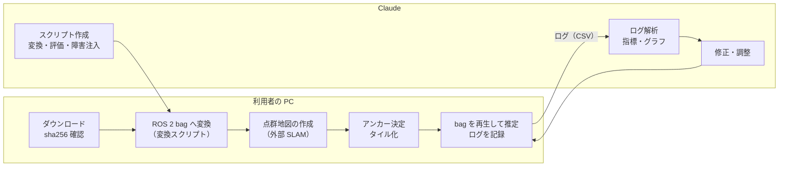

# 検証計画: i2Nav-Robot データセットを使った検証

- 関連文書: [要件定義](./requirements.md) / [設計書](./design.md)（v0.7。9 章「検証計画」） / [アルゴリズム説明書](./algorithm.md)
- 状態: ドラフト（v0.1）

本書は、公開データセット **i2Nav-Robot**（武漢大学 i2Nav グループ）を使って、本システムの自己位置推定をどう検証するかをまとめたものである。データセットの情報は、同データセットの GitHub リポジトリ（2026-01-16 のコミット `2ffdca6`）の README、`calibration/calibration.yaml`、`sequence_detail/i2nav_robot.json` で確認した内容に基づく。

---

## 1. データセットの概要

### 1.1 本システムとの対応

| 項目 | i2Nav-Robot | 本システムの想定 | 扱い |
|---|---|---|---|
| 車両 | 車輪ロボット AgileX Ranger MINI 3 | 車輪型、最高 6 km/h | 平均速度は約 1.7 m/s で、ほぼ同じ |
| GNSS（RTK） | **NovAtel OEM719 の RTK 解**（`/novatel/oem7/fix`、1 Hz） | u-blox F9P の RTK-FIX、〜10 Hz | OEM719 を GNSS 入力として使う（1.2 節） |
| GNSS（F9P） | **単独測位（SPP）**（`/ublox/f9p/fix`、1 Hz） | — | RTK ではないので、位置の補正には使わない。「RTK-FIX 以外を棄却する」ことの確認に使う |
| LiDAR | Hesai AT128（`sensor_msgs/PointCloud2`、10 Hz、水平 120°）、Livox Mid360（`livox_ros_driver/CustomMsg`、10 Hz、水平 360°） | 1 台 | まず標準の型で扱える AT128 を使う。Mid360 は変換を用意してから |
| IMU | ADIS16465（`/adi/adis16465/imu`、`sensor_msgs/Imu`、200 Hz） | 6 軸 IMU | そのまま使える |
| ODOM | `/insprobe/ranger/odometer`（`insprobe_msgs/RangerOdometer`、50 Hz、4 輪の速度と操舵角） | 前進速度 | 前進速度に変換する（1.2 節） |
| 真値 | 位置 0.02 m、姿勢 0.01° 程度（ADIS16465 の IMU 中心、局所 NED） | — | 評価に使う（5 章） |
| 点群地図 | **配布されない**（README に「ポリシー上の理由で提供しない」と明記） | 統合済みの地図が入力される | 外部の SLAM ツールで作る（4 章） |
| 形式 | ROS1 bag とテキストファイル | ROS 2 | ROS 2 bag に変換する（3 章） |
| ライセンス | GPLv3。データは学術目的に限る | — | 業務での利用可否は別途確認する |
| サイズ | 全体で約 450 GB | — | 必要なシーケンスだけを落とす |

### 1.2 データセットの注意点

- **RangerOdometer の左右の取り違え**: README に「`/insprobe/ranger/odometer` は左右の車輪のデータが逆に記録されているので、入れ替えて使うこと」と明記されている。変換時に入れ替える。
- **ODOM の前進速度**: 同梱の `*_ODO_SPEED.txt`（4 輪の速度と操舵角から計算した車両座標系の速度、時刻は GNSS 週秒）を使うのが最も簡単である。Ranger MINI 3 は四輪操舵で、横方向に動くモード（カニ歩き・その場旋回）を持つ。本システムの予測モデルは前進速度だけを扱うので、横方向の移動が含まれる区間がないかを最初に確認する（3.3 節）。
- **OEM719 の RTK-FIX の判定**: `/novatel/oem7/fix` の `status` が RTK の FIX / FLOAT を区別しているかは不明である。区別していない場合は、変換時に標準偏差（`*_OEM7_GNSS.pos` の std、または `position_covariance`）から `status` を付け直す（3.2 節）。README によれば、OEM719 の RTK 解には「複雑な環境による外れ値が多い」とあるので、誤った FIX の扱い（設計書 3.13 節）の検証にも使える。
- **GNSS が 1 Hz**: 本システムの既定値は 〜10 Hz を想定している。FIX 後の安定待ち（1 s）はおよそ 1〜2 エポック、GNSS の再アンカー（3 回一致）はおよそ 3 秒に相当する。検証用のパラメータで調整する（6.2 節）。
- **時刻**: ROS メッセージのタイムスタンプは UNIX 秒、テキストファイルは GNSS 週秒（SOW）。README に変換式がある（うるう秒 18 秒）。
- **座標系**: ADIS16465 と Mid360 の IMU は前・右・下（FRD）。本システムの base_link は前・左・上（FLU）とするので、変換が必要である。
- **真値の原点**: 真値（`*_groundtruth.nav`、`*_trajectory.csv`）は局所 NED 座標で、原点の緯度経度は README に記載がない。UTM での評価には位置合わせが必要である（5.1 節）。

### 1.3 シーケンス

`sequence_detail/i2nav_robot.json` より。

| シーケンス | 時間 [s] | 距離 [m] | 場面 | 特徴 | 真値 | GNSS |
|---|---|---|---|---|---|---|
| building00 | 1201 | 1673 | 屋外 | GNSS 劣化 | 地図照合/INS | あり |
| building01 | 1369 | 1730 | **屋内/屋外** | 照明変化 | 地図照合/INS | あり |
| building02 | 2110 | 2522 | 屋外 | 動的物体 | GNSS/INS | あり |
| parking00 | 1141 | 1583 | **屋内/屋外** | 照明変化 | 地図照合/INS | あり |
| parking01 | 1060 | 1224 | 屋内 | モーションブラー | 地図照合/INS | なし |
| parking02 | 1257 | 1442 | 屋内 | モーションブラー | 地図照合/INS | なし |
| playground00 | 1786 | 1711 | 屋外 | 構造物が少ない | GNSS/INS | あり |
| street00 | 1380 | 1668 | 屋外 | 動的物体 | GNSS/INS | あり |
| street01 | 1520 | 1660 | 屋外 | 動的物体 | GNSS/INS | あり |
| street02 | 1380 | 1847 | 屋外 | 動的物体 | GNSS/INS | あり |

本システムにとって重要なのは、GNSS 区間と地図区間をまたぐ **building01 と parking00** である。名前から、building / parking / street の各グループは同じ場所を走っていると推測されるが、実際に軌跡が重なるかは真値の軌跡を重ねて確認する（3.3 節）。

### 1.4 外部パラメータ（キャリブレーションファイルより）

ADIS16465 の IMU 中心（FRD）を基準にした値。本システムでは **base_link = ADIS16465 の IMU 中心（FLU に変換）** とする。真値も同じ点を基準にしているので、そのまま比較できる。

| 項目 | ファイルの値（FRD） | base_link（FLU）での値 | 備考 |
|---|---|---|---|
| GNSS アンテナ（`gnss_lever`） | (0.0, -0.07, -0.365) m | **(0.0, 0.07, 0.365) m** | アンテナ高さ $`l_z`$ = 0.365 m。設計書 3.6 節の傾き補正を試せる |
| ODOM の基準点（`odo_lever`） | (0.0, 0.0, 0.852) m | (0.0, 0.0, -0.852) m | 地面の高さ |
| IMU と ODOM の時刻差（`td_imu_odo`） | -0.01 s | — | 変換時に補正する |
| AT128 LiDAR | `T_lidar_imu`（並進 0.042, -0.018, -0.063 m） | 逆変換して FLU に | 並進は 3D モデルから、回転はオンライン推定値（README） |

---

## 2. 検証の進め方と役割分担

この作業環境（クラウド上のコンテナ）には ROS 2 がなく、データセットの配布元にも接続できない。そのため、次のように分担する。

| 担当 | 内容 |
|---|---|
| Claude（この環境） | 変換・評価・障害注入のスクリプトを書く。コアの単体テストと合成データのシミュレーションを行う。GitHub Actions の CI で ROS 2 ノードをビルドする。受け取ったログを解析し、パラメータの調整や修正を行う |
| 利用者（手元の PC） | データのダウンロード、ROS 2 bag への変換、点群地図の作成、推定ノードでの bag 再生とログの記録。ログを Claude に渡す |

注意: 変換スクリプトは、この環境では実データで試せない（ROS1 bag を読むための `rosbags` パッケージもこの環境には入れられない）。最初の実行は利用者の PC で行い、エラーが出たらその内容を受け取って直す。

---

## 3. 準備

### 3.1 ダウンロード

1. 最初は次の 4 シーケンスに絞る（全部で約 450 GB あるため）。
   - **street00**（屋外・GNSS/INS の真値）: Phase 1 の GNSS + デッドレコニングの検証
   - **parking01** と **parking02**（屋内）: 地図の作成と、地図による LiDAR 自己位置推定
   - **parking00**（屋内/屋外）: GNSS と地図区間の切り替わり
2. `sha256sum/sha256sum.json` でファイルの完全性を確認する。
3. データはリポジトリの外に置く（例: `$GLL_DATA/i2nav/<シーケンス名>/`）。リポジトリには入れない。

### 3.2 ROS 2 bag への変換（`tools/i2nav/convert_i2nav.py`、Claude が作成）

利用者の PC に `pip install rosbags` を入れて実行する。変換内容:

| 入力 | 出力（ROS 2） | 処理 |
|---|---|---|
| `/adi/adis16465/imu` | `/sensing/imu`（`sensor_msgs/Imu`、frame `base_link`） | FRD → FLU（y, z の符号を反転） |
| `*_ODO_SPEED.txt`（または `/insprobe/ranger/odometer`） | `/sensing/odom`（`geometry_msgs/TwistWithCovarianceStamped`） | GNSS 週秒 → UNIX 秒、`td_imu_odo` の補正。bag のトピックを使う場合は左右を入れ替えて前進速度を計算する |
| `/novatel/oem7/fix` | `/sensing/gnss/fix`（`sensor_msgs/NavSatFix`） | RTK-FIX の判定が `status` で区別されていなければ、水平 σ ≤ `fix_std_threshold`（既定 0.03 m）のときだけ `status = 2`、それ以外は 0 に付け直す。`position_covariance` に std² を入れる |
| `/ublox/f9p/fix` | `/sensing/gnss_spp/fix` | そのまま（単独測位。棄却の確認用） |
| `/hesai/at128/points` | `/sensing/lidar/points`（`sensor_msgs/PointCloud2`） | そのまま（外部パラメータは TF で与える） |
| — | `/tf_static` | base_link → at128 / gnss_antenna の静的 TF（1.4 節） |
| `*_trajectory.csv` | `/groundtruth/pose`（評価用） | GNSS 週秒 → UNIX 秒、NED → UTM（5.1 節の位置合わせ後） |

独自メッセージ（`insprobe_msgs`、`livox_ros_driver`）の定義は、`rosbags` の型登録で読み込む。i2Nav-Robot のリポジトリはサブモジュール（`third_party/i2nav_robot`、特定コミットに固定）として参照する案で、`.msg` 定義とキャリブレーションファイルをそこから読む（未実施）。

### 3.3 データの事前確認（`tools/i2nav/inspect_i2nav.py`、Claude が作成）

変換後、次の項目を 1 枚のレポート（図付き）にまとめる。結果を Claude に渡してもらい、以降の設定を決める。

- 各トピックの実際の周期と欠落
- OEM719 の `status` の値の分布、水平 σ の分布、FIX と判定される区間の割合
- ODOM の横方向の速度成分の有無（四輪操舵のカニ歩き・その場旋回の検出）
- 真値の軌跡を重ねた図（同じ場所を走るシーケンスの組み合わせの確認）
- 屋内/屋外の境界の位置と、その前後での OEM719 の σ の変化

---

## 4. 点群地図の作成とアンカーの決定

データセットには点群地図が含まれないので、利用者が外部の SLAM ツールで作る。これは、本番で「統合済みの地図を外部ツールで作る」手順（設計書 5.1 節）の予行演習にもなる。

### 4.1 地図の作成

| 地図 | 作成に使うシーケンス | 自己位置推定に使うシーケンス | 目的 |
|---|---|---|---|
| parking 地図 | parking01 | parking02、parking00 | 別の走行で作った地図での照合（同じシーケンスでの照合は楽観的な結果になるため避ける） |
| building 地図 | building00 または building02 | building01 | 屋内/屋外の切り替わり |

- SLAM ツールは利用者が選ぶ（例: FAST-LIO2 や LIO-SAM など。同グループの [i2Nav-Robot-Baseline](https://github.com/i2Nav-WHU/i2Nav-Robot-Baseline) に、ベースライン手法の設定ファイルが公開されている）。
- 出力は、地図座標系の点群（PCD）と、地図作成時の軌跡（時刻付き）の 2 つ。
- 同じ場所を走っていることは 3.3 節の図で確認してから組み合わせる。

### 4.2 アンカーの決定（`tools/i2nav/fit_anchor.py`、Claude が作成）

地図作成に使ったシーケンスの屋外区間で、「SLAM の軌跡（地図座標系）」と「OEM719 の RTK 解（UTM、σ ≤ 3 cm の点だけ）」を時刻で対応付ける。その対応から、地図 → UTM の変換（2D の回転・並進と高さのオフセット。縮尺は 1 に固定）を最小二乗で求め、`maps.yaml` のアンカー形式（設計書 5.2 節）で出力する。

- 残差の RMS と最大値もあわせて出力し、アンカーの精度の目安にする。
- 屋内だけのシーケンス（parking01）で作った地図は、GNSS との対応が取れない。その場合は、同じ場所を屋外も含めて走る parking00 の軌跡で地図とつなぐか、真値を使ってアンカーを決める（真値は 5.1 節で UTM に合わせてあるので使える）。この場合は、アンカー誤差の検証には使えないことに注意する。

### 4.3 タイル化

`gll_map_tiler`（設計書 5.2 節、Phase 2 で実装）で、点群をタイルに分割し、点ごとの共分散を計算する。

---

## 5. 評価の方法

### 5.1 真値の位置合わせ（`tools/i2nav/align_groundtruth.py`、Claude が作成）

真値は局所 NED 座標で、原点の緯度経度が公開されていない。そこで、GNSS/INS の真値を持つ屋外シーケンスで、真値の軌跡を OEM719 の RTK 解（σ ≤ 3 cm）に 2D の剛体変換で合わせ、UTM で表した真値を作る。

- 屋内のシーケンス（地図照合/INS の真値）は、同じ場所の屋外シーケンスと真値の座標系が共通かどうか不明である。共通でなければ、相対的な評価（開始時の姿勢をそろえる）に切り替える。
- 真値の精度（位置 0.02 m）に位置合わせの残差が加わるので、評価の分解能は数 cm と考える。

### 5.2 指標（`tools/i2nav/evaluate.py`、Claude が作成）

| 指標 | 内容 | 対応する要件 |
|---|---|---|
| 水平位置誤差 | 出力と真値の差を、進行方向（縦）と横に分けた RMS・95% 値・最大値 | FR-1、FR-3 |
| yaw 誤差 | RMS・最大値 | FR-3 |
| 出力の補正ステップ | 出力の周期ごとの差から、真値の移動量を引いたものの最大値 | **FR-4（飛びがないこと）** |
| 共分散の整合性 | 誤差が報告した 3σ の中に入る割合、NEES の平均 | 設計書 3.13 節の判定の前提 |
| 初期化の時間 | 起動から `INITIALIZING` を抜けるまでの時間と、そのときの yaw 誤差 | 設計書 3.11 節 |
| 状態の推移 | `GNSS_AIDED` / `LIDAR_AIDED` / `DEGRADED` / `LOST` などの時間の割合と、区間との対応 | 設計書 3.12・3.13 節 |
| 観測の採用・棄却 | GNSS と LiDAR の採用率、棄却数、再アンカーと再位置推定の回数 | 設計書 3.13 節 |
| 処理時間 | 予測・更新・GICP・タイル再構築の処理時間（p50 / p99） | 設計書 9 章 |

出力は、指標の表（Markdown）と図（軌跡、誤差の時系列と区間の色分け、状態の時系列）。

### 5.3 推定ノードが出すログ（CSV）

評価と解析のため、`gll_ros2` にデバッグ用の CSV 出力（パラメータ `debug_csv_path`）を設ける。1 行 = 1 出力周期。

| 列 | 内容 |
|---|---|
| `t` | 時刻（UNIX 秒） |
| `x, y, yaw` | 出力（出力整形後） |
| `raw_x, raw_y, raw_yaw` | フィルタの推定値 |
| `var_x, var_y, var_yaw` | 出力の共分散の対角（$`\Sigma_w + \mathbf{o}\mathbf{o}^\top`$） |
| `raw_var_x, raw_var_y, raw_var_yaw` | フィルタの共分散の対角 |
| `offset_x, offset_y, offset_yaw` | 出力整形のオフセット |
| `status, recovery_state, active_map_group` | 状態 |
| `roll, pitch, gyro_bias, odom_scale` | 補助推定とバイアス |

観測ごとのイベント（採用・棄却・再アンカー、Mahalanobis 距離、GICP の品質指標と処理時間）は、別の CSV（`debug_events_path`）に 1 行 1 イベントで出す。

---

## 6. 検証シナリオ

### 6.1 シナリオの一覧

| ID | 段階 | シーケンス | 内容 | 主な確認点 |
|---|---|---|---|---|
| V1-1 | Phase 1 | street00 | GNSS（OEM719）+ IMU + ODOM | 水平位置・yaw の精度、初期化時間、アンテナ高さ（0.365 m）の傾き補正の効果（補正あり/なしで比較） |
| V1-2 | Phase 1 | street00 | GNSS を 10 / 30 / 60 s 間引く（障害注入） | デッドレコニング中の誤差の伸び、共分散の整合性、GNSS 復帰時の再アンカーと出力の滑らかさ |
| V1-3 | Phase 1 | street00 | F9P（単独測位）を GNSS 入力にする | RTK-FIX 以外が採用されないこと（全棄却になること） |
| V1-4 | Phase 1 | street00 | FIX と判定された GNSS に 0.3〜1 m のずれを注入 | 誤った FIX を信用する方針のもとで、出力が飛ばず、`DEGRADED` が通知されること |
| V2-1 | Phase 2 | parking02（地図は parking01） | LiDAR + IMU + ODOM | 地図区間での精度、GICP の採用率、タイル読み込みの遅延、処理時間 |
| V2-2 | Phase 2 | parking02 | 初期姿勢に 1〜3 m / 10〜30° の誤差を与える | 地図区間での初期化（複数の初期値からの照合） |
| V3-1 | Phase 3 | parking00、building01 | 全センサ | 屋内/屋外の切り替わりでの出力の滑らかさ、状態の推移、再アンカーの回数 |
| V3-2 | Phase 3 | parking00 | アンカーに 0.1〜0.5 m / 0.5〜2° の誤差を注入 | 食い違いの検出、アンカーずれの記録、FIX が外れた直後の LiDAR 側への再アンカー |
| V3-3 | Phase 3 | parking02 | LiDAR 観測を 5〜20 s 止める・外れ値を注入 | 再位置推定、`LOST` への遷移と復帰 |

障害注入（間引き・ずれ・停止）は、変換後の bag を加工するスクリプト（`tools/i2nav/inject_faults.py`、Claude が作成）で行う。元の bag は変更しない。

### 6.2 このデータセット用のパラメータ（初期値）

| パラメータ | 既定値 | i2Nav-Robot 用 | 理由 |
|---|---|---|---|
| `gnss_lever_arm` | 未定 | (0.0, 0.07, 0.365) | 1.4 節 |
| `gnss_fix_settle_time` | 1.0 s | 1.0 s（1〜2 エポック） | 1 Hz のため |
| `reanchor_confirm_gnss` | 3 | 3（約 3 秒） | 1 Hz のため時間は長くなる。短すぎると単発の外れ値を拾うので、まずはこのまま |
| `aid_timeout` | 1.0 s | 2.0 s | 1 Hz だと 1 s では GNSS が「有効でない」と判定されうる |
| `use_gnss_velocity` | false | false | 速度トピックがない |
| `gnss_max_stddev` | 0.05 m | 0.05 m | 変換時の FIX 判定（0.03 m）と合わせて調整する |

---

## 7. 合格基準（仮）

設計書 9 章の仮の基準を、このデータセットでの目標とする。真値と位置合わせの誤差（数 cm）を含むため、初回の結果を見て見直す。

| 項目 | 基準（仮） |
|---|---|
| 水平位置の横方向誤差（GNSS 区間） | RMS < 0.05 m |
| 水平位置の横方向誤差（地図区間） | RMS < 0.10 m |
| yaw 誤差 | RMS < 1.0° |
| 出力の補正ステップ | 1 周期あたり < 0.02 m |
| 共分散の整合性 | 誤差が 3σ 以内に入る割合 > 95% |
| 状態 | 通常走行で `LOST` にならない |
| 処理時間 | GICP < 60 ms（p99） |

---

## 8. 未決事項

1. i2Nav-Robot のリポジトリをサブモジュールとして取り込むか（`.msg` 定義とキャリブレーションの参照用）。
2. 地図作成に使う SLAM ツールの選定（利用者側）。
3. OEM719 の `/novatel/oem7/fix` の `status` が RTK の FIX / FLOAT を区別しているか（3.3 節の事前確認で判明する）。
4. 屋内シーケンスの真値の座標系が、同じ場所の屋外シーケンスと共通かどうか。
5. ODOM に横方向の移動（四輪操舵のカニ歩き・その場旋回）が含まれるか。含まれる場合は、その区間を評価から外すか、予測モデルに横速度の入力を加えるかを決める。
6. ライセンス（GPLv3、学術目的に限る）と、このプロジェクトでの利用目的が合っているかの確認。
