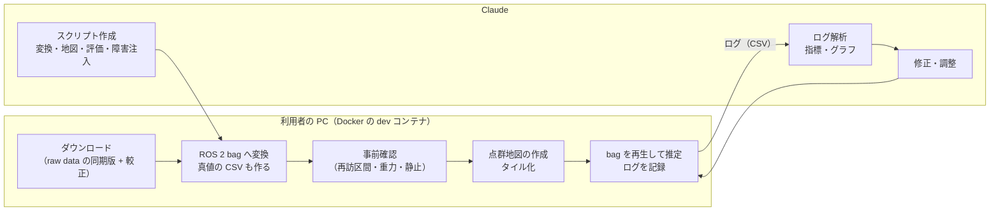

# 検証計画: KITTI を使った LiDAR 自己位置推定の検証

- 関連文書: [要件定義](./requirements.md) / [設計書](./design.md)（v0.12。9 章「検証計画」） / [アルゴリズム説明書](./algorithm.md) / [tiled_pcd_map](../tiled_pcd_map/README.md)
- 状態: ドラフト（v0.1。実データでの検証の最初として、点群地図と LiDAR による自己位置推定を KITTI で確かめる。点群地図の作り方も本書で決める）

本書は、公開データセット **KITTI**（raw data）を使って、本システムの **LiDAR による自己位置推定**（Phase 2 で実装した部分）を実データで検証する計画である。GNSS まわり（RTK-FIX の判定、GNSS の再アンカー、GNSS 区間と地図区間の切り替わり）は、KITTI では確かめられない（1.1 節）。そちらは後で、自社の車両で記録したデータで検証する（8 章）。

データセットの情報は、KITTI の論文（Geiger ほか, "Vision meets Robotics: The KITTI Dataset", IJRR 2013）、raw data の devkit の説明（OXTS の各列の定義）、KITTI のウェブサイトで確認した内容に基づく。確認できなかった点は「要確認」とし、3.3 節の事前確認で決める。

---

## 1. データセットの概要

### 1.1 本システムとの対応

| 項目 | KITTI（raw data） | 本システムの想定 | 扱い |
|---|---|---|---|
| 車両 | 乗用車（VW Passat）。市街地・住宅地を数十 km/h で走る | 車輪型、最高 6 km/h | 速度が大きく違う。1 スキャン（0.1 s）の間の移動が 10 m/s で 1 m になるので、デスキューと予測の影響が大きい（1.2 節） |
| LiDAR | Velodyne HDL-64E、10 Hz、約 10 万点/スキャン。`velodyne_points/data/*.bin`（x, y, z, 反射強度の float32）。**点ごとの時刻は無い** | Livox Mid-360（点ごとの時刻あり） | センサは違うが、前処理・GICP・地図との照合の流れは同じ。点ごとの時刻は必要なら方位角から作る（1.2 節） |
| IMU | OXTS RT3003 の加速度・角速度（車体座標系）。**同期版（synced）は 10 Hz**（記録は 100 Hz。非同期版（unsynced）なら 100 Hz） | 6 軸 IMU（100 Hz 以上） | まず同期版の 10 Hz で試す。予測に不足があれば非同期版の OXTS を足す（9 章） |
| ODOM | **ホイールオドメトリは無い** | 前進速度（`nav_msgs/Odometry` の twist） | OXTS の前進速度 `vf`・横速度 `vl`・ヨーレート `wz` で代用する。GNSS/INS の速度なので、車輪より精度がよすぎる。劣化させた場合も試す（6 章 V-L3） |
| GNSS | **生の GNSS は無い**（OXTS の緯度経度は GNSS/INS の融合結果） | u-blox F9P の RTK-FIX | **入力には使わない**。真値として評価だけに使う |
| 真値 | OXTS RT3003（L1/L2 RTK、分解能 0.02 m / 0.1°） | — | 評価に使う（5 章）。RTK が外れた区間や通信断の区間は除く |
| 点群地図 | **配布されない** | 統合済みの地図が入力される | 自分で作る（4 章） |
| 形式 | テキストファイルとバイナリファイル | ROS 2 | ROS 2 bag（MCAP）に変換する（3.2 節） |
| ライセンス | CC BY-NC-SA 3.0（非営利に限る） | — | **業務での利用可否は別途確認する**（9 章） |
| 入手 | ドライブごとの zip。ダウンロードには KITTI のサイトへのログイン（利用登録）が要る | — | 必要なドライブだけを落とす（3.1 節） |

### 1.2 データセットの注意点

- **座標系**: OXTS（IMU）も Velodyne も、前・左・上（FLU）である（論文）。本システムでは **base_link = OXTS の IMU の位置** とする。真値も同じ点の値なので、そのまま比較できる。IMU の回転の変換は要らない（`imu.rotation_rpy_deg: [0, 0, 0]`）。
- **LiDAR の取り付け位置**: 日付ごとの `calib_imu_to_velo.txt`（R と T）は、IMU 座標の点を Velodyne 座標に移す変換 $`\mathbf{p}_{\mathrm{velo}} = \mathbf{R}\mathbf{p}_{\mathrm{imu}} + \mathbf{T}`$ である。本システムの `lidar.extrinsic_*` は base_link から見た LiDAR の姿勢なので、逆変換（$`\mathbf{R}^\top`$、$`-\mathbf{R}^\top\mathbf{T}`$）を入れる。変換スクリプトが値を出力する（3.2 節）。
- **加速度に重力が含まれるか（要確認）**: 本システムは、静止時に z 方向へ約 +9.8 m/s² が出る比力を前提にしている。OXTS の `ax, ay, az` がそうなっているかは論文に書かれていない。3.3 節で、止まっている区間の値を見て確かめる。重力が除かれていれば、変換時に roll / pitch から重力の分を足す。
- **yaw の基準**: OXTS の yaw は「0 = 東、反時計回りが正」で、真の東が基準である。本システムの出力は UTM のグリッドが基準なので、真値を作るときに**子午線収差**を補正する。KITTI の走行地（カールスルーエ、東経約 8.4°、北緯約 49°）は UTM の 32 帯（中央子午線は東経 9°）にあり、収差は約 0.45° になる。yaw の評価（目標 1° 以下）に対して無視できない。
- **UTM の帯**: 32 帯（北半球）。`maps.yaml` の `utm` と `gnss.utm_zone` をどちらも 32 にする（違うと起動が止まる）。
- **スキャンの時刻**: 同期版の `velodyne_points/timestamps.txt` は、スキャナーが**前を向いた時刻**（カメラのトリガ）である（論文）。1 回転の開始と終了の時刻（`timestamps_start.txt` / `timestamps_end.txt`）は非同期版にだけある。点ごとの時刻は無いので、デスキューをするなら、各点の方位角から「前を向いた時刻からの差」（−0.05〜+0.05 s）を作る。回転の向きは、符号を変えた 2 通りを試して決める。
- **動き補正済みかどうか（要確認）**: 論文には、点群の動き補正について記述が無い。LiDAR オドメトリの文献では、KITTI の点群を補正済みとして扱うものもある。ここは決め打ちせず、V-L0（6 章）で「デスキューなし」「方位角の時刻でデスキュー（符号 2 通り）」の 3 通りを比べて決める。
- **OXTS の通信断**: 論文によれば、約 1 秒の通信断がときどきあり、その間の値は線形補間され、最後の 3 列（`posmode, velmode, orimode`）が −1 になっている。真値の評価からは外す。IMU・ODOM としては補間値のまま使う（補間なので、その間の予測はやや甘くなる）。
- **起動時の静止**: 本システムは、起動直後の `attitude.static_init_time`（既定 3 s）の IMU の平均から、roll / pitch とジャイロのバイアスを決める。この間に車が動いていても判定はしない（`AttitudeEstimator::addStaticSample`）。ドライブの最初に車が止まっているかを 3.3 節で確かめ、止まっていなければ、bag を止まっている時刻から始めるか、`static_init_time` を小さくする（6.2 節）。
- **IMU が 10 Hz**: `motion.imu_timeout`（既定 0.1 s）は 100 Hz 以上の IMU を想定した値である。10 Hz だと、間隔のぶれで IMU が途切れたと判定されうるので、検証用の値を大きくする（6.2 節）。

### 1.3 ドライブの選び方

KITTI の odometry ベンチマークのシーケンス 00〜10 は、raw data のドライブの一部である。本計画では、IMU・速度・緯度経度が入っている **raw data の同期版**（synced+rectified）を使う（odometry ベンチマークの配布物には IMU と緯度経度が無く、点群は全シーケンス一括でしか落とせないため）。

| odometry の番号 | raw data のドライブ | フレーム | 特徴 | 使い方 |
|---|---|---|---|---|
| 04 | 2011_09_30_drive_0016 | 0〜270 | 短い（約 27 s） | 変換・起動・外部パラメータの確認（V-L0） |
| 05 | 2011_09_30_drive_0018 | 0〜2760 | 住宅地。ループがあり、同じ道を再び通る | **主な検証**（V-L1〜V-L5） |
| 07 | 2011_09_30_drive_0027 | 0〜1100 | 住宅地。終盤で出発地点の近くに戻る | 小さめの検証（05 の前に試す場合） |
| 08 | 2011_09_30_drive_0028 | 1100〜5170 | 同じ道を逆向きに通る区間がある | 逆向きの照合（V-L6） |
| 00 | 2011_10_03_drive_0027 | 0〜4540 | 住宅地。再訪が多い。別の日 | 追加の検証 |

- 2011_09_30 のドライブは、同じ日の較正ファイル（`2011_09_30_calib.zip`）を使う。00 は `2011_10_03_calib.zip`。
- 再訪の位置・回数・向きは、OXTS の軌跡を重ねて確かめてから使う（3.3 節）。別のドライブどうしで同じ道を通っていれば、「別の走行で作った地図で照合する」組み合わせに使える（V-L7）。
- 点群の量の目安は 1 スキャン約 2 MB（10 万点 × 16 バイト）で、05 なら点群だけで約 5 GB。zip には画像も含まれるので、展開後に画像（`image_00`〜`image_03`）は消してよい。

---

## 2. 検証の進め方と役割分担

この作業環境（クラウド上のコンテナ）には ROS 2 がなく、KITTI の配布元にも接続できない（ログインも要る）。そのため、次のように分担する。

| 担当 | 内容 |
|---|---|
| Claude（この環境） | 変換・地図作成・評価・障害注入のスクリプトを書く。コアの単体テストと合成データのシミュレーションを行う。受け取ったログを解析し、パラメータの調整や修正を行う |
| 利用者（手元の PC） | KITTI のダウンロード、ROS 2 bag への変換、点群地図の作成、推定ノードでの bag 再生とログの記録。ログを Claude に渡す |

注意: スクリプトは、この環境では KITTI の実データで試せない。KITTI と同じ形式の小さな合成データで動作を確かめてから渡し、最初の実データでの実行は利用者の PC で行う。エラーが出たらその内容を受け取って直す。

---

## 3. 準備

### 3.1 ダウンロード

1. KITTI のサイトで利用登録し、raw data のページから次をダウンロードする。
   - `2011_09_30_calib.zip`（較正）
   - `2011_09_30_drive_0016_sync.zip`（04。まずこれだけで V-L0 まで進める）
   - `2011_09_30_drive_0018_sync.zip`（05）
2. データはリポジトリの外に置く（例: `$GLL_DATA/kitti/raw/2011_09_30/2011_09_30_drive_0018_sync/`）。リポジトリには入れない。
3. 使うのは `oxts/`、`velodyne_points/` と較正ファイルだけである。画像は消してよい。

### 3.2 ROS 2 bag への変換（`tools/kitti/kitti_to_bag.py`、Claude が作成）

Docker の `dev` ステージのコンテナの中で実行する。ROS には依存させず、`tools/tile_demo/make_bag.py` と同じく MCAP を直接書く（numpy だけで動くようにする。緯度経度 → UTM の変換に pyproj を使うので、スクリプトを作るときに `dev` ステージに追加する）。

| 入力 | 出力（ROS 2） | 処理 |
|---|---|---|
| `oxts/data/*.txt` の `ax, ay, az, wx, wy, wz` | `/sensing/imu`（`sensor_msgs/Imu`、frame `base_link`） | 車体座標系のまま（FLU）。重力が除かれていれば足す（1.2 節） |
| `oxts/data/*.txt` の `vf, vl, wz` | `/sensing/odom`（`nav_msgs/Odometry`。twist だけを埋める） | 劣化のオプション: 縮尺の誤差（`--odom-scale 1.02` など）、白色雑音（`--odom-noise 0.05`） |
| `velodyne_points/data/*.bin` | `/sensing/lidar/points`（`sensor_msgs/PointCloud2`。x, y, z, intensity） | stamp は `timestamps.txt`。オプション `--point-time none / azimuth / azimuth-reversed` で、方位角から作った float32 の `time` 列（stamp からの秒）を付ける（1.2 節） |
| 真値 + 誤差 | `/initialpose`（`geometry_msgs/PoseWithCovarianceStamped`。launch の `initial_pose_topic` の既定値） | 静止初期化の後の時刻に 1 回出す。`--init-error 2.0,15` で位置・yaw に誤差を与える（V-L2）。共分散も誤差に合わせて入れる |
| `oxts/data/*.txt` の `lat, lon, alt, yaw` | `/groundtruth/pose`（評価用）と `groundtruth.csv` | UTM 32 帯に投影し、yaw を子午線収差で補正する（1.2 節）。通信断（最後の 3 列が −1）の行に印を付ける |
| `calib_imu_to_velo.txt` | `/tf_static`（base_link → velodyne）と、`lidar.extrinsic_*` に入れる値の表示 | 逆変換する（1.2 節） |
| — | — | `--start` / `--end`（フレーム番号）で区間を切り出す。`--drop-lidar 120:15`（120 s から 15 s 止める）のように LiDAR の欠落を入れる（V-L4） |

トピック名は launch の既定値（`/sensing/imu`、`/sensing/odom`、`/sensing/lidar/points`、`/initialpose`）に合わせる。GNSS のトピックは作らない。再生は `ros2 bag play --clock` で行い、推定ノードは `use_sim_time:=true` で起動する。

### 3.3 データの事前確認（`tools/kitti/inspect_kitti.py`、Claude が作成）

変換の前に、次の項目を 1 枚のレポート（図付き）にまとめる。結果を Claude に渡してもらい、以降の設定と区間の分け方を決める。

- OXTS とスキャンの時刻の間隔と欠落（通信断の回数と長さ）
- `posmode` と `pos_accuracy` の分布（RTK が得られている割合。真値として使える区間）
- 止まっている区間の加速度（`az` が約 +9.8 か、約 0 か。1.2 節）
- ドライブの最初に車が止まっているか、止まっている時間
- 速度の分布（最大・平均）
- 軌跡の図と、**再訪区間の一覧**: 時刻が 60 s 以上離れて、位置が 5 m 以内に戻ってくる区間と、そのときの向き（同じ向き / 逆向き）。4.2 節の区間の分け方に使う
- 複数のドライブを落とした場合は、ドライブどうしの軌跡の重なり

---

## 4. 点群地図の作成（検討結果）

KITTI には点群地図が含まれないので、自分で作る。本番では「外部ツールで作った統合済みの地図（PCD）と、アンカー（地図の 1 点の緯度経度と方位）」が入力になる（設計書 5 章）。検証ではこの入力を KITTI から作る。

### 4.1 作り方の比較

| 案 | 方法 | 良い点 | 悪い点 |
|---|---|---|---|
| A | 真値（OXTS）の姿勢で、スキャンを地図座標に並べて重ねる | 道具が要らず、すぐ作れる。地図が UTM に直接合う（アンカーの誤差が無い） | OXTS の誤差（RTK が得られていても数 cm、外れた区間はそれ以上）が、そのまま地図のにじみや二重の壁になる。本番の手順（外部ツールで作る）とは違う |
| B | LiDAR SLAM（外部ツール）で作り、OXTS の軌跡との対応からアンカーを決める | **本番と同じ手順の予行演習**になる。スキャンどうしの整合がよい。アンカーを決める処理は、Phase 3 のアンカー較正ツールの試作になる | SLAM ツールの準備が要る。ループを閉じないツールではずれが残る。アンカーの推定誤差が加わる |
| C | 案 A の姿勢を初期値にして、small_gicp でスキャンを地図に合わせ直す | 地図のにじみが減り、UTM にもほぼ合う | 自作の処理が増える（実質、SLAM の一部を作ることになる） |

**決定: 案 A で始め、次に案 B を行う。案 C は行わない。**

- 最初の目的は、変換・地図・照合・評価の一連の流れを実データで回し、明らかな不具合（座標系、外部パラメータ、時刻、デスキュー）を見つけることである。それには、道具が要らず、アンカーの誤差も入らない案 A が早い。
- 案 A の地図でよい結果が出たら、案 B の地図で同じ評価をする（V-L5）。両者の差が、地図の作り方とアンカーの誤差の影響になる。本番の地図は外部ツールで作るので、案 B の結果の方が本番に近い。
- 案 C は、案 A の地図のにじみが照合の精度を明らかに下げていた場合の予備とする。案 B で SLAM ツールを使えば、同じ目的は達成できる。

### 4.2 地図を作る区間と評価する区間を分ける

地図を作ったスキャンと同じスキャンで照合すると、点が完全に一致するため、結果が楽観的になる。**精度の評価では、地図に使ったスキャンを照合に使わない。** 例外は動作確認の V-L0 だけである。

- 分け方: 3.3 節の再訪区間の一覧を使い、**最初に通ったときのスキャンで地図を作り、再び通ったときのスキャンで照合する**。再び通ったときのスキャンは、地図に入れない。
- 地図が無い場所を走る区間もできる（2 回目以降に新しい道へ入るなど）。そこはデッドレコニングになり、地図に戻ったときの照合と再位置推定の確認にもなる。精度の指標は、地図の上にいる区間だけで計算する（5.2 節）。
- 同じドライブの中なので、時間差は数分である。駐車車両などは地図と同じままなので、時間がたった地図（季節や駐車の違い）での照合は確かめられない。別のドライブ（別の日を含む）で同じ道を通っていれば、V-L7 で確かめる。

### 4.3 案 A の手順（`tools/kitti/build_map_from_gt.py`、Claude が作成）

1. 地図に使うフレームを選ぶ（4.2 節）。通信断の行と、`pos_accuracy` が閾値（最初は 0.05 m）を超える行は使わない。
2. 各スキャンを前処理する: 距離でクロップ（最初は 3〜50 m）、デスキュー（V-L0 で決めた方法）。
3. OXTS の姿勢（6 自由度）と `calib_imu_to_velo.txt` で、スキャンを地図座標に移す。地図座標は、最初のフレームの位置を原点にし、x = 東、y = 北（UTM のグリッド）、z = 高さとする。距離は実距離にする（UTM の座標の差を、原点での縮尺係数 k で割る）。
4. 全体を 0.1 m でボクセル間引きし、PCD で書き出す。あわせて `maps.yaml` の地図グループを書き出す。アンカーは UTM で与える: `anchor: {map_point: [0, 0, 0], easting: <原点の E>, northing: <原点の N>, ellipsoid_height: <原点の alt>, grid_heading_deg: 90.0}`（x 軸 = 東なので、グリッド北から時計回りに 90°）。`alt` の基準（楕円体高か標高か）は論文で確認できないが、地図上の初期化の z の初期値に使うだけなので、地図の中で一貫していればよい。
5. `tiled_pcd_map_tiler` でタイルにする（まず `--tile-size 20 --voxel-size 0.2`）。
6. 地図の品質を目で見る: 再訪で重ねた部分の壁の厚み、地面の段差。にじみが大きければ、`pos_accuracy` の閾値を下げるか、地図に使う区間を 1 回の通過に限る。

### 4.4 案 B の手順（SLAM ツールは利用者が選ぶ。アンカーの決定は `tools/kitti/fit_anchor.py`、Claude が作成）

1. 4.2 節で選んだ地図用のスキャンで、LiDAR SLAM を実行する。LiDAR だけで動くものが扱いやすい（例: KISS-ICP 系や GLIM）。IMU を強く使う手法は、同期版の 10 Hz の IMU では不足する。出力は、地図座標系の点群（PCD）と、地図作成時の軌跡（時刻付き）の 2 つ。
2. `fit_anchor.py` で、SLAM の軌跡と OXTS の軌跡（UTM）を時刻で対応付け、3 次元の剛体変換を最小二乗で求める。
   - 回転のうち**水平面からの傾き**（roll / pitch の成分）で PCD を回し、地図の z 軸を鉛直にそろえる（要件定義 4 章の前提。SLAM の地図は、最初のスキャンの傾きのまま作られることが多い）。
   - 残りの鉛直軸まわりの回転と並進から、`maps.yaml` のアンカー（UTM）を出力する。
   - 対応点の残差の RMS と最大値もあわせて出力し、アンカーの精度の目安にする。
3. 4.3 節の 5〜6 と同じくタイル化し、品質を目で見る。

---

## 5. 評価の方法

### 5.1 真値

- OXTS の緯度経度を UTM 32 帯に投影し、yaw を子午線収差で補正したものを真値とする（3.2 節の `groundtruth.csv`）。基準点は base_link（OXTS の位置）なので、推定の出力とそのまま比べられる。
- 時刻は OXTS の時刻で、出力の時刻に線形補間して合わせる。
- 通信断の行と、`pos_accuracy` が閾値を超える行は評価から外す。真値の分解能（0.02 m / 0.1°）と RTK の精度から、評価の分解能は数 cm・0.1° 程度と考える。

### 5.2 指標（`tools/kitti/evaluate.py`、Claude が作成）

| 指標 | 内容 | 対応する要件 |
|---|---|---|
| 水平位置誤差 | 出力と真値の差を、進行方向（縦）と横に分けた RMS・95% 値・最大値。**地図の上にいる区間だけ**で計算する | FR-1、FR-3 |
| yaw 誤差 | RMS・最大値 | FR-3 |
| 出力の補正ステップ | 出力の周期ごとの差から、真値の移動量を引いたものの最大値 | **FR-4（飛びがないこと）** |
| 共分散の整合性 | 誤差が報告した 3σ の中に入る割合、NEES の平均。`lidar.cov_scale` を決める材料にする | 設計書 3.13 節の判定の前提 |
| 地図上での初期化 | 成功率、初期姿勢を受け取ってから `INITIALIZING` を抜けるまでの時間、そのときの誤差 | 設計書 3.11 節 |
| 状態の推移 | `LIDAR_AIDED` / `DEAD_RECKONING` / `DEGRADED` / `LOST` の時間の割合と、地図の上にいるかどうかとの対応 | 設計書 3.12・3.13 節 |
| LiDAR の照合 | 採用率、棄却数（品質・ゲート）、再位置推定の回数、インライア率と overlap の分布 | 設計書 3.13 節 |
| デッドレコニング | 地図の外や LiDAR の欠落の間の、走った距離に対する誤差の伸び（横・縦）。`dr_distance` と ERROR の時刻 | FR-8 |
| 処理時間 | 予測・更新・GICP・タイル再構築の処理時間（p50 / p99）、ターゲットが空だった回数 | 設計書 9 章 |

出力は、指標の表（Markdown）と図（軌跡と地図、誤差の時系列と地図の上かどうかの色分け、状態の時系列）。

### 5.3 推定ノードが出すログ（CSV）

`gll_ros2` のパラメータ `debug_csv_path` を指定すると、出力を CSV に書く（実装済み）。1 行 = 1 出力周期。

| 列 | 内容 |
|---|---|
| `t` | 時刻（UNIX 秒） |
| `x, y, yaw` | 出力（出力整形後） |
| `raw_x, raw_y, raw_yaw` | フィルタの推定値 |
| `var_x, var_y, var_yaw` | 出力の共分散の対角（$`\Sigma_w + \mathbf{o}\mathbf{o}^\top`$） |
| `raw_var_x, raw_var_y, raw_var_yaw` | フィルタの共分散の対角 |
| `offset_x, offset_y, offset_yaw` | 出力整形のオフセット |
| `status, recovery_state, active_map_group` | 状態 |
| `roll, pitch, gyro_bias, odom_scale` | 補助推定とバイアス |
| `dr_distance` | 最後に位置の観測を採用してから走った距離 [m]（設計書 3.12 節） |

観測ごとのイベント（採用・棄却・再アンカー・再位置推定、Mahalanobis 距離、GICP の品質指標と処理時間）は、別の CSV（`debug_events_path`）に 1 行 1 イベントで出す（**未実装**。V-L1 の前に追加する）。それまでは、`~/debug/lidar_pose` と `/diagnostics` を bag に記録して代わりにする。

---

## 6. 検証シナリオ

### 6.1 シナリオの一覧

| ID | ドライブ | 地図 | 内容 | 主な確認点 |
|---|---|---|---|---|
| V-L0 | 04 | 案 A（**同じスキャン**） | 動作確認 | 変換・TF・外部パラメータ・起動手順が正しいこと。地図上での初期化から追跡まで通ること。誤差は数 cm になるはず（楽観的な値なので精度の評価には使わない）。**デスキューの 3 通り**（なし / 方位角 / 方位角の符号を反転）で、インライア率と誤差を比べ、以降の設定を決める |
| V-L1 | 05 | 案 A（1 回目の通過） | 再訪区間の追跡 | 地図区間での精度、照合の採用率、共分散の整合性（→ `cov_scale`）、処理時間、タイルの読み込み（ターゲットが空にならないこと） |
| V-L2 | 05 | 案 A | 地図上での初期化 | 初期姿勢に 1〜3 m・10〜30° の誤差を与え（位置と誤差を変えて 20 回程度）、成功率・時間・誤った位置で初期化しないことを確認する |
| V-L3 | 05 | 案 A | ODOM を劣化させる | 縮尺の誤差（+2〜5 %）と雑音を入れても、LiDAR の照合で位置が保たれること。`odom_scale` の推定が誤差の方へ動くこと |
| V-L4 | 05 | 案 A | LiDAR を止める・地図の外に出る | 5〜20 s の欠落と、地図の無い区間の走行で、デッドレコニングの誤差の伸び、`dr_error_distance` での ERROR、再開後の照合または再位置推定での復帰、出力が飛ばないこと |
| V-L5 | 05 | 案 B | V-L1・V-L2 を案 B の地図で行う | 案 A との差（地図の作り方とアンカーの誤差の影響）。アンカーの残差と、出力の誤差の関係 |
| V-L6 | 08 | 案 A | 逆向きの再訪 | 逆向きに通ったときの照合（HDL-64E は全周なので照合できるはず）。初期化の候補の yaw の範囲 |
| V-L7 | 3.3 節で見つかった組み合わせ | 案 A（別のドライブ） | 別の走行で作った地図での照合 | 駐車車両などが変わった地図での、照合の採用率と精度 |

障害（ODOM の劣化、LiDAR の欠落、初期姿勢の誤差）は、変換スクリプトのオプションで bag を作り分けて入れる（3.2 節）。元のデータは変更しない。

### 6.2 このデータセット用のパラメータ（初期値）

| パラメータ | 既定値 | KITTI 用 | 理由 |
|---|---|---|---|
| `gnss.utm_zone` / `utm_north` | 54 / true | **32** / true | カールスルーエ（1.2 節）。`maps.yaml` の `utm` と合わせる |
| `imu.rotation_rpy_deg` | [0, 0, 0] | [0, 0, 0] | OXTS は FLU |
| `attitude.static_init_time` | 3.0 s | 最初の停止時間に合わせる（止まっていなければ 0.1 s 程度） | 1.2 節。止まっていない場合、ジャイロのバイアスはフィルタの推定に任せる |
| `motion.imu_timeout` | 0.1 s | 0.25 s | IMU が 10 Hz |
| `motion.odom_hold_max` | 0.1 s | 0.25 s | ODOM も 10 Hz |
| `lidar.extrinsic_xyz` / `extrinsic_rpy_deg` | 0 | `calib_imu_to_velo.txt` の逆変換（変換スクリプトが出力） | 1.2 節 |
| `lidar.time_field` | auto | V-L0 で決める（`""` = 使わない、または `time`） | 1.2 節 |
| `lidar.min_range` | 1.0 m | 3.0 m | 車体の屋根の点を除く（V-L0 で点群を見て調整） |
| `lidar.base_link_height` | 0 m | 地面から OXTS までの高さ | 論文の図では Velodyne が地面から 1.73 m。そこから `calib_imu_to_velo.txt` の高さの差を引く |
| `lidar.cov_scale` | 0.15 | 0.15（まずこのまま） | V-L1 の共分散の整合性で決める |
| `monitor.dr_error_distance` | 30 m（仮） | 30 m（まずこのまま） | 車速が速いので、数秒で超える。V-L4 の誤差の伸びは参考値として記録する（ODOM の性質が違うので、この値は自社のデータで決める） |
| GNSS のトピック | — | つながない | 1.1 節 |

---

## 7. 合格基準（仮）

設計書 9 章の仮の基準のうち、LiDAR に関わるものを、このデータセットでの目標とする。真値の誤差（数 cm）と、想定より速い車速を含むため、初回の結果を見て見直す。

| 項目 | 基準（仮） |
|---|---|
| 水平位置の横方向誤差（地図の上の区間） | RMS < 0.10 m |
| yaw 誤差（地図の上の区間） | RMS < 1.0° |
| 出力の補正ステップ | 1 周期あたり < 0.02 m |
| 共分散の整合性 | 誤差が 3σ 以内に入る割合 > 95% |
| 地図上での初期化 | 初期姿勢の誤差 3 m・30° 以内で成功率 > 95%。誤った位置で初期化しない |
| 状態 | 地図の上の通常走行で `LOST` にならない |
| デッドレコニングの監視 | `dr_distance` が `dr_error_distance` を超えてから 1 出力周期以内に ERROR、照合を採用したら解除 |
| 処理時間 | GICP < 60 ms（p99）。HDL-64E は Mid-360 より点が多いので、前処理後の点数もあわせて記録する |

---

## 8. このデータセットで確かめられないこと

次の項目は KITTI では確かめられないので、自社の車両で記録したデータで検証する（その計画は別に作る）。

- GNSS まわり: RTK-FIX の判定と棄却、GNSS による初期化、GNSS の再アンカー、GNSS FIX 中の LiDAR の食い違い判定とアンカーずれの記録、GNSS 区間と地図区間の切り替わり（要件定義 3 章の例1・例2）
- Livox Mid-360 に固有のこと: 点ごとの時刻とデスキュー、上向きの視野での地面と構造物の見え方
- 最高 6 km/h での振る舞いと、ホイールオドメトリの性質（スリップ、縮尺の変化）。`dr_error_distance` の最終的な値

---

## 9. 未決事項

1. **ライセンス**: KITTI は CC BY-NC-SA 3.0（非営利に限る）。このプロジェクトでの利用目的に合っているかを確認する。
2. **点群が動き補正済みかどうか**（V-L0 で決める。1.2 節）。
3. **OXTS の加速度に重力が含まれるか**（3.3 節で決める）。
4. **ドライブの最初に車が止まっているか**（3.3 節。`static_init_time` の値が決まる）。
5. **IMU が 10 Hz で足りるか**: V-L1 で予測が原因の棄却が多ければ、非同期版（unsynced）の 100 Hz の OXTS を足す（点群は同期版を使い、時刻で合わせる）。
6. **案 B の SLAM ツールの選定**（利用者側）。
7. **別のドライブどうしの重なり**（3.3 節。V-L7 ができるかが決まる）。
8. **`debug_events_path` の実装**（5.3 節。V-L1 の前に）。
