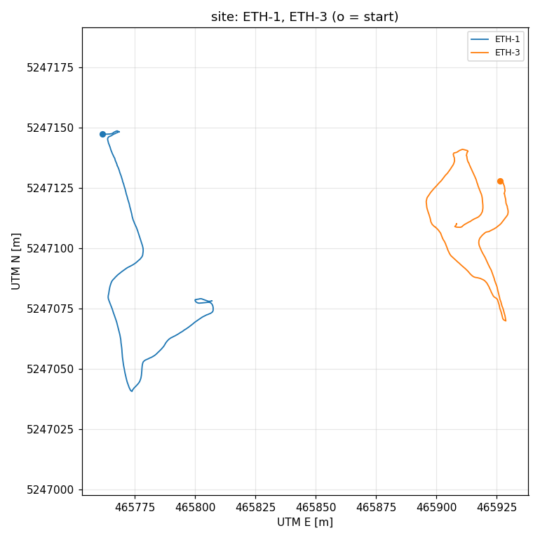
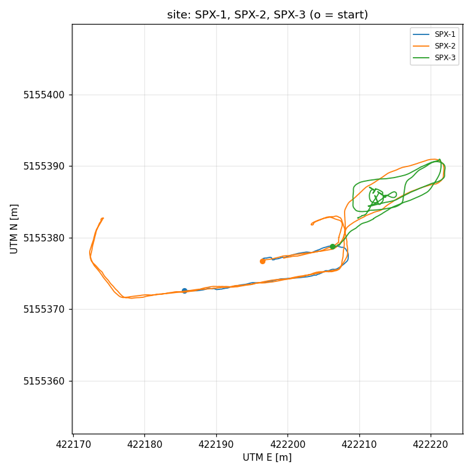
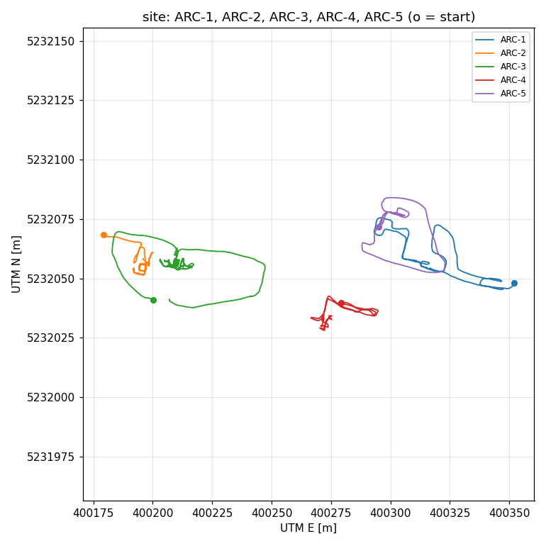
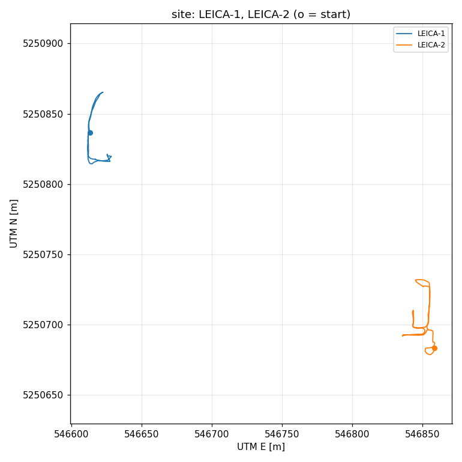
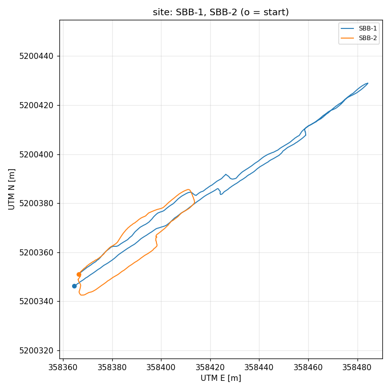

# GrandTour 事前確認レポート

生成: tools/grandtour/inspect_grandtour.py。このファイルを Claude に渡す。

## 1. ミッションの概要

| ミッション | フォルダ | 時間 [s] | 経路長 [m] | GNSS [Hz] | GNSS の欠け（>1 s） | 水平 σ p50 / p95 [m] | 高さの幅 [m] | 最初の静止 [s] | 速さ p50 / p95 [m/s] | 横速度 p95 [m/s] | MS60 の範囲 |
|---|---|---|---|---|---|---|---|---|---|---|---|
| ETH-1 | 2024-10-01-11-29-55 | 350 | 200 | 200.0 | 0 回・0 s | 0.004 / 0.007 | 3.5 | 5.7 | 0.69 / 1.04 | 0.13 | 68 % |
| ETH-2 | 2024-10-01-11-47-44 | 434 | - | - | - 回・- s | - / - | - | 2.0 | 0.62 / 0.94 | 0.20 | 57 % |
| ETH-3 | 2024-10-01-12-00-49 | 480 | 207 | 200.0 | 0 回・0 s | 0.005 / 0.037 | 1.7 | 5.8 | 0.50 / 0.92 | 0.17 | 7 % |
| SPX-1 | 2024-11-02-17-10-25 | 390 | 39 | 200.0 | 0 回・0 s | 0.012 / 0.020 | 4.3 | 4.4 | 0.38 / 0.87 | 0.10 | 57 % |
| SPX-2 | 2024-11-02-17-18-32 | 399 | 175 | 200.0 | 0 回・0 s | 0.026 / 0.102 | 4.4 | 0.2 | 0.53 / 0.92 | 0.10 | - |
| SPX-3 | 2024-11-02-17-43-10 | 230 | 95 | 200.0 | 0 回・0 s | 0.007 / 0.009 | 0.1 | 1.5 | 0.42 / 0.98 | 0.20 | 51 % |
| ARC-1 | 2024-11-18-12-05-01 | 449 | 233 | 200.0 | 0 回・0 s | 0.003 / 0.289 | 3.2 | 9.1 | 0.57 / 0.96 | 0.12 | 69 % |
| ARC-2 | 2024-11-18-13-22-14 | 441 | 121 | 200.0 | 0 回・0 s | 0.061 / 0.335 | 4.7 | 9.2 | 0.22 / 0.75 | 0.10 | - |
| ARC-3 | 2024-11-18-13-48-19 | 729 | 304 | 200.0 | 0 回・0 s | 0.004 / 0.519 | 7.1 | 6.6 | 0.37 / 1.05 | 0.11 | 27 % |
| ARC-4 | 2024-11-18-15-46-05 | 413 | 151 | 200.0 | 0 回・0 s | 0.068 / 1.034 | 2.5 | 0.0 | 0.35 / 0.91 | 0.11 | 19 % |
| ARC-5 | 2024-11-18-16-59-23 | 407 | 167 | 200.0 | 0 回・0 s | 0.309 / 1.484 | 1.1 | 0.0 | 0.43 / 0.94 | 0.10 | 38 % |
| LEICA-1 | 2024-11-25-14-57-08 | 327 | 148 | 200.0 | 0 回・0 s | 0.006 / 0.176 | 1.9 | 0.0 | 0.32 / 1.12 | 0.09 | 59 % |
| LEICA-2 | 2024-11-25-16-36-19 | 438 | 204 | 200.0 | 0 回・0 s | 1.238 / 1.386 | 0.7 | 2.6 | 0.53 / 0.89 | 0.08 | 40 % |
| SBB-1 | 2024-12-03-13-15-38 | 518 | 303 | 200.0 | 0 回・0 s | 0.006 / 0.024 | 0.4 | 4.4 | 0.73 / 0.97 | 0.10 | 90 % |
| SBB-2 | 2024-12-03-13-26-40 | 288 | 142 | 200.0 | 0 回・0 s | 0.009 / 0.200 | 1.0 | 0.3 | 0.60 / 0.96 | 0.13 | 72 % |

- 最初の静止: 脚のオドメトリの速度が 0.05 m/s・0.05 rad/s 未満の間。`attitude.static_init_time` を決める材料。
- MS60 の範囲: トータルステーションの測定がある秒の割合。

## 2. ミッションどうしの経路の重なり（5 m 以内）

行 = 地図を作るミッション、列 = 照合するミッション。値 = 照合するミッションの経路のうち、地図の経路の近くを通る割合と長さ（同じ向き / 逆向きの長さ）。

| 地図 \ 照合 | ETH-1 | ETH-3 |
|---|---|---|
| ETH-1 | — | 0 %・0 m（0 / 0） |
| ETH-3 | 0 %・0 m（0 / 0） | — |

| 地図 \ 照合 | SPX-1 | SPX-2 | SPX-3 |
|---|---|---|---|
| SPX-1 | — | 62 %・110 m（44 / 46） | 8 %・8 m（0 / 2） |
| SPX-2 | 100 %・40 m（17 / 21） | — | 100 %・96 m（32 / 46） |
| SPX-3 | 37 %・14 m（6 / 2） | 49 %・86 m（27 / 32） | — |

| 地図 \ 照合 | ARC-1 | ARC-2 | ARC-3 | ARC-4 | ARC-5 |
|---|---|---|---|---|---|
| ARC-1 | — | 0 %・0 m（0 / 0） | 0 %・0 m（0 / 0） | 0 %・0 m（0 / 0） | 66 %・110 m（58 / 19） |
| ARC-2 | 0 %・0 m（0 / 0） | — | 9 %・28 m（16 / 4） | 0 %・0 m（0 / 0） | 0 %・0 m（0 / 0） |
| ARC-3 | 0 %・0 m（0 / 0） | 27 %・32 m（14 / 7） | — | 0 %・0 m（0 / 0） | 0 %・0 m（0 / 0） |
| ARC-4 | 0 %・0 m（0 / 0） | 0 %・0 m（0 / 0） | 0 %・0 m（0 / 0） | — | 0 %・0 m（0 / 0） |
| ARC-5 | 49 %・116 m（51 / 37） | 0 %・0 m（0 / 0） | 0 %・0 m（0 / 0） | 0 %・0 m（0 / 0） | — |

| 地図 \ 照合 | LEICA-1 | LEICA-2 |
|---|---|---|
| LEICA-1 | — | 0 %・0 m（0 / 0） |
| LEICA-2 | 0 %・0 m（0 / 0） | — |

| 地図 \ 照合 | SBB-1 | SBB-2 |
|---|---|---|
| SBB-1 | — | 73 %・104 m（89 / 2） |
| SBB-2 | 41 %・124 m（84 / 21） | — |

重なりが長い組（上位 5）:

- SBB-2 → SBB-1: 124 m（照合側の経路の 41 %。同じ向き 84 m・逆向き 21 m）
- ARC-5 → ARC-1: 116 m（照合側の経路の 49 %。同じ向き 51 m・逆向き 37 m）
- SPX-1 → SPX-2: 110 m（照合側の経路の 62 %。同じ向き 44 m・逆向き 46 m）
- ARC-1 → ARC-5: 110 m（照合側の経路の 66 %。同じ向き 58 m・逆向き 19 m）
- SBB-1 → SBB-2: 104 m（照合側の経路の 73 %。同じ向き 89 m・逆向き 2 m）

## 3. データの約束事の確認

### 3.1 オドメトリの姿勢と速度

姿勢の解釈（standard = 姿勢は機体を親フレームで表したもの。ROS の Odometry と同じ。inverted = その逆）と、速度（twist）の座標系（child = 機体、parent = 親フレーム）を、位置を微分した速度との差 [m/s] で決める（4 通りのうち最小のもの）。 速度で決まらないときは、機体座標系で見た移動の向きのそろい方（0〜1）で姿勢の解釈だけを決める。 歩く向き: 機体の +x からの角度（0° なら前向き、180° ならそのフレームは後ろ向き）。

| ミッション | トピック | frame_id | 速度の差 std/child・std/parent・inv/child・inv/parent | そろい方 std / inv | 判定 | 決め手 | 歩く向き [deg] |
|---|---|---|---|---|---|---|---|
| ETH-1 | anymal_state_odometry | odom | 0.062・0.713・32.010・32.021 | 0.98 / 0.13 | standard / child | 速度 | 0 |
| ETH-1 | cpt7_ie_tc_odometry | enu_origin | 1.144・0.948・12.141・12.127 | 0.97 / 0.18 | standard / - | 向き | -0 |
| ETH-1 | dlio_map_odometry | dlio_map | 0.198・0.963・11.910・11.957 | 0.95 / 0.18 | standard / child | 速度 | -90 |
| ETH-2 | anymal_state_odometry | odom | 0.050・0.861・33.717・33.718 | 0.98 / 0.10 | standard / child | 速度 | -6 |
| ETH-2 | dlio_map_odometry | dlio_map | 0.166・0.837・6.221・6.271 | 0.95 / 0.08 | standard / child | 速度 | -97 |
| ETH-3 | anymal_state_odometry | odom | 0.056・0.747・34.353・34.377 | 0.96 / 0.09 | standard / child | 速度 | -2 |
| ETH-3 | cpt7_ie_tc_odometry | enu_origin | 0.809・0.847・5.154・5.140 | 0.95 / 0.16 | standard / - | 向き | 2 |
| ETH-3 | dlio_map_odometry | dlio_map | 0.168・0.714・5.145・5.184 | 0.93 / 0.16 | standard / child | 速度 | -94 |
| SPX-1 | anymal_state_odometry | odom | 0.043・0.665・2.736・2.779 | 0.98 / 0.02 | standard / child | 速度 | 0 |
| SPX-1 | cpt7_ie_tc_odometry | enu_origin | 0.485・0.454・1.733・1.695 | 0.99 / 0.33 | standard / - | 向き | 1 |
| SPX-1 | dlio_map_odometry | dlio_map | 0.164・0.683・2.716・2.765 | 0.95 / 0.02 | standard / child | 速度 | -90 |
| SPX-2 | anymal_state_odometry | odom | 0.047・0.751・3.312・3.322 | 0.96 / 0.05 | standard / child | 速度 | 1 |
| SPX-2 | cpt7_ie_tc_odometry | enu_origin | 0.774・0.685・3.248・3.185 | 0.95 / 0.02 | standard / - | 向き | -1 |
| SPX-2 | dlio_map_odometry | dlio_map | 0.173・0.834・3.205・3.175 | 0.92 / 0.03 | standard / child | 速度 | -88 |
| SPX-3 | anymal_state_odometry | odom | 0.043・0.820・7.779・7.792 | 0.81 / 0.10 | standard / child | 速度 | -0 |
| SPX-3 | cpt7_ie_tc_odometry | enu_origin | 0.796・0.592・4.049・3.994 | 0.77 / 0.07 | standard / - | 向き | 1 |
| SPX-3 | dlio_map_odometry | dlio_map | 0.182・0.783・4.203・4.101 | 0.70 / 0.06 | standard / child | 速度 | -92 |
| ARC-1 | anymal_state_odometry | odom | 0.125・0.872・8.078・8.086 | 0.94 / 0.11 | standard / child | 速度 | -1 |
| ARC-1 | cpt7_ie_tc_odometry | enu_origin | 0.860・0.968・9.102・9.128 | 0.93 / 0.13 | standard / - | 向き | 0 |
| ARC-1 | dlio_map_odometry | dlio_map | 0.232・0.875・9.157・9.181 | 0.89 / 0.13 | standard / child | 速度 | -89 |
| ARC-2 | anymal_state_odometry | odom | 0.046・0.447・5.471・5.506 | 0.98 / 0.21 | standard / child | 速度 | -2 |
| ARC-2 | cpt7_ie_tc_odometry | enu_origin | 0.553・0.530・5.432・5.410 | 0.94 / 0.23 | standard / - | 向き | 1 |
| ARC-2 | dlio_map_odometry | dlio_map | 0.187・0.479・5.355・5.467 | 0.79 / 0.23 | standard / child | 速度 | -88 |
| ARC-3 | anymal_state_odometry | odom | 0.115・0.793・9.601・9.633 | 0.92 / 0.07 | standard / child | 速度 | -3 |
| ARC-3 | cpt7_ie_tc_odometry | enu_origin | 0.785・0.827・5.460・5.487 | 0.89 / 0.06 | standard / - | 向き | 4 |
| ARC-3 | dlio_map_odometry | dlio_map | 0.214・0.784・5.284・5.408 | 0.79 / 0.06 | standard / child | 速度 | -92 |
| ARC-4 | anymal_state_odometry | odom | 0.045・0.681・2.779・2.788 | 0.75 / 0.08 | standard / child | 速度 | -2 |
| ARC-4 | cpt7_ie_tc_odometry | enu_origin | 0.671・0.753・2.597・2.642 | 0.72 / 0.08 | standard / - | 向き | 4 |
| ARC-4 | dlio_map_odometry | dlio_map | 0.148・0.692・2.807・2.808 | 0.67 / 0.09 | standard / child | 速度 | -96 |
| ARC-5 | anymal_state_odometry | odom | 0.088・0.732・7.582・7.516 | 0.97 / 0.43 | standard / child | 速度 | 0 |
| ARC-5 | cpt7_ie_tc_odometry | enu_origin | 0.743・0.852・3.591・3.615 | 0.96 / 0.36 | standard / - | 向き | -1 |
| ARC-5 | dlio_map_odometry | dlio_map | 0.179・0.792・2.648・2.593 | 0.93 / 0.32 | standard / child | 速度 | -87 |
| LEICA-1 | anymal_state_odometry | odom | 0.064・0.901・4.079・4.123 | 0.92 / 0.04 | standard / child | 速度 | -2 |
| LEICA-1 | cpt7_ie_tc_odometry | enu_origin | 0.916・0.806・4.114・4.079 | 0.91 / 0.04 | standard / - | 向き | 2 |
| LEICA-1 | dlio_map_odometry | dlio_map | 0.154・0.890・4.050・4.115 | 0.86 / 0.03 | standard / child | 速度 | -94 |
| LEICA-2 | anymal_state_odometry | odom | 0.070・0.814・5.507・5.544 | 0.96 / 0.30 | standard / child | 速度 | -1 |
| LEICA-2 | cpt7_ie_tc_odometry | enu_origin | 0.779・0.784・5.365・5.328 | 0.96 / 0.30 | standard / - | 向き | 1 |
| LEICA-2 | dlio_map_odometry | dlio_map | 0.146・0.818・5.512・5.515 | 0.92 / 0.29 | standard / child | 速度 | -90 |
| SBB-1 | anymal_state_odometry | odom | 0.314・1.007・14.789・14.819 | 0.97 / 0.25 | standard / child | 速度 | -1 |
| SBB-1 | cpt7_ie_tc_odometry | enu_origin | 0.954・0.353・14.693・14.680 | 0.97 / 0.25 | standard / parent | 速度 | 1 |
| SBB-1 | dlio_map_odometry | dlio_map | 0.195・0.984・14.738・14.806 | 0.95 / 0.25 | standard / child | 速度 | -91 |
| SBB-2 | anymal_state_odometry | odom | 0.146・0.857・6.224・6.228 | 0.96 / 0.26 | standard / child | 速度 | -0 |
| SBB-2 | cpt7_ie_tc_odometry | enu_origin | 0.844・0.426・5.726・5.638 | 0.95 / 0.27 | standard / - | 向き | 1 |
| SBB-2 | dlio_map_odometry | dlio_map | 0.210・0.866・5.660・5.701 | 0.90 / 0.27 | standard / child | 速度 | -93 |

### 3.2 静的 TF の解釈（base → box_base の向き）

真値（box_base）と脚のオドメトリ（base）の回転の変化から求めた向きと、tf から計算した向き（GrandTour のサンプルと同じ解釈 / その逆）の差。official が小さければ、サンプルの解釈で正しい。

| ミッション | 使った組 | 当てはめの RMS [deg] | official との差 [deg] | 逆との差 [deg] |
|---|---|---|---|---|
| ETH-1 | 933 | 0.24 | 0.61 | 0.61 |
| ETH-3 | 1082 | 0.20 | 0.76 | 0.76 |
| SPX-1 | 236 | 0.49 | 1.62 | 1.62 |
| SPX-2 | 926 | 0.26 | 0.27 | 0.28 |
| SPX-3 | 499 | 0.22 | 1.77 | 1.77 |
| ARC-1 | 1367 | 0.37 | 0.44 | 0.44 |
| ARC-2 | 1142 | 0.42 | 0.14 | 0.14 |
| ARC-3 | 2125 | 0.41 | 0.46 | 0.46 |
| ARC-4 | 1032 | 0.25 | 0.49 | 0.49 |
| ARC-5 | 904 | 0.36 | 0.49 | 0.49 |
| LEICA-1 | 594 | 0.26 | 1.81 | 1.81 |
| LEICA-2 | 988 | 0.24 | 0.76 | 0.76 |
| SBB-1 | 1250 | 0.35 | 1.88 | 1.88 |
| SBB-2 | 804 | 0.31 | 0.75 | 0.75 |

### 3.3 真値の精度の目安

| ミッション | ie_rt と ie_tc の水平差 p50 / p95 / 最大 [m] | MS60 との差 RMS / p95 / 最大 [m]（点数） | 求めたプリズムの位置（真値の機体座標系）[m] |
|---|---|---|---|
| ETH-1 | 0.08 / 0.15 / 0.18 | 0.010 / 0.014 / 0.125（4547） | [ 0.303 -0.041 -0.235] |
| ETH-2 | - | - | - |
| ETH-3 | 0.27 / 0.74 / 0.78 | 0.013 / 0.027 / 0.070（545） | [ 0.306 -0.044 -0.183] |
| SPX-1 | 5.01 / 5.16 / 5.21 | 0.087 / 0.148 / 0.282（1485） | [ 0.269 -0.034 -0.162] |
| SPX-2 | 0.51 / 0.96 / 1.15 | - | - |
| SPX-3 | 0.03 / 0.06 / 0.06 | 0.010 / 0.015 / 0.058（2229） | [ 0.303 -0.036 -0.24 ] |
| ARC-1 | 0.87 / 1.05 / 1.10 | 0.016 / 0.029 / 0.060（6139） | [ 0.307 -0.037 -0.239] |
| ARC-2 | 1.51 / 2.36 / 2.53 | - | - |
| ARC-3 | 0.62 / 1.35 / 1.69 | 0.291 / 0.206 / 16.141（3654） | [ 0.326 -0.028  0.002] |
| ARC-4 | 0.77 / 2.39 / 2.46 | 0.585 / 1.471 / 1.527（1514） | [ 0.455  0.042 -2.335] |
| ARC-5 | 1.80 / 1.96 / 2.00 | 0.557 / 0.837 / 0.934（2987） | [ 0.229 -0.237  1.377] |
| LEICA-1 | 0.31 / 4.58 / 4.92 | 0.019 / 0.033 / 0.430（3752） | [ 0.308 -0.036 -0.387] |
| LEICA-2 | 0.51 / 0.88 / 0.97 | 0.490 / 1.118 / 1.204（3423） | [ 0.227 -0.098  0.548] |
| SBB-1 | 0.06 / 0.12 / 0.12 | 0.026 / 0.046 / 0.114（9236） | [ 0.31  -0.038 -0.18 ] |
| SBB-2 | 0.80 / 0.89 / 1.01 | 0.226 / 0.541 / 0.547（4082） | [ 0.33  -0.042 -0.324] |

- ie_rt はリアルタイムの PPP 解（精度が低い）。ie_tc は後処理の密結合解（真値に使う）。
- MS60 との差は、トータルステーションの座標を真値に剛体変換で合わせ、プリズムの位置（レバーアーム）も同時に求めた後の残差。
